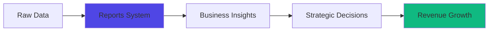
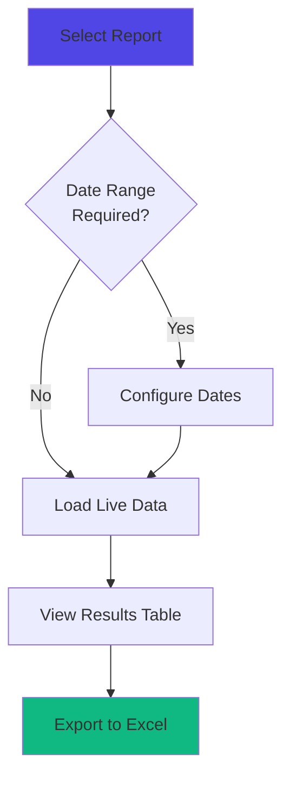

## Overview

Journey's reporting system transforms raw transactional data into actionable business insights. The platform includes 8 pre-built reports covering critical business metrics, with the ability to create custom reports using simple SQL queries.

## Why Reports Matter

Reports provide the data-driven insights needed to:

- **Optimize revenue**: Identify high-value customer segments and products
- **Reduce churn**: Track dunning subscriptions and payment failures before they become cancellations
- **Improve operations**: Monitor delivery performance and fulfillment efficiency
- **Recover revenue**: Reach out to abandoned cart customers with targeted campaigns
- **Forecast growth**: Analyze subscription signup trends and customer lifetime value

## Pre-Built Reports

Journey includes 8 production-ready reports that cover the most common business intelligence needs.

<AccordionGroup>
<Accordion title="Abandoned Cart">

Track potential customers who started but didn't complete their subscription signup.

**Use Cases:**
- Email marketing campaigns to recover lost sales
- Identify friction points in checkout flow
- A/B test recovery messaging strategies

**Includes:**
- Customer name and email
- Product they were interested in
- Date of abandonment (configurable date range)

**Business Impact:** Typical abandoned cart recovery campaigns achieve 10-15% conversion rates, directly recovering lost revenue.

</Accordion>

<Accordion title="Delivery Date Changes">

Monitor when customers reschedule their deliveries and understand demand patterns.

**Use Cases:**
- Identify delivery timing preferences
- Optimize delivery route planning
- Detect seasonal demand shifts

**Includes:**
- Original vs. new delivery date
- Customer details
- Date when change was made (configurable date range)

**Business Impact:** Understanding delivery date change patterns helps optimize inventory management and reduce fulfillment costs.

</Accordion>

<Accordion title="Dunning Subscriptions">

Real-time view of subscriptions with payment failures, sorted by retry attempts.

**Use Cases:**
- Proactive customer outreach before cancellation
- Payment method update campaigns
- Revenue recovery prioritization

**Includes:**
- Subscription status (past_due or error)
- Number of settling attempts
- Customer contact information
- Subscription ID for quick lookup

**Business Impact:** Early intervention on dunning subscriptions can recover 60-70% of at-risk revenue.

<Tip>
This report is always live (no date filtering) to show current at-risk subscriptions. Sort by "Settling attempts" to prioritize customers closest to expiration.
</Tip>

</Accordion>

<Accordion title="Paused Subscriptions">

Find valuable customers who paused their subscriptions after making successful payments.

**Use Cases:**
- Win-back campaigns targeting engaged customers
- Identify pause reasons through customer interviews
- Re-engagement email sequences

**Includes:**
- Customer details
- Count of successful payments before pause
- Current subscription status (on_hold or cancelled)

**Business Impact:** Customers with payment history are 3x more likely to reactivate than new signups, making them high-value targets.

</Accordion>

<Accordion title="Paid Orders">

Complete transaction history with product-level detail.

**Use Cases:**
- Revenue reporting and reconciliation
- Product performance analysis
- Customer purchase behavior tracking

**Includes:**
- Customer information
- Product variations purchased
- Order date and item count
- Configurable date range filtering

**Business Impact:** Essential for financial reporting, tax compliance, and understanding which products drive revenue.

</Accordion>

<Accordion title="Payments Export">

Detailed payment data with line items, VAT breakdown, and customer information.

**Use Cases:**
- Accounting system integration
- Tax reporting and compliance
- Revenue recognition
- Financial audits

**Includes:**
- Payment ID and status
- Customer details including SSN (for tax reporting)
- Line item details with quantities and amounts
- VAT totals by rate
- Created and last attempt timestamps

**Business Impact:** Streamlines financial operations and ensures tax compliance with detailed VAT breakdowns.

</Accordion>

<Accordion title="Subscription Customers and Statuses">

Complete customer subscription overview with product details.

**Use Cases:**
- Customer success outreach prioritization
- Product mix analysis per customer
- Subscription health monitoring

**Includes:**
- Customer contact details
- All subscription order items
- Current subscription status
- Subscription ID for quick access

**Business Impact:** Helps customer success teams prioritize high-value customers and identify upsell opportunities.

</Accordion>

<Accordion title="Subscription Statuses per Product">

Product-level subscription health metrics.

**Use Cases:**
- Product performance benchmarking
- Inventory planning by subscription status
- Identify products with high churn rates

**Includes:**
- Product and product variation names
- Subscription counts by status (active, past_due, expired, on_hold, error, cancelled)
- Grouped by product for easy comparison

**Business Impact:** Identifies which products retain customers best and which need improvement.

</Accordion>
</AccordionGroup>

## Report Interface

The reporting dashboard provides an intuitive interface for exploring your business data.

### Interactive Features

<Steps>
<Step title="Select a Report">
Click any report from the accordion list on the left sidebar. The report automatically loads with live data from your database.
</Step>

<Step title="Configure Date Range">
For time-based reports, use the date range picker to filter results:
- **Last 7 days**: Quick view of recent activity
- **Last 30 days**: Monthly performance
- **Last 90 days**: Quarterly trends
- **Custom range**: Any date range for specific analysis
</Step>

<Step title="Review Results">
Results display in a sortable table showing the first 5 rows. The total row count appears at the bottom.
</Step>

<Step title="Export to Excel">
Click the "Download Excel" button to export the complete dataset (not just the preview rows) for deeper analysis in Excel, Google Sheets, or your BI tool.
</Step>
</Steps>

### Data Visualization

<Info>
All reports show a live preview of your data. The table displays the first 5 rows, but Excel exports include all matching records.
</Info>

## Overview Dashboard

The Overview page serves as your merchant dashboard home, providing real-time business metrics and customer activity monitoring. This single-page view gives you immediate visibility into subscription health, revenue trends, and customer behavior.

<Info>
Access the Overview dashboard immediately after logging into your merchant portal. All metrics update in real-time as customers interact with your business.
</Info>

### Key Metrics

The Overview dashboard shows three important numbers at the top:

**Active Subscriptions** - How many customers are currently active

**Average Deliveries per Subscription** - How often your customers are ordering (higher = better retention)

**Lifetime Value** - Average revenue per active subscription

<Tip>
Track your lifetime value (LTV) compared to customer acquisition cost (CAC). Healthy subscription businesses have an LTV:CAC ratio of 3:1 or higher.
</Tip>

### Live Activity Feed

See what customers are doing in real-time:
- New signups
- Delivery date changes
- Subscription pauses and resumes
- Frequency changes

This helps you spot patterns and verify that your customer portal is working smoothly.

### Dashboard Charts & Tables

Select a date range (last 7, 30, or 90 days) to view:

**Subscription Status Trends**
- How your active, paused, and past-due subscription counts are changing
- Look for steady growth in active subscriptions
- Watch for unexpected spikes in past-due (payment issues) or on-hold (engagement issues)

**Product Revenue Breakdown**
- Top 5 products by revenue
- Helps with inventory planning and marketing focus

**Successful Deliveries**
- How many times each product was delivered (subscription vs. one-off)
- Helps forecast demand and plan fulfillment capacity

**New Subscription Signups**
- Which products customers are subscribing to
- Whether signups are growing or declining
- Good indicator of marketing effectiveness

### When to Check

- **Daily** - Glance at active subscriptions and live activity for health check
- **Weekly** - Review revenue and signups to inform business decisions
- **Monthly** - Deep dive into trends for strategic planning

## Requesting Custom Reports

The built-in reports cover most common use cases, but you might need something specific to your business.

### When to Request a Custom Report

You should request a custom report if you need to:
- **Analyze specific customer segments** - e.g., "Show me all customers who paused their subscription in the last 30 days"
- **Track unusual metrics** - e.g., "Show customers with the longest average time between purchases"
- **Monitor performance** - e.g., "Weekly report of churn rate by subscription type"
- **Financial analysis** - e.g., "Revenue by postal code" or "Payment success rates by payment method"
- **Operational insights** - e.g., "Orders that failed delivery twice"

### What to Include in Your Request

When requesting a custom report, provide:

1. **Report name** - What you want to call it (e.g., "High-Value Customers")
2. **Data you need** - What columns or information matter (e.g., customer name, total spent, last purchase date)
3. **Filters** - Any conditions to narrow results (e.g., only customers with 5+ purchases, or only from last 90 days)
4. **How often** - Do you need this once, weekly, or ongoing?
5. **Export format** - Usually Excel, but let us know if different

### Example Request

**Report Name:** "High-Value Customers"

**What you want to see:**
- Customer name and email
- Total amount they've spent
- Number of successful payments
- When they last paid

**Filters:**
- Only customers with 5 or more successful payments
- Sort by highest revenue first

**Frequency:** Monthly

### What Happens Next

Once you request a report:

1. **Our team reviews** - We make sure the data can be extracted and is meaningful
2. **We build it** - Takes a few days typically
3. **We test it** - Verify it shows the right data
4. **We add it** - New report appears in your reports sidebar
5. **You use it** - Access anytime, export to Excel, view trends

### Report Privacy & Security

All custom reports:
- **Show only your data** - Reports automatically filter to only your merchant's information
- **Can be confidential** - We handle any sensitive data (customer SSN, payment info) carefully
- **Are auditable** - We keep records of who requested and accessed reports

## Related Concepts

<CardGroup cols={2}>
<Card title="Communication System" icon="envelope" href="/customer-engagement/communication">
Learn how reports integrate with automated customer notifications
</Card>

<Card title="Recurring Payments" icon="credit-card" href="/payments/recurring-payments">
Understand the payment data that powers financial reports
</Card>

