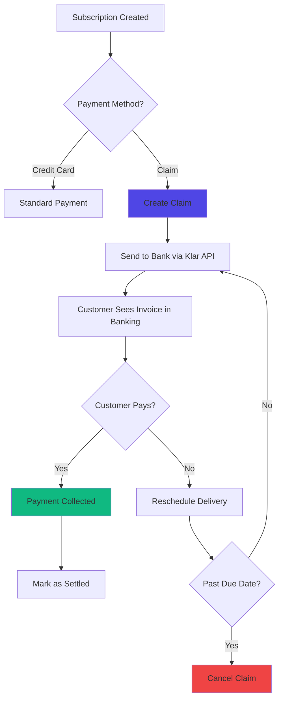

## Overview

Journey's claims system integrates with Icelandic banking infrastructure (via **Klar API**) to issue formal invoices (claims) to customers. Instead of charging credit cards directly, merchants can send invoices through the banking system that customers pay via their online banking portal or automatic bill pay.

<Info>
**What is a Claim?** In Icelandic banking, a "claim" (kröfugagnaskilaboð) is a formal invoice sent through the banking system. Customers see these claims in their online banking and can pay them like any other bill.
</Info>

## Why Use Claims?

Claims provide an alternative payment method that's particularly useful for:

**B2B Customers:**
- Companies often prefer invoice payments over credit cards
- Easier accounting and reconciliation
- Better cash flow management (pay later)

**High-Value Orders:**
- Customers may not want to use credit cards for large amounts
- Bank invoices feel more official and trustworthy
- Lower risk of card declines

**Recurring Subscriptions:**
- Some customers prefer monthly invoices over automatic charges
- Provides transparency into what they're paying for
- Easier to pause or adjust payments

**Payment Flexibility:**
- Customers get due dates (typically 10-30 days)
- Can pay via any bank account
- No need for credit card on file



## Key Concepts

<AccordionGroup>
<Accordion title="Claim - The Invoice">

**Definition:** A formal invoice created in the banking system that appears in the customer's online banking portal.

**Unique Identifier:**
- **Claim Number:** Format `{bank_number}{ledger}{auto_number}`
  - Example: `0515660000123` (Islandsbanki + Ledger 66 + Claim 123)
- **Due Date:** When the claim must be paid
- **Claimant:** Your company's SSN (kennitala)

**Key Fields:**
- **Amount:** Total to be charged (includes other costs)
- **PayorID:** Customer's SSN (kennitala)
- **DueDate:** Initial payment deadline (typically +10 days)
- **FinalDueDate:** Extended deadline before penalties (typically +30 days)
- **CancellationDate:** When claim is automatically cancelled (typically +100 days)
- **OtherCosts:** Processing fees added to the invoice

**Lifecycle:**
```
NEW → UNPAID → PAID (or CANCELLED)
```

</Accordion>

<Accordion title="ClaimSpec - Configuration Template">

**Definition:** A reusable configuration that defines how claims are created and managed.

**Purpose:** Different customer segments may need different claim configurations:
- **Standard customers:** 10 day due, 30 day final due
- **B2B customers:** 30 day due, 60 day final due
- **Pre-paid:** Claims created before delivery, auto-deliver after due date

**Key Settings:**
- `cron_spec`: When to create claims (e.g., "0 0 * * *" = daily)
- `claim_zone_days`: How many days before delivery to create claim (default: 5)
- `due_days`: Days until initial due date (default: 10)
- `final_due_days`: Days until final due date (default: 30)
- `cancellation_days`: Days until auto-cancellation (default: 100)
- `other_cost_prc`: Processing fee percentage (default: 2.7%)
- `auto_delivery_after_due_date`: Deliver even if unpaid (for pre-payment models)

**Multiple Specs:**
You can create multiple ClaimSpecs and assign them to different payment methods/customers.

</Accordion>

<Accordion title="Klar API - Banking Integration">

**What is Klar?** Klar (now part of Open Banking Iceland) provides APIs to interact with Icelandic banking infrastructure.

**Supported Banks:**
- Íslandsbanki
- Landsbankinn
- Arion banki

**Authentication:**
- OAuth 2.0 via Auth0
- Access tokens valid for 15 minutes (cached)
- Company-specific credentials per merchant

**API Operations:**
```typescript
// Create a new claim
POST /claims

// Get claim status
GET /claims/single?claimant={id}&account={claim_no}&dueDate={date}

// Update claim details
PUT /claims

// Cancel claim
POST /claims/delete

// Get payment information
GET /claims/payments?fromDate={date}&toDate={date}
```

**Rate Limiting:**
- Fetch claims day-by-day to avoid overload
- Use date ranges strategically
- Cache tokens for 15 minutes

</Accordion>

<Accordion title="Payment Status Flow">

Journey tracks claim payments through specific payment statuses:

**CLAIM_CREATED:** Claim sent to bank, awaiting payment
```python
payment.payment_status = PaymentStatus.CLAIM_CREATED
```

**SETTLED:** Customer paid the claim
```python
payment.payment_status = PaymentStatus.SETTLED
claim.is_collected = True
```

**FAILED:** Claim cancelled or expired
```python
payment.payment_status = PaymentStatus.FAILED
claim.is_cancelled = True
```

**Integration with Subscription Status:**
- CLAIM_CREATED → Subscription stays ACTIVE
- SETTLED → Delivery proceeds normally
- FAILED → Subscription may move to ERROR or ON_HOLD

</Accordion>
</AccordionGroup>

## How Claims Work

### Creating a Claim

<Steps>
<Step title="Customer Setup">
Customer's primary payment method must be set to use the "Claim" payment processor.

```python
# Payment method linked to claim spec
payment_method = PaymentMethod.objects.create(
    customer=customer_object,
    payment_processor=claim_processor,  # name='Claim'
    claim_spec=claim_spec_instance
)
```

**Requirements:**
- Customer must have a valid Icelandic SSN (kennitala)
- Payment processor name must be exactly "Claim"
- ClaimSpec must be assigned (or default used)
</Step>

<Step title="Delivery Triggers Claim Creation">
When a delivery enters the "claim zone" (typically 5 days before delivery date), the system creates a claim.

**Automated via Cron:**
```bash
# Run daily via check_claims management command
python manage.py check_claims
```

**Query Logic:**
```python
# Find deliveries eligible for claims
delivery.objects.filter(
    order_id__payment_id__isnull=True,  # No payment yet
    delivery_date__lte=now + timedelta(days=5),  # In claim zone
    delivery_date__gte=now - timedelta(days=60),  # Not too old
    subscription_id__subscription_status='active',
    cancelled=False
)
```

**Creation Flow:**
1. Create `Claim` object linked to order
2. Create `payment` object with status CLAIM_CREATED
3. Calculate amount and other costs
4. Send claim to bank via Klar API
5. Save claim number and due date from API response
</Step>

<Step title="Bank Processes Claim">
Klar API sends the claim to the customer's bank:

```json
{
  "Key": {
    "Claimant": "5210952459",
    "Account": "0515660000123",
    "DueDate": "2025-10-27"
  },
  "PayorID": "1234567890",
  "Amount": 5000,
  "OtherCosts": 135,
  "FinalDueDate": "2025-11-16",
  "CancellationDate": "2026-01-25"
}
```

**Bank Actions:**
- Validates customer SSN exists
- Posts invoice to customer's banking portal
- Sends notification to customer (email/SMS)
- Sets up automatic payment scheduling
</Step>

<Step title="Customer Pays in Banking Portal">
Customer logs into their online banking and sees the claim:

**Customer Experience:**
- Invoice appears in "Bills to Pay" section
- Shows amount, due date, merchant name
- Can pay immediately or schedule payment
- Can set up automatic payment for future claims

**Payment Methods:**
- Direct bank transfer
- Credit card (via banking portal)
- Automatic bill pay setup
</Step>

<Step title="Journey Checks Claim Status">
Daily cron job checks all pending claims:

```python
# Check claims management command runs daily
# Fetches claim status from Klar API
api_claims = ClaimAPI.get_claims_to_be_checked()

for api_claim in api_claims:
    if api_claim.Status == 'Paid':
        ClaimService.mark_payment_as_collected(claim)
    elif api_claim.Status == 'Cancelled':
        ClaimService.mark_payment_as_failed(claim)
```

**Status Transitions:**
- `Unpaid` → Keep checking
- `Paid` → Mark as collected, deliver order
- `Cancelled` → Mark as failed, handle accordingly
</Step>

<Step title="Payment Collected">
When claim status changes to `Paid`:

**Journey Actions:**
1. Update payment status to SETTLED
2. Mark claim as collected (`is_collected=True`)
3. Update subscription status to ACTIVE
4. Proceed with delivery normally
5. Record payment date and API response

**Stock Management:**
- Reserved stock converted to fulfilled
- Delivery marked as ready for packing
- Customer notification sent (optional)
</Step>
</Steps>

### Checking Claim Status

The `check_claims` management command runs daily to synchronize claim statuses.

<Tabs>
<Tab title="Create New Claims">

**Step 1:** Find deliveries that need claims

```python
# Queries deliveries where:
# - Customer has Claim payment processor
# - No payment object exists yet
# - Delivery date is within claim_zone_days
# - Subscription is active

deliveries = Claim.objects.get_deliveries_to_create_new_claims()
```

**Step 2:** Create claim for each delivery

```python
for delivery in deliveries:
    ClaimService.create_claim_from_delivery(delivery)
```

**What Happens:**
1. Create Claim database record
2. Create payment object with CLAIM_CREATED status
3. Calculate amount with other_cost_prc
4. Call Klar API to create claim
5. Store claim_no and due_date from response

</Tab>

<Tab title="Check Pending Claims">

**Step 1:** Get all pending claims from database

```python
db_claims = Claim.objects.get_pending_claims()
# Returns claims where is_collected=False and is_cancelled=False
```

**Step 2:** Fetch claim statuses from Klar API

```python
api_claims = ClaimAPI.get_claims_to_be_checked()
# Fetches claims from bank for date range covering all pending claims
```

**Step 3:** Match and update

```python
for api_claim in api_claims:
    # Find matching DB claim by claim_no and due_date
    linked_db_claim = find_matching_claim(api_claim)

    if api_claim.Status == 'Paid':
        ClaimService.mark_payment_as_collected(linked_db_claim)
    elif api_claim.Status == 'Cancelled':
        ClaimService.mark_payment_as_failed(linked_db_claim)
```

**Status Handling:**
- **Paid:** Set payment to SETTLED, mark claim collected
- **Cancelled:** Set payment to FAILED, cancel delivery, mark claim cancelled
- **Unpaid:** Increment number_checked counter, reschedule delivery if needed

</Tab>

<Tab title="Update Payment Info">

**Step 1:** Find claims marked as collected but missing payment date

```python
paid_claims = Claim.objects.filter(
    is_collected=True,
    date_paid__isnull=True
)
```

**Step 2:** Fetch payment details from bank

```python
payment_info = ClaimAPI.get_claims_payment_info()
# Gets payment transaction data including exact payment timestamp
```

**Step 3:** Update claim records

```python
for payment in payment_info:
    claim.date_paid = payment['TransactionDate']
    claim.payment_api_response = payment
    claim.save()
```

**Why This Matters:**
- Precise payment timestamp for accounting
- Full payment details including bank reference
- Audit trail for financial reconciliation

</Tab>
</Tabs>

## ClaimSpec Configuration

ClaimSpec objects define how claims behave for different customer segments.

### Default ClaimSpec

Journey automatically creates a default ClaimSpec if none exists:

```python
ClaimSpec.objects.create(
    name="Default",
    cron_spec="0 0 * * *",  # Daily at midnight
    claim_zone_days=5,
    due_days=10,
    final_due_days=30,
    cancellation_days=100,
    other_cost_prc=2.7,
    auto_reschedule=False,
    auto_delivery_after_due_date=False,
    is_default=True
)
```

### Multiple ClaimSpecs

Create different specs for different business models:

<AccordionGroup>
<Accordion title="Standard B2C - Pay Before Delivery">

**Use Case:** Regular customers who must pay before delivery

```python
ClaimSpec.objects.create(
    name="Standard Customer",
    cron_spec="0 0 * * *",  # Create claims daily
    claim_zone_days=5,      # 5 days before delivery
    due_days=10,
    final_due_days=30,
    cancellation_days=100,
    other_cost_prc=2.7,
    auto_delivery_after_due_date=False  # Don't deliver until paid
)
```

**Behavior:**
- Claim created 5 days before delivery
- Customer has 10 days to pay
- If unpaid, delivery rescheduled
- Claim cancelled after 100 days

</Accordion>

<Accordion title="B2B - Extended Payment Terms">

**Use Case:** Corporate customers with 30-day payment terms

```python
ClaimSpec.objects.create(
    name="Corporate Net 30",
    cron_spec="0 0 1 * *",  # First of month
    claim_zone_days=3,
    due_days=30,
    final_due_days=60,
    cancellation_days=120,
    other_cost_prc=1.5,     # Lower fees for volume
    auto_delivery_after_due_date=False
)
```

**Behavior:**
- Claim created first of month
- 30 days to pay
- Extended final due date (60 days)
- Lower processing fees

</Accordion>

<Accordion title="Pre-Payment - Auto Deliver">

**Use Case:** Customers pay after receiving delivery (SAA model)

```python
ClaimSpec.objects.create(
    name="Post-Delivery Payment",
    cron_spec="0 0 * * *",
    claim_zone_days=2,
    due_days=7,
    final_due_days=20,
    cancellation_days=60,
    other_cost_prc=2.7,
    auto_delivery_after_due_date=True  # Deliver even if unpaid
)
```

**Behavior:**
- Claim created 2 days before delivery
- Delivery happens regardless of payment
- Customer receives product, then pays
- If unpaid after 60 days, claim cancelled

<Warning>
**Risk:** Use `auto_delivery_after_due_date=True` only for trusted customers or low-value items. You're delivering before payment confirmation.
</Warning>

</Accordion>
</AccordionGroup>

### Cron Spec Syntax

The `cron_spec` field uses standard cron syntax:

```bash
# Format: minute hour day month weekday
# * = any value
# */X = every X units

"0 0 * * *"      # Every day at midnight
"0 8 * * 1"      # Every Monday at 8 AM
"0 0 1 * *"      # First day of every month
"0 0 */7 * *"    # Every 7 days
"0 12 15 * *"    # 15th of every month at noon
```

**Claim Creation Timing:**
- Claims are only created if `is_today_match(cron_spec)` returns True
- Allows merchants to batch claims (e.g., once per month)
- Reduces API calls to banking system
- Aligns with customer expectations (e.g., monthly invoices)

## API Reference

### ClaimService - High-Level Operations

<Tabs>
<Tab title="create_claim_from_delivery()">

**Purpose:** Create a new claim for a delivery

```python
from apps.claims.models import ClaimService

ClaimService.create_claim_from_delivery(delivery_object)
```

**What It Does:**
1. Gets ClaimSpec for the order's customer
2. Creates Claim database record
3. Creates payment object with CLAIM_CREATED status
4. Regenerates order line items
5. Calls Klar API to create claim in banking system
6. Stores claim number and due date

**Returns:** `True` on success

**Raises:**
- `Exception` if customer has no SSN
- `Exception` if ClaimSpec not found

</Tab>

<Tab title="mark_payment_as_collected()">

**Purpose:** Mark claim as paid and update subscription

```python
ClaimService.mark_payment_as_collected(claim_object)
```

**What It Does:**
1. Updates payment status to SETTLED
2. Sets `claim.is_collected = True`
3. Triggers subscription status update
4. Proceeds with delivery fulfillment

**Use Case:** Called when Klar API returns status `Paid`

</Tab>

<Tab title="mark_payment_as_failed()">

**Purpose:** Handle cancelled or failed claims

```python
ClaimService.mark_payment_as_failed(claim_object)
```

**What It Does:**
1. Cancels the associated delivery
2. Updates payment status to FAILED
3. Sets `claim.is_cancelled = True`
4. Triggers subscription status update
5. Unreserves stock

**Use Case:** Called when Klar API returns status `Cancelled`

</Tab>

<Tab title="send_reminder()">

**Purpose:** Send payment reminder to customer (not yet implemented)

```python
ClaimService.send_reminder(claim_object)
```

**Planned Behavior:**
- Send email/SMS reminder about unpaid claim
- Include claim number and due date
- Link to payment portal
- Mark `has_sent_reminder = True`

**Current Status:** Placeholder, not yet implemented

</Tab>
</Tabs>

### ClaimAPI - Banking Integration

<Tabs>
<Tab title="create_claim()">

**Purpose:** Send claim to banking system via Klar API

```python
from apps.claims.models import ClaimAPI

ClaimAPI.create_claim(claim_object)
```

**API Call:**
```http
POST https://{provider}.openbankingapi.is/DataPlato/Banks/1.0/claims
Authorization: Bearer {token}
X-Company-Id: {company_key}

[{
  "Key": {
    "Claimant": "5210952459",
    "Account": "0515660000123",
    "DueDate": "2025-10-27"
  },
  "PayorID": "1234567890",
  "Amount": 5000,
  "OtherCosts": 135,
  "Reference": "0515660000123",
  "FinalDueDate": "2025-11-16",
  "CancellationDate": "2026-01-25",
  "Identifier": "1KH",
  "BillNumber": "",
  "CustomerNumber": "1234567890",
  "NoticeAndPaymentFee": {
    "Printing": 0,
    "Paperless": 0
  },
  "OtherDefaultCosts": 0,
  "DefaultInterest": {
    "Rule": "DefaultInterestAmount",
    "Percentage4": 0,
    "SpecialCode": ""
  },
  "PermitOutOfSequencePayment": false,
  "IsPartialPaymentAllowed": false
}]
```

**Response:**
```json
{
  "success": true,
  "data": {
    "ClaimNo": "0515660000123",
    "DueDate": "2025-10-27"
  }
}
```

**Stored Fields:**
- `claim.claim_no`: From response
- `claim.due_date`: From response
- `claim.create_api_response`: Full response
- `claim.create_api_payload`: What was sent
- `claim.date_created`: Timestamp

</Tab>

<Tab title="get_status()">

**Purpose:** Check current status of a single claim

```python
status_response = ClaimAPI.get_status(claim_object)
```

**API Call:**
```http
GET /claims/single?claimant={id}&account={claim_no}&dueDate={date}
```

**Response:**
```json
{
  "success": true,
  "data": {
    "Key": {
      "Claimant": "5210952459",
      "Account": "0515660000123",
      "DueDate": "2025-10-27"
    },
    "Status": "Paid",  // or "Unpaid", "Cancelled"
    "Amount": 5000,
    "AmountPaid": 5135
  }
}
```

**Status Values:**
- `Unpaid`: Claim exists, customer hasn't paid
- `Paid`: Customer paid the claim
- `Cancelled`: Claim was cancelled
- `Invalid`: Claim data is invalid
- `Unknown`: Status cannot be determined

</Tab>

<Tab title="get_claims_to_be_checked()">

**Purpose:** Fetch all claims in date range to check statuses

```python
api_claims = ClaimAPI.get_claims_to_be_checked()
```

**Logic:**
1. Get all pending claims from database
2. Find min/max creation dates
3. Add buffer (-10 days, +100 days)
4. Fetch claims from Klar API day-by-day
5. Return combined list

**Why Day-by-Day:**
- Prevents API timeout on large date ranges
- Rate limiting compliance
- More reliable than single large request

**Returns:** List of `ClaimApiResponse` objects

</Tab>

<Tab title="update_claim()">

**Purpose:** Modify an existing claim in the banking system

```python
response = ClaimAPI.update_claim(
    claim_object,
    update_payload={'Amount': 6000}
)
```

**API Call:**
```http
PUT /claims

[{
  "Key": {
    "Claimant": "5210952459",
    "Account": "0515660000123",
    "DueDate": "2025-10-27"
  },
  "Amount": 6000
}]
```

**Use Cases:**
- Update amount if order changed
- Extend due date
- Adjust other costs

**Note:** Not all fields can be updated after creation. Check Klar API docs for limitations.

</Tab>

<Tab title="cancel_claim()">

**Purpose:** Cancel a claim in the banking system

```python
ClaimAPI.cancel_claim(claim_object, request)
```

**API Call:**
```http
POST /claims/delete

[{
  "Claimant": "5210952459",
  "Account": "0515660000123",
  "DueDate": "2025-10-27"
}]
```

**Actions:**
1. Send delete request to Klar API
2. If successful, set `claim.is_cancelled = True`
3. Log action to `statistic.LoggingEvent`
4. Optionally set subscription to ON_HOLD

**Admin Action:**
Available as bulk action in Django admin:
- Select claims
- Choose "Cancel selected claims"
- Option to set subscription ON_HOLD
- Confirmation screen

</Tab>
</Tabs>

## Delivery Synchronization

Claims integrate tightly with Journey's delivery scheduling system.

### Delivery Rescheduling

When a claim remains unpaid close to delivery date, the system automatically reschedules:

<Steps>
<Step title="Check Payment Status">
Daily cron job checks if claim is paid.

```python
if api_claim.Status != 'Paid':
    # Claim is still unpaid
    handle_unpaid_claim(claim, delivery)
```
</Step>

<Step title="Calculate Reschedule Threshold">
Delivery needs rescheduling if it's too close to packing zone:

```python
DAYS_BEFORE_MOVING = 2
end_of_packing_zone = merchant.delivery_date_offset

needs_to_move = delivery.delivery_date < (
    end_of_packing_zone - timedelta(days=DAYS_BEFORE_MOVING)
)
```

**Example:**
- Packing zone ends: October 25
- Threshold: October 23 (2 days before)
- Delivery date: October 22
- Result: Needs rescheduling (too close)
</Step>

<Step title="Find Next Available Date">
Reschedule to next available delivery date for customer's postal code:

```python
new_date = find_a_first_delivery_date(
    postal_code=customer.postal_code,
    from_date=end_of_packing_zone
)

delivery.delivery_date = new_date
delivery.save()
```
</Step>

<Step title="Update Claim Counter">
Track how many times delivery has been moved:

```python
claim.number_moved += 1
claim.save()
```

**Monitoring:** Use `number_moved` to identify problematic claims that reschedule repeatedly.
</Step>
</Steps>

### Auto-Delivery After Due Date

For certain business models (like SAA), deliver even if claim is unpaid:

```python
# In ClaimSpec
auto_delivery_after_due_date = True

# In check_claims command
if claim_spec.auto_delivery_after_due_date and claim.due_date < today:
    check_for_auto_delivery(delivery)
```

**How It Works:**
1. Claim created before delivery
2. Delivery date arrives
3. Even if claim unpaid, delivery proceeds
4. Customer receives product
5. Claim remains open until paid or cancelled

**Business Logic:**
- Used for trusted customers
- Low-value items with acceptable loss risk
- Customer goodwill (deliver first, collect later)
- Invoice sent after delivery confirmation

<Warning>
**Financial Risk:** Carefully monitor `auto_delivery_after_due_date` claims. Track non-payment rates and adjust credit limits accordingly.
</Warning>

## Configuration & Setup

### Initial Setup

<Steps>
<Step title="Get Klar API Credentials">
Register with Klar/Open Banking Iceland to get:

- `username`: Your Klar account email
- `password`: Account password
- `client_id`: OAuth client ID
- `client_secret`: OAuth client secret
- `app_id`: Your application ID
- `company_key`: Your company UUID
- `claimant`: Your company SSN (kennitala)
- `identifier`: 3-letter merchant code (e.g., "1KH")
- `bank_number`: Your bank's routing number (e.g., "0515" for Íslandsbanki)
</Step>

<Step title="Configure Payment Processor">
Create "Claim" payment processor in Django admin:

```python
# Via Django admin at /admin/merchant/payment_processor/
payment_processor.objects.create(
    name="Claim",  # Must be exactly "Claim"
    meta={
        "username": "your-email@example.com",
        "password": "your-password",
        "client_id": "your-client-id",
        "client_secret": "your-client-secret",
        "app_id": "your-app-id",
        "company_key": "your-company-uuid",
        "claimant": "1234567890",  # Your company SSN
        "identifier": "ABC",
        "bank_number": "0515",
        "provider": "islandsbanki"  # or "landsbankinn"
    },
    meta_test={
        # Same structure with test credentials
    }
)
```

**Supported Providers:**
- `islandsbanki`: Íslandsbanki
- `landsbankinn`: Landsbankinn
- `arionbanki`: Arion banki (if supported)
</Step>

<Step title="Create ClaimSpec">
Define default claim configuration:

```python
# Via Django admin at /admin/claims/claimspec/
ClaimSpec.objects.create(
    name="Default",
    cron_spec="0 0 * * *",
    claim_zone_days=5,
    due_days=10,
    final_due_days=30,
    cancellation_days=100,
    other_cost_prc=2.7,
    auto_reschedule=False,
    auto_delivery_after_due_date=False,
    is_default=True
)
```
</Step>

<Step title="Assign to Customers">
Create payment methods for customers using claims:

```python
# When customer chooses "Invoice" payment option
claim_processor = payment_processor.objects.get(name="Claim")
default_spec = ClaimSpec.objects.get(is_default=True)

PaymentMethod.objects.create(
    customer=customer_object,
    payment_processor=claim_processor,
    claim_spec=default_spec  # Or specific spec for this customer
)
```
</Step>

<Step title="Setup Cron Job">
Schedule daily claim checking:

```bash
# Add to crontab
0 8 * * * cd /app && python manage.py check_claims

# Or use Django cron package
# Add to CRONJOBS setting
CRONJOBS = [
    ('0 8 * * *', 'django.core.management.call_command', ['check_claims']),
]
```

**Timing Recommendation:**
- Run after 8 AM (after banking systems update)
- Before packing zone cutoff
- Daily for active claim checking
</Step>
</Steps>

### Testing in Development

```python
# In settings.py
TESTING = True

# Uses meta_test credentials from payment processor
# Creates test claims with amount=100 ISK
# Skips actual delivery fulfillment
```

**Test Flow:**
1. Create customer with test SSN
2. Create delivery with claim payment method
3. Run `python manage.py check_claims`
4. Check claim created in Klar test environment
5. Manually mark as paid in Klar dashboard
6. Run check_claims again to verify status update

## Monitoring & Admin Interface

### Django Admin

Access claims management at `/admin/claims/claim/`

**List View:**
- Claim ID and claim number
- Associated order
- Collection status (is_collected)
- Cancellation status (is_cancelled)
- Number of times checked
- Number of times delivery moved
- Reminder status

**Filters:**
- Is collected: Yes/No
- Is cancelled: Yes/No

**Search:**
- Claim ID
- Claim number
- Order ID
- Customer name
- Customer email

**Bulk Actions:**
- **Cancel selected claims:** Send delete request to bank
  - Option to set subscription ON_HOLD
  - Confirmation screen with claim details

**Individual Claim View:**
- Full API response data (JSON)
- Payment details when collected
- Creation and payment timestamps
- Link to customer's portal (/me/{customer_id})

### Key Metrics to Monitor

<Tabs>
<Tab title="Payment Collection Rate">

**Metric:**
```python
collected = Claim.objects.filter(is_collected=True).count()
total = Claim.objects.count()
collection_rate = (collected / total) * 100
```

**Target:** &gt;85% collection rate

**Action Items if Low:**
- Review due_days (too short?)
- Check other_cost_prc (too high?)
- Verify customer communication
- Consider extending payment terms
</Tab>

<Tab title="Delivery Reschedules">

**Metric:**
```python
avg_reschedules = Claim.objects.aggregate(
    avg_moved=Avg('number_moved')
)['avg_moved']
```

**Target:** &lt;2 reschedules per claim

**Action Items if High:**
- Increase claim_zone_days (give more notice)
- Adjust due_days (more time to pay)
- Review auto_delivery_after_due_date option
- Segment customers (B2B vs B2C specs)
</Tab>

<Tab title="Cancellation Rate">

**Metric:**
```python
cancelled = Claim.objects.filter(is_cancelled=True).count()
cancellation_rate = (cancelled / total) * 100
```

**Target:** &lt;10% cancellation rate

**High Cancellations Mean:**
- Customers can't/won't pay
- Due dates too aggressive
- Product/service issues
- Needs customer outreach

</Tab>

<Tab title="Time to Payment">

**Metric:**
```python
paid_claims = Claim.objects.filter(is_collected=True).exclude(date_paid__isnull=True)
avg_days = paid_claims.aggregate(
    avg_time=Avg(F('date_paid') - F('date_created'))
)
```

**Insights:**
- Fast payment (1-3 days): Good customer engagement
- Medium (4-10 days): Normal behavior
- Slow (&gt;10 days): Consider reminders

</Tab>
</Tabs>

### Logging & Debugging

**Claim Creation:**
```python
# Stored in claim.create_api_response
{
  "success": true,
  "data": {...},
  "error": null
}
```

**Status Checks:**
```python
# Stored in claim.check_api_response
# Updates on each check_claims run
```

**Payment Info:**
```python
# Stored in claim.payment_api_response
{
  "Key": {...},
  "TransactionDate": "2025-10-20T14:32:00",
  "AmountDeposited": 5135
}
```

**System Logs:**
```python
# Via apps.statistic.models.add_logging_event
# Level: INFO, WARNING, ERROR
# Searchable in admin
```

## Best Practices

<AccordionGroup>
<Accordion title="For Merchants">

**Customer Communication:**
- Explain invoice payment option during signup
- Send email when claim is created (not yet implemented - consider adding)
- Include claim number and due date in delivery notifications
- Provide link to online banking portal

**ClaimSpec Strategy:**
- Start with default spec for all customers
- Create premium spec for high-value customers (longer terms, lower fees)
- Use separate spec for B2B with extended payment windows
- Monitor and adjust based on collection rates

**Financial Planning:**
- Cash flow: Claims mean delayed payment (10-30 days)
- Budget for 10-15% non-payment rate
- Factor in other_cost_prc when pricing
- Track aged receivables (unpaid claims &gt;60 days)

**Customer Service:**
- Train team on how claims work
- Have process for manual payment confirmation
- Know how to cancel/update claims
- Understand delivery rescheduling logic

</Accordion>

<Accordion title="For Developers">

**Error Handling:**
```python
try:
    ClaimAPI.create_claim(claim)
except Exception as e:
    # Log to Sentry
    sentry_sdk.capture_exception(e)

    # Save error to claim
    claim.create_api_response = {'error': str(e)}
    claim.save()

    # Don't crash - mark for manual review
```

**Testing Checklist:**
- [ ] Test claim creation with valid SSN
- [ ] Test claim creation with invalid SSN
- [ ] Test status checking for paid claims
- [ ] Test status checking for cancelled claims
- [ ] Test delivery rescheduling logic
- [ ] Test auto_delivery_after_due_date flow
- [ ] Test bulk claim cancellation
- [ ] Verify stock management integration
- [ ] Check subscription status updates
- [ ] Test with all supported banks

**Performance:**
- Cache Klar API tokens (15 minutes)
- Fetch claims day-by-day, not large ranges
- Use database indexes on claim_no, due_date, is_collected
- Limit claims query to relevant date ranges

**Security:**
- Store Klar credentials in payment_processor.meta
- Use meta_test for development/staging
- Validate customer SSN format before API call
- Log all claim operations for audit trail

</Accordion>

<Accordion title="Multi-Tenant Considerations">

**Per-Tenant Config:**
- Each tenant needs own Klar credentials
- Separate claimant (company SSN) per tenant
- Different bank accounts per tenant
- Unique identifier per tenant

**Database Isolation:**
- Claims scoped to tenant schema
- No cross-tenant claim access
- Payment processors per tenant
- ClaimSpecs can be shared or unique

**Cron Job Execution:**
```python
# check_claims iterates all tenants
for tenant in tenants:
    with tenant_context(tenant):
        # Process claims for this tenant
        self.handle_tenant(tenant)
```

**Testing Multi-Tenant:**
- Verify claim_no uniqueness across tenants
- Test with different bank configurations
- Ensure no data leakage between tenants

</Accordion>
</AccordionGroup>

## Troubleshooting

<AccordionGroup>
<Accordion title="Claims Not Being Created">

**Symptoms:**
- Deliveries in claim zone but no claims created
- Empty results from `get_deliveries_to_create_new_claims()`

**Diagnosis:**
1. Check cron schedule matches ClaimSpec cron_spec
2. Verify payment method has payment_processor.name='Claim'
3. Confirm claim_spec is assigned to payment method
4. Check customer has valid SSN
5. Verify subscription status is 'active'
6. Ensure delivery is within claim_zone_days

**Solutions:**
```python
# Manual check
from apps.claims.models import Claim
deliveries = Claim.objects.get_deliveries_to_create_new_claims()
print(f"Eligible deliveries: {deliveries.count()}")

# Check payment methods
from apps.order.models import payment_method
claim_methods = payment_method.objects.filter(
    payment_processor__name='Claim'
)
print(f"Customers with claim payment: {claim_methods.count()}")
```

</Accordion>

<Accordion title="Klar API Errors">

**Symptoms:**
- claim.create_api_response contains error
- "Http Error" or "Error Connecting" in response

**Common Errors:**

**401 Unauthorized:**
```json
{"error": "Http Error: 401"}
```
- Invalid credentials
- Expired token (shouldn't happen with caching)
- Wrong company_key for this tenant

**Solution:** Verify credentials in payment_processor.meta

**404 Not Found:**
- Wrong provider name (islandsbanki vs landsbankinn)
- Wrong API endpoint URL
- Claimant SSN doesn't exist in bank system

**400 Bad Request:**
- Invalid PayorID (customer SSN)
- Malformed payload
- Due date in past

**Solution:** Log full request/response, check payload structure

**Timeout:**
- Bank API slow or down
- Date range too large (get_claims)

**Solution:** Reduce date range, retry later

</Accordion>

<Accordion title="Claims Stuck in Unpaid Status">

**Symptoms:**
- Claims show as unpaid in database
- Customer says they paid
- Delivery keeps rescheduling

**Diagnosis:**
1. Check claim status in Klar dashboard manually
2. Verify claim_no and due_date match
3. Check check_claims cron is running
4. Look at check_api_response for errors

**Solutions:**
```python
# Manual status check
from apps.claims.models import Claim, ClaimAPI
claim = Claim.objects.get(id=123)
status = ClaimAPI.get_status(claim)
print(status)

# Force mark as collected (emergency)
from apps.claims.models import ClaimService
ClaimService.mark_payment_as_collected(claim)
```

**Manual Override:**
If bank shows paid but API doesn't:
1. Go to admin: `/admin/claims/claim/{id}/`
2. Manually set `is_collected = True`
3. Update payment status to SETTLED
4. Update subscription status if needed

</Accordion>

<Accordion title="Delivery Not Proceeding After Payment">

**Symptoms:**
- Claim marked as collected
- Payment status is SETTLED
- Delivery still on hold

**Diagnosis:**
1. Check subscription status (should be ACTIVE)
2. Verify delivery not cancelled
3. Check stock availability
4. Look for errors in order processing

**Solutions:**
```python
# Check subscription status
from apps.order.models import subscription
sub = subscription.objects.get(id=claim.order_id.subscription_id.id)
print(f"Status: {sub.subscription_status}")

# Manually update if stuck
sub.subscription_status = 'active'
sub.save()

# Check delivery
delivery = claim.order_id.delivery_id
print(f"Cancelled: {delivery.cancelled}")
print(f"Delivered: {delivery.delivered}")
```

**Process Manually:**
1. Verify payment collected
2. Update subscription to ACTIVE
3. Ensure delivery not cancelled
4. Run stock fulfillment if needed
5. Notify warehouse/delivery team

</Accordion>
</AccordionGroup>

## Related Concepts

<CardGroup cols={2}>
<Card title="Recurring Payments" icon="credit-card" href="/recurring-payments">
Understanding Journey's payment processing and alternatives to claims
</Card>

<Card title="Dunning" icon="bell" href="/dunning">
How claims integrate with subscription payment retry logic
</Card>

<Card title="Communication System" icon="envelope" href="/communication">
Consider adding claim notification events for customer updates
</Card>

<Card title="Reports" icon="chart-bar" href="/reports">
Track claim collection rates and payment timing in reports
</Card>
</CardGroup>
