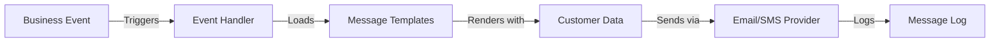
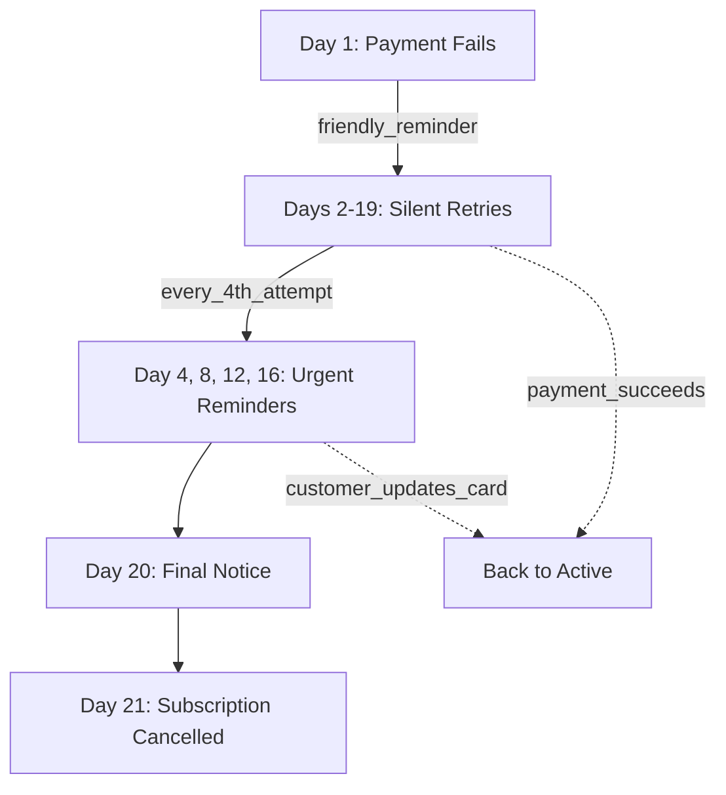
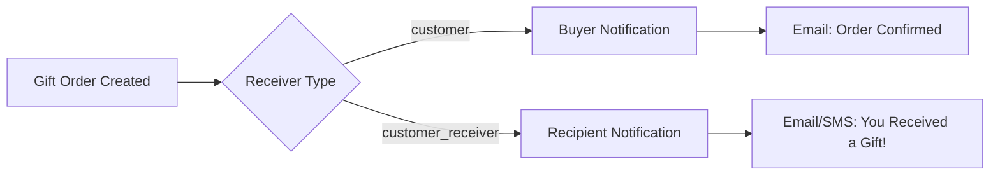

## What are Communications?

**Communications** in Journey are event-driven messages automatically sent to customers at key moments in their journey. Journey's system supports multi-channel delivery (email, SMS), dynamic template rendering, and intelligent dunning sequences—all managed through a simple event-based API.

<Info>
**Key Innovation:** Journey's communication system automatically enriches messages with contextual data (customer, order, subscription) and supports separate messaging for gift recipients, making complex notification flows simple to implement.
</Info>

## The Event-Driven Model

Journey's communications work through a trigger-based system:

<Steps>
<Step title="Events = Triggers">
Moments in the customer journey (payment succeeds, delivery scheduled, payment fails)
</Step>

<Step title="Messages = Templates">
Define what gets sent using Django template syntax with access to customer and order data
</Step>

<Step title="Providers = Delivery">
Email (Postmark) and SMS (Twilio/Nova) handle actual message delivery
</Step>

<Step title="Logs = Audit Trail">
Complete history of every communication with provider responses
</Step>
</Steps>

### Communication Flow



## Built-in Events

Journey includes pre-configured events for common scenarios:

| Event | Trigger Point | Channel | Purpose |
|-------|--------------|---------|---------|
| `subscription_payment_authorized` | Payment succeeds | Email | Welcome new subscribers |
| `oneoff_payment_authorized` | One-time purchase | Email | Order confirmation |
| `delivery_complete` | Driver marks delivered | Email/SMS | Delivery confirmation |
| `driver_starts_route` | Driver begins route | SMS | Pre-delivery notification |
| `inform_future_event` | Scheduled (cron) | Email/SMS | Delivery reminders |
| `past_due_first_time` | First payment failure | Email | Friendly dunning notice |
| `still_on_error_every_fourth` | Every 4 retry attempts | Email | Urgent payment reminder |
| `subscription_expired` | Max retries reached | Email | Cancellation notice |
| `invoice_sent_automatically` | Payment settles | Email | PDF invoice delivery |

<Info>
Events can be triggered programmatically via the `event_handler()` function or run automatically on a schedule via cron jobs.
</Info>

## Message Templates

### Template Structure

Messages define the content sent when an event triggers:

```typescript
{
  id: string;
  event_id: string;
  provider: 'email' | 'sms';
  subject?: string;           // Email only
  content: string;            // HTML (email) or plain text (SMS)
  content_text: string;       // Plain text version (email)
  receiver: 'customer' | 'customer_receiver';
}
```

### Template Variables

Templates have access to contextual data using Django template syntax:

<AccordionGroup>
  <Accordion title="Customer Data" icon="user">
    ```django
    {{ customer_object.full_name }}
    {{ customer_object.email }}
    {{ customer_object.phone_number }}
    {{ customer_object.address }}
    {{ customer_object.postal_code }}
    {{ customer_object.city }}
    ```
  </Accordion>

  <Accordion title="Order & Delivery" icon="box">
    ```django
    {{ order_object.id }}
    {{ product_variation_object.name }}
    {{ delivery_object.delivery_date|date:"F j, Y" }}
    {{ delivery_option_object.name }}
    ```
  </Accordion>

  <Accordion title="Subscription" icon="repeat">
    ```django
    {{ subscription_object.id }}
    {{ subscription_object.subscription_status }}
    ```
  </Accordion>

  <Accordion title="Merchant Branding" icon="store">
    ```django
    {{ merchant_object.name }}
    {{ merchant_object.from_email }}
    {{ merchant_object.reply_to_email }}
    ```
  </Accordion>

  <Accordion title="Special Variables" icon="sparkles">
    ```django
    {{ login_code }}              // 6-digit auth code
    {{ magic_url }}               // One-click login link
    {{ delivery_window_start }}   // Estimated time window
    {{ delivery_window_end }}
    {{ greeting_card_text }}      // Gift message
    ```
  </Accordion>
</AccordionGroup>

### Example: Order Confirmation Email

```django
Subject: Your {{ product_variation_object.name }} is on the way!

Hi {{ customer_object.full_name }},

Great news! Your order #{{ order_object.id }} is confirmed and will be
delivered on {{ delivery_object.delivery_date|date:"l, F j" }}.

Delivery address:
{{ customer_receiver_object.address }}
{{ customer_receiver_object.postal_code }} {{ customer_receiver_object.city }}

Track your order: https://{{ merchant_object.name }}.com/orders/{{ order_object.id }}

Questions? Reply to this email or contact {{ merchant_object.reply_to_email }}.

Best,
The {{ merchant_object.name }} Team
```

### Example: Delivery Reminder SMS

```django
Hi {{ customer_object.full_name }}! Your {{ merchant_object.name }} delivery
arrives {{ delivery_object.delivery_date|date:"M j" }}.
Track: {{ merchant_object.name }}.com/me
```

<Tip>
**SMS Best Practices:** Keep messages under 160 characters, include merchant name, add tracking link if relevant, and use concise language.
</Tip>

## Delivery Channels

### Email via Postmark

Journey uses Postmark for enterprise-grade email delivery:

**Features:**
- HTML and plain text versions
- Open tracking and click tracking
- BCC to merchant email
- PDF attachments (invoices)
- Bounce and spam handling
- Delivery webhooks

**Configuration:**

```python
{
  "name": "email",
  "name_of_provider": "Postmark",
  "token": "your-postmark-server-token"
}
```

**Email capabilities:**
```python
{
  "TrackOpens": True,
  "Bcc": "orders@yourstore.com",
  "MessageStream": "outbound",
  "Attachments": [...]  // PDF invoices
}
```

### SMS via Twilio or Nova

Send SMS notifications via Twilio (international) or Nova (Iceland-specific).

**Twilio Configuration:**

```python
{
  "name": "sms",
  "name_of_provider": "Twilio",
  "token": "your-twilio-auth-token"
}
```

**Nova Configuration:**

```python
{
  "name": "sms",
  "name_of_provider": "Nova",
  "token": "your-nova-api-token"
}
```

**Phone formatting:**
- Twilio: International format (+1, +44, +354)
- Nova: Automatically adds +354 for Iceland

<Warning>
Always validate phone numbers before sending SMS. Invalid numbers will fail silently with provider errors logged in `message_log`.
</Warning>

## Triggering Events

### From Your Application

Trigger events programmatically when key moments happen:

```python
from apps.communication.views import event_handler, EventHandles

# After successful payment
event_handler(
    context={
        'customer_object': customer,
        'subscription_object': subscription,
        'order_object': order,
        'merchant_object': merchant,
        'delivery_object': delivery
    },
    event_handle=EventHandles.SUBSCRIPTION_PAYMENT_SUCCESSFULLY_AUTHORIZED
)
```

### With Automatic Context Enrichment

Pass a `delivery_object` to automatically populate context:

```python
event_handler(
    context={},  # Auto-populated from delivery
    event_handle='delivery_complete',
    delivery_object=delivery,
    merchant_object=merchant
)
```

**Automatically adds:**
- `customer_object`
- `customer_receiver_object` (for gifts)
- `product_variation_object`
- `subscription_object`
- `delivery_object`

<Info>
Context enrichment saves you from manually passing common variables, reducing boilerplate code and preventing errors.
</Info>

### Scheduled Events (Cron)

Events with `meta.type = 'time_and_filter'` run automatically:

```json
{
  "name": "Delivery Reminder - 2 Days Ahead",
  "handle": "inform_future_event",
  "active": true,
  "meta": {
    "type": "time_and_filter",
    "days_ahead": 2,
    "hour_of_day": 9,
    "paid": false
  }
}
```

**Cron job:**
```bash
# Runs hourly
python manage.py inform_future_event
```

**Process:**
1. Finds events with scheduling config
2. Checks if current hour matches `hour_of_day`
3. Finds deliveries `days_ahead` days out
4. Sends notifications to qualifying customers

## Dunning (Payment Failures)

Journey includes intelligent dunning that automatically manages payment failure communications.

### Dunning Flow



### Dunning Events

<AccordionGroup>
  <Accordion title="past_due_first_time" icon="circle-exclamation">
    **Trigger:** First payment failure (Day 1)

    **Tone:** Friendly and informative

    **Message:**
    ```
    Subject: Quick heads up about your subscription

    We tried to process your payment but it didn't go through.
    No worries - this happens sometimes!

    We'll automatically retry tomorrow. If your card needs updating,
    you can do that here: [link]
    ```
  </Accordion>

  <Accordion title="still_on_error_every_fourth" icon="triangle-exclamation">
    **Trigger:** Every 4th retry attempt (Days 4, 8, 12, 16)

    **Tone:** More urgent with each iteration

    **Message (Day 8):**
    ```
    Subject: Action needed: Payment still pending

    We've tried several times to process your subscription payment.

    Please update your payment method to avoid service interruption:
    [link]

    Questions? Reply to this email.
    ```
  </Accordion>

  <Accordion title="error_first_time" icon="xmark">
    **Trigger:** Max retries reached (Day 20)

    **Tone:** Final warning, clear consequences

    **Message:**
    ```
    Subject: Final notice: Subscription will be cancelled

    After 20 attempts, we haven't been able to process your payment.

    Your subscription will be cancelled in 24 hours unless you
    update your payment details: [link]

    We'd love to keep you as a customer!
    ```
  </Accordion>

  <Accordion title="subscription_expired" icon="ban">
    **Trigger:** Subscription cancelled (Day 21)

    **Tone:** Professional, offer to reactivate

    **Message:**
    ```
    Subject: Subscription cancelled

    Your subscription has been cancelled due to payment failure.

    To reactivate, simply update your payment method and
    restart your subscription: [link]

    We hope to see you again soon!
    ```
  </Accordion>
</AccordionGroup>

### Dunning Configuration

Configure per merchant:

```json
{
  "dunning_settling_attempts": 20,        // Max retries
  "failed_payment_cancelled_days": 20     // Days until cancel
}
```

<Info>
Customers can update payment methods during the dunning period. The next retry automatically uses the new card, recovering the subscription.
</Info>

## Gift Orders

When customers send gifts, Journey can notify both the buyer and recipient separately.

### How It Works



### Receiver Types

Specify who receives each message:

```json
{
  "receiver": "customer"           // Person who placed order
}

{
  "receiver": "customer_receiver"  // Delivery recipient
}
```

### Example: Gift Notifications

<Tabs>
  <Tab title="To Buyer">
    ```django
    Subject: Your gift order is confirmed

    Hi {{ customer_object.full_name }},

    Your gift order for {{ customer_receiver_object.full_name }}
    is confirmed!

    Delivery date: {{ delivery_object.delivery_date|date:"F j, Y" }}
    Delivery to: {{ customer_receiver_object.address }}

    We'll notify them on the delivery day.
    ```
  </Tab>

  <Tab title="To Recipient">
    ```django
    Subject: You received a gift!

    Hi {{ customer_receiver_object.full_name }},

    Someone special sent you a gift!

    {{ product_variation_object.name }} will be delivered on
    {{ delivery_object.delivery_date|date:"F j, Y" }}.

    
    Message from sender:
    "{{ greeting_card_text }}"
    

    Enjoy!
    ```
  </Tab>
</Tabs>

<Warning>
When `customer_receiver_object` equals `customer_object` (self-gift), Journey automatically sends only one message to avoid duplicate notifications.
</Warning>

## Invoice Delivery

Automatically email PDF invoices after successful payments.

### Invoice Flow

<Steps>
<Step title="Enable for Customer">
```python
customer.auto_send_invoices = True
customer.save()
```
</Step>

<Step title="Payment Settles">
System detects successful payment
</Step>

<Step title="Generate PDF">
```python
pdf_bytes = generate_invoice_pdf(
    payment_id=payment.id,
    tenant_schema=connection.schema_name
)
```

**PDF generation endpoint:**
```
GET /me/pdf-invoice/{payment_id}
Host: {tenant}.yourdomain.com
X-Secret: {database_password}
```
</Step>

<Step title="Attach to Email">
```python
pdf_attachment = {
    'filename': f"invoice-{payment_id}.pdf",
    'content': pdf_bytes,
    'mimetype': 'application/pdf'
}
```
</Step>

<Step title="Send via Event Handler">
```python
event_handler(
    context={'pdf_attachment': pdf_attachment},
    event_handle=EventHandles.INVOICE_SENT_AUTOMATICALLY,
    delivery_object=delivery
)
```
</Step>
</Steps>

<Info>
Invoice emails include both HTML summary and PDF attachment, giving customers choice of format for accounting/record-keeping.
</Info>

## Message Logs

Every communication is logged with complete details for debugging and analytics.

### Log Structure

```typescript
{
  id: string;
  phone_number?: string;        // For SMS
  email?: string;               // For email
  customer_id: string;
  content: string;              // What was sent
  response: string;             // Provider response
  status: 'sent' | 'failed';
  event_handle: string;         // Which event triggered it
  created: timestamp;
}
```

### Querying Logs

```python
# Find all messages to a customer
logs = message_log.objects.filter(
    customer_id=customer
).order_by('-created')

# Failed messages in last 24 hours
failed = message_log.objects.filter(
    status='failed',
    created__gte=timezone.now() - timedelta(days=1)
)

# Count by event type
stats = message_log.objects.values('event_handle').annotate(
    count=Count('id')
)
```

### Provider Responses

<Tabs>
  <Tab title="Postmark Success">
    ```json
    {
      "MessageID": "b7bc2f4a-e38e-4336-af7d-e6c392c2f817",
      "To": "customer@example.com",
      "SubmittedAt": "2025-10-15T12:00:00Z",
      "ErrorCode": 0
    }
    ```
  </Tab>

  <Tab title="Postmark Error">
    ```json
    {
      "ErrorCode": 300,
      "Message": "Invalid email address"
    }
    ```
  </Tab>

  <Tab title="Twilio Success">
    ```json
    {
      "sid": "SM1234567890abcdef",
      "status": "queued",
      "to": "+3547771234"
    }
    ```
  </Tab>
</Tabs>

## Multi-Tenant Support

Journey's communication system is fully multi-tenant aware.

### Tenant Isolation

Each merchant has:
- Isolated event configurations
- Separate message templates
- Independent provider credentials
- Private message logs

```python
# Communications run in tenant context
with schema_context(tenant.schema_name):
    event_handler(...)
```

### Per-Tenant Configuration

<CodeGroup>

```python Merchant A
{
  "name": "Store A",
  "from_email": "hello@storea.com",
  "reply_to_email": "support@storea.com",
  "bcc_email": "orders@storea.com",
  "email_provider": postmark_provider_a,
  "sms_provider": twilio,
  "dunning_settling_attempts": 20
}
```

```python Merchant B
{
  "name": "Store B",
  "from_email": "hi@storeb.com",
  "reply_to_email": "help@storeb.com",
  "bcc_email": "admin@storeb.com",
  "email_provider": postmark_provider_b,
  "sms_provider": nova,
  "dunning_settling_attempts": 15
}
```

</CodeGroup>

### Automated Processing

```python
# Cron jobs process all tenants
for tenant in Tenant.objects.all():
    with tenant_context(tenant):
        process_scheduled_events()
```

## Testing

### Test Mode

When `TESTING=True`, communications use local providers:

```python
# Email → MailHog (localhost:1025)
# SMS → Console output
# All → Logged to message_log
```

### MailHog Setup

View test emails at `http://localhost:8025`

```bash
# Start with Docker Compose
docker compose up mailhog
```

### Testing Events

```python
# Set event to inactive for testing
event.active = False
event.save()

# Trigger manually
event_handler(
    context={'customer_object': test_customer},
    event_handle='test_event'
)

# Check message_log for results
logs = message_log.objects.filter(
    event_handle='test_event'
).latest('created')
```

<Tip>
Use inactive events to test message rendering without actually sending communications to customers.
</Tip>

## Best Practices

<AccordionGroup>
  <Accordion title="Always Provide Plain Text Versions" icon="file-lines">
    Email clients like Gmail may strip HTML or display it poorly. Always include a `content_text` version for accessibility and deliverability.
  </Accordion>

  <Accordion title="Use Template Variables Consistently" icon="brackets-curly">
    Don't hardcode customer data. Use `{{ customer_object.full_name }}` instead of "John" to ensure personalization works across all customers.
  </Accordion>

  <Accordion title="Keep SMS Under 160 Characters" icon="mobile">
    Messages over 160 characters split into multiple SMS, increasing costs. Use abbreviations and short URLs.
  </Accordion>

  <Accordion title="Monitor Failed Messages" icon="triangle-exclamation">
    Set up alerts for failed message rates above 5%. High failure rates indicate provider issues or invalid contact data.
  </Accordion>

  <Accordion title="Respect Frequency Limits" icon="clock">
    Don't over-communicate. Recommended maximums: transactional messages per transaction, delivery reminders 1-2 per delivery, marketing 1-2 per week.
  </Accordion>

  <Accordion title="Include Unsubscribe for Marketing" icon="ban">
    For promotional messages, include clear unsubscribe links to comply with email regulations (CAN-SPAM, GDPR).
  </Accordion>

  <Accordion title="Test Across Email Clients" icon="envelope">
    Test templates in Gmail, Outlook, Apple Mail, and mobile clients to ensure consistent rendering.
  </Accordion>

  <Accordion title="Use Meaningful Event Handles" icon="tag">
    Name events clearly: `delivery_reminder_2d` is better than `event_123`. This aids debugging and maintenance.
  </Accordion>
</AccordionGroup>

## API Reference

### Event Handler Function

```python
event_handler(
    context: dict,                    # Template variables
    event_handle: str = None,         # Event identifier
    delivery_object: Delivery = None, # Auto-populates context
    merchant_object: Merchant = None, # Merchant config
    schema_name: str = None,          # Multi-tenant schema
    event_object: Event = None        # Direct event reference
)
```

**Parameters:**
- `context` - Dictionary of variables available to templates
- `event_handle` - String identifier from `EventHandles` enum
- `delivery_object` - Optional delivery for automatic context enrichment
- `merchant_object` - Merchant configuration (auto-detected if not provided)
- `schema_name` - Tenant schema (auto-detected if not provided)
- `event_object` - Alternative to `event_handle` for direct reference

**Returns:** `HttpResponse` with provider response

**Example:**
```python
from apps.communication.views import event_handler

event_handler(
    context={
        'customer_object': customer,
        'custom_message': 'Welcome aboard!'
    },
    event_handle='welcome_email'
)
```

### EventHandles Enum

```python
class EventHandles:
    # Authentication
    USER_REQUESTS_LOGIN_CODE
    USER_REQUESTS_LOGIN_CODE_EMAIL

    # Payments
    SUBSCRIPTION_PAYMENT_SUCCESSFULLY_AUTHORIZED
    ONEOFF_PAYMENT_SUCCESSFULLY_AUTHORIZED
    INVOICE_SENT_AUTOMATICALLY

    # Delivery
    DELIVERY_COMPLETE_THROUGH_ROUTE_PLANNER
    DRIVER_STARTS_A_ROUTE
    INFORM_FUTURE_EVENT

    # Dunning
    SUBSCRIPTION_STATUS_SET_TO_PAST_DUE_FOR_THE_FIRST_TIME
    SUBSCRIPTION_STATUS_SET_TO_ERROR_FOR_THE_FIRST_TIME
    SUBSCRIPTION_STATUS_SET_TO_EXPIRED
    SUBSCRIPTION_STATUS_STILL_ON_ERROR_EVERY_FOURTH_TIME
```

## Common Use Cases

### Passwordless Authentication

```python
# SMS login code
context = {
    'login_code': '123456',
    'customer_object': customer,
    'merchant_object': merchant
}
event_handler(context, EventHandles.USER_REQUESTS_LOGIN_CODE)
```

### Subscription Welcome Email

```python
# After successful payment
event_handler(
    context={
        'customer_object': customer,
        'subscription_object': subscription,
        'product_variation_object': product,
        'merchant_object': merchant
    },
    event_handle=EventHandles.SUBSCRIPTION_PAYMENT_SUCCESSFULLY_AUTHORIZED
)
```

### Delivery Tracking Updates

```python
# Driver en route notification
event_handler(
    context={
        'driver_name': driver.name,
        'delivery_window_start': '14:00',
        'delivery_window_end': '16:00'
    },
    event_handle='driver_starts_route',
    delivery_object=delivery
)
```

### Payment Failure Recovery

```python
# Automatic dunning email
event_handler(
    context={},  # Auto-populated from delivery
    event_handle=EventHandles.SUBSCRIPTION_STATUS_SET_TO_PAST_DUE_FOR_THE_FIRST_TIME,
    delivery_object=delivery,
    merchant_object=merchant
)
```

## API Endpoints

<CardGroup cols={3}>
  <Card title="List Events" icon="list" href="/api/communication/events/list">
    Get all events
  </Card>
  <Card title="Create Event" icon="plus" href="/api/communication/events/create">
    Create new event
  </Card>
  <Card title="Get Event" icon="eye" href="/api/communication/events/get">
    Retrieve details
  </Card>
  <Card title="List Messages" icon="envelope" href="/api/communication/messages/list">
    Get templates
  </Card>
  <Card title="Create Message" icon="pen" href="/api/communication/messages/create">
    Create template
  </Card>
  <Card title="Message Logs" icon="clock-rotate-left" href="/api/communication/logs">
    View send history
  </Card>
</CardGroup>

## Related Concepts

<CardGroup cols={2}>
  <Card
    title="Subscriptions"
    icon="repeat"
    href="/concepts/subscriptions"
  >
    Understand subscription lifecycle and automated billing that triggers communications
  </Card>
  <Card
    title="Billing & Dunning"
    icon="credit-card"
    href="/concepts/billing-dunning"
  >
    Learn about payment retry logic and dunning communication sequences
  </Card>
  <Card
    title="Delivery & Fulfillment"
    icon="truck"
    href="/concepts/delivery-fulfillment"
  >
    Explore delivery events that trigger customer notifications
  </Card>
  <Card
    title="Multi-Tenancy"
    icon="building"
    href="/concepts/multi-tenancy"
  >
    Understand tenant isolation and per-merchant communication configuration
  </Card>
</CardGroup>
