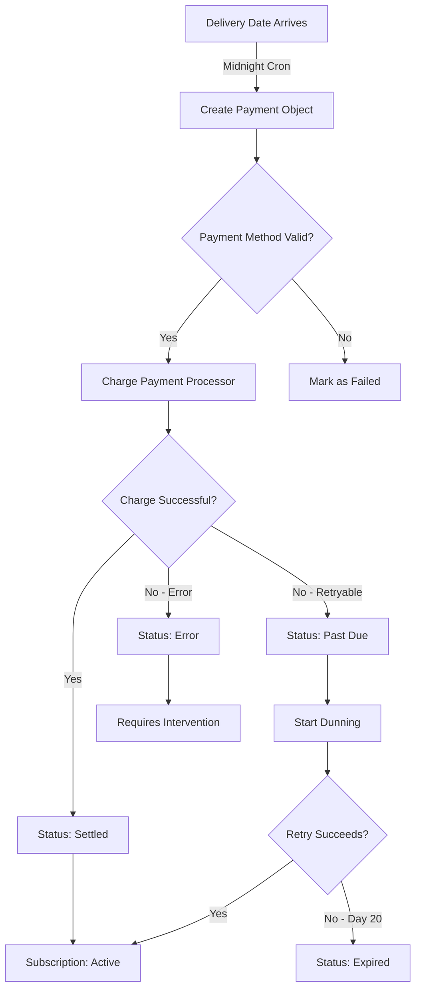
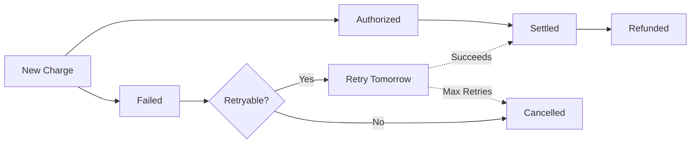

## What are Recurring Payments?

**Recurring Payments** in Journey are automated billing transactions that execute on defined schedules without manual intervention. Journey's system handles everything from payment method storage to retry logic, enabling businesses to run subscription models with minimal operational overhead.

<Info>
**Key Innovation:** Journey's recurring payment engine supports multi-frequency billing within a single subscription, automatic dunning management, and seamless switching between payment processors (Straumur, Reepay, Rapyd) without code changes.
</Info>

## How Recurring Payments Work

Journey's billing system operates on a delivery-centric model where payments are tied to delivery dates:

<Steps>
<Step title="Subscription Created">
Customer signs up with payment method verification
</Step>

<Step title="Orders Generated">
System creates orders from subscription recipe based on item frequencies
</Step>

<Step title="Deliveries Scheduled">
Each order gets a delivery date (which is also the charge date)
</Step>

<Step title="Automated Charging">
On delivery date, system automatically charges the customer's payment method
</Step>

<Step title="Status Updates">
Payment status updates subscription state (active, past_due, error, expired)
</Step>

<Step title="Dunning Management">
Failed payments trigger automatic retry sequences with customer notifications
</Step>
</Steps>

### Payment Flow Diagram



## Payment States

Payments progress through clearly defined states:



### Status Definitions

<AccordionGroup>
  <Accordion title="New Charge" icon="plus">
    Payment object created but not yet attempted. Occurs when delivery date arrives and system creates initial payment record.

    **Next Step:** Immediate charge attempt via payment processor
  </Accordion>

  <Accordion title="Authorized" icon="lock">
    Payment method has been authorized (pre-authorized) but funds not yet captured. Common with Reepay and some Rapyd flows.

    **Next Step:** Capture funds when delivery ships
  </Accordion>

  <Accordion title="Settled" icon="circle-check">
    Money successfully captured and transferred. This is the successful end state.

    **Effect:** Subscription remains/returns to active status
  </Accordion>

  <Accordion title="Failed" icon="circle-xmark">
    Payment attempt was declined by payment processor or bank.

    **Triggers:**
    - Insufficient funds (past_due)
    - Expired card (error)
    - Invalid card (error)
    - Technical issues (error)

    **Next Step:** Automatic retry based on error classification
  </Accordion>

  <Accordion title="Cancelled" icon="ban">
    Payment was cancelled due to:
    - Max retry attempts exceeded (20 days default)
    - Delivery cancelled before charge
    - Merchant manually cancelled

    **Final State:** No further processing
  </Accordion>

  <Accordion title="Refunded" icon="rotate-left">
    Previously settled payment has been refunded to customer.

    **Triggers:**
    - Customer return
    - Merchant error
    - Service cancellation

    **Process:** Full or partial refund via payment processor API
  </Accordion>

  <Accordion title="Uncapturable" icon="hourglass-end">
    Authorization has expired before capture (typically 7 days for card authorizations).

    **Resolution:** New authorization required
  </Accordion>
</AccordionGroup>

## Multi-Frequency Billing

Journey uniquely supports different billing frequencies for items within a single subscription.

### How It Works

**Traditional Systems:**
```
All items share one frequency
❌ Customer must create separate subscriptions for different schedules
❌ Higher operational complexity
❌ More payment transactions = more fees
```

**Journey's Approach:**
```
Each item has its own frequency
✅ Single subscription for all items
✅ Intelligent delivery synchronization
✅ Fewer transactions through batching
```

### Example: Grocery Subscription

```json
{
  "subscription_id": 789,
  "order_items": [
    {
      "product": "Fresh Milk",
      "frequency": "every_7_days",
      "next_charge": "2025-11-01"
    },
    {
      "product": "Eggs",
      "frequency": "every_14_days",
      "next_charge": "2025-11-08"
    },
    {
      "product": "Coffee Beans",
      "frequency": "every_30_days",
      "next_charge": "2025-11-15"
    }
  ]
}
```

**Billing Schedule:**
- **Nov 1:** Charge for Milk only
- **Nov 8:** Charge for Milk + Eggs (synchronized)
- **Nov 15:** Charge for Milk + Coffee (synchronized)
- **Nov 22:** Charge for Milk + Eggs (synchronized)

<Info>
Journey's 5-day synchronization window automatically batches items, reducing payment processing fees by up to 60% compared to separate charges.
</Info>

## Payment Processors

Journey supports multiple payment processors with unified API:

| Processor | Region | Features | Use Case |
|-----------|--------|----------|----------|
| **Straumur** | Iceland | Local cards, low fees | Icelandic merchants |
| **Reepay** | Europe | SEPA, cards, subscriptions | European expansion |
| **Rapyd** | Global | 900+ payment methods | International markets |

### Processor Configuration

<Tabs>
  <Tab title="Straumur">
    ```json
    {
      "name": "Straumur",
      "merchant_id": "your_merchant_id",
      "terminal_identifier_gateway": "your_terminal_id",
      "terminal_identifier_pos": "your_pos_terminal_id",
      "shared_secret": "your_secret",
      "payment_page_url": "https://test.straumur.is/payment/"
    }
    ```

    **Capabilities:**
    - Icelandic debit/credit cards
    - Token-based recurring payments
    - Pre-authorization and capture
    - Refunds and voids
  </Tab>

  <Tab title="Reepay">
    ```json
    {
      "name": "Reepay",
      "private_key": "priv_...",
      "webhook_secret": "whsec_..."
    }
    ```

    **Capabilities:**
    - European cards (SEPA region)
    - Native subscription management
    - Dunning built-in
    - Webhook notifications
  </Tab>

  <Tab title="Rapyd">
    ```json
    {
      "name": "Rapyd",
      "access_key": "your_access_key",
      "secret_key": "your_secret_key"
    }
    ```

    **Capabilities:**
    - 900+ payment methods globally
    - Virtual card numbers
    - Multi-currency support
    - Compliance tools
  </Tab>
</Tabs>

### Processor Selection

Journey automatically selects the processor based on:
1. **Customer location** - Straumur for Iceland, Reepay for Europe
2. **Subscription configuration** - Processor assigned at subscription level
3. **Fallback hierarchy** - Merchant default if not specified

```python
# Processor priority
if subscription.payment_processor_id:
    use_processor = subscription.payment_processor_id
elif customer.preferred_processor:
    use_processor = customer.preferred_processor
else:
    use_processor = merchant.default_payment_processor_id
```

<Warning>
Once a subscription starts with a processor, changing processors mid-cycle requires customer re-verification and may interrupt service.
</Warning>

## Automated Billing Cron

Journey runs daily billing automation at midnight:

```bash
python manage.py payment_for_delivery
```

### Cron Job Workflow

<Steps>
<Step title="Process New Deliveries">
Find deliveries whose `delivery_date` matches today:

```python
deliveries = delivery.objects.filter(
    delivery_date__date=today,
    cancelled=False,
    order_id__payment_id__isnull=True
)

for delivery_item in deliveries:
    create_payment_and_charge(delivery_item)
```

**Result:** New charges processed for today's deliveries
</Step>

<Step title="Capture Authorized Payments">
Find payments in `authorized` state ready for capture:

```python
authorized_payments = payment.objects.filter(
    payment_status=PaymentStatus.AUTHORIZED,
    delivery__delivery_date__date=today
)

for payment in authorized_payments:
    capture_payment(payment)
```

**Result:** Pre-authorized payments captured
</Step>

<Step title="Retry Failed Payments">
Process past_due subscriptions within retry window:

```python
failed_payments = payment.objects.filter(
    payment_status=PaymentStatus.FAILED,
    subscription__subscription_status=SubscriptionStatusChoices.PAST_DUE,
    settling_attempts__lt=20  # Max retry limit
)

for payment in failed_payments:
    if not already_retried_today(payment):
        retry_payment(payment)
```

**Result:** Daily retry attempts for recoverable failures
</Step>

<Step title="Cancel Old Failed Payments">
Cancel payments that have exceeded retry window:

```python
old_failures = payment.objects.filter(
    payment_status=PaymentStatus.FAILED,
    created__lt=today - timedelta(days=20)
)

for payment in old_failures:
    cancel_payment_and_expire_subscription(payment)
```

**Result:** Expired subscriptions and cancelled deliveries
</Step>

<Step title="Send Dunning Communications">
Trigger customer notifications based on payment status:

```python
# First failure
if payment.settling_attempts == 1:
    send_past_due_email()

# Every 4th attempt
if payment.settling_attempts % 4 == 0:
    send_urgent_reminder()

# Final notice
if payment.settling_attempts == 20:
    send_final_notice()
```

**Result:** Automated customer communication
</Step>
</Steps>

### Cron Configuration

**Recommended Schedule:**
```cron
0 0 * * * python manage.py payment_for_delivery
```

**Monitoring:**
```bash
# Check last run
tail -f /var/log/cron.log

# Monitor Sentry for errors
# Alerts configured for:
# - Payment processor failures
# - High retry rates
# - Authorization declines
```

## Payment Retry Logic

Journey implements intelligent retry logic based on error classification.

### Error Classification

| Error Type | Example Codes | Classification | Retry Strategy |
|------------|--------------|----------------|----------------|
| Insufficient Funds | `51`, `insufficient_funds` | PAST_DUE | Daily retry × 20 |
| Card Declined | `05`, `card_declined` | PAST_DUE | Daily retry × 20 |
| Do Not Honor | `04`, `do_not_honor` | PAST_DUE | Daily retry × 20 |
| Expired Card | `54`, `expired_card` | ERROR | No retry (update required) |
| Invalid Card | `14`, `invalid_card_number` | ERROR | No retry (update required) |
| Fraud Suspected | `fraud_detected` | ERROR | No retry (verification required) |
| Gateway Error | `500`, `timeout` | ERROR | No retry (technical issue) |

### Retry Schedule

<Tabs>
  <Tab title="PAST_DUE (Retryable)">
    ```
    Day 1:  Attempt 1 → Failed
            Status: past_due
            Action: Send friendly reminder

    Day 2:  Attempt 2 → Failed
            Action: Silent retry

    Day 3:  Attempt 3 → Failed
            Action: Silent retry

    Day 4:  Attempt 4 → Failed
            Action: Send urgent reminder (4th attempt)

    Days 5-7: Silent retries

    Day 8:  Attempt 8 → Failed
            Action: Send urgent reminder (8th attempt)

    Days 9-11: Silent retries

    Day 12: Attempt 12 → Failed
            Action: Send urgent reminder (12th attempt)

    Days 13-15: Silent retries

    Day 16: Attempt 16 → Failed
            Action: Send urgent reminder (16th attempt)

    Days 17-19: Silent retries

    Day 20: Attempt 20 → Failed (FINAL)
            Status: error
            Action: Send final notice

    Day 21: No retry
            Status: expired
            Action: Cancel subscription
    ```
  </Tab>

  <Tab title="ERROR (Requires Action)">
    ```
    Day 1:  Attempt 1 → Failed (expired card)
            Status: error
            Action: Send immediate notification
                   "Please update payment method"

    Day 2+: No automatic retries
            Status: remains error
            Action: Customer must update card

    When customer updates:
            System: Automatically use new card
            Next scheduled: Normal billing resumes
    ```
  </Tab>
</Tabs>

<Info>
Customers can update payment methods at any time during the retry period. The next retry automatically uses the new card without manual intervention.
</Info>

### Retry Prevention

Journey prevents multiple retries per day:

```python
def check_payment_attempt_already_happened_today(payment):
    """Ensures one retry per 24 hours"""
    is_before_8am = timezone.now().hour < 8

    if is_before_8am:
        return True  # Skip early morning

    last_attempt_date = payment.last_attempt.date()
    today = timezone.now().date()

    if last_attempt_date == today:
        return True  # Already tried today

    return False  # OK to retry
```

## Payment Method Management

### Adding Payment Methods

<Steps>
<Step title="Create Checkout Session">
```bash
POST /api/v1/straumur/create-session-add-card/
{
  "customer_id": 42,
  "return_url": "https://yourstore.com/payment-success"
}
```

**Response:**
```json
{
  "checkoutUrl": "https://checkout.straumur.is/...",
  "session_id": "sess_abc123"
}
```
</Step>

<Step title="Redirect Customer">
Redirect customer to `checkoutUrl` for card entry and verification.
</Step>

<Step title="Webhook Callback">
Journey receives webhook when verification completes:

```json
{
  "event": "payment_method.verified",
  "payment_method_id": "pm_xyz789",
  "card_last_four": "4242",
  "card_type": "visa",
  "expiry": "12/2027"
}
```
</Step>

<Step title="Set as Primary">
```python
payment_method = PaymentMethod.objects.get(id="pm_xyz789")
payment_method.status = "active"
payment_method.save()

customer.primary_payment_method = payment_method
customer.save()
```

**Result:** Next billing cycle uses new card
</Step>
</Steps>

### Updating During Dunning

**Scenario:** Payment fails, customer updates card while in retry period.

**Journey's Behavior:**
1. Customer adds new payment method
2. New card becomes `primary_payment_method`
3. Next retry (could be hours later) uses new card automatically
4. If successful, subscription returns to `active` immediately
5. No missed deliveries or service interruption

```python
# Next billing attempt
latest_payment_method = customer.primary_payment_method
response = charge(
    payment_method=latest_payment_method,  # New card used automatically
    amount=calculate_total(order)
)

if response.success:
    subscription.subscription_status = "active"  # Recovered!
```

<Tip>
This seamless recovery is a key feature - customers can fix payment issues without contacting support or missing deliveries.
</Tip>

## Refunds and Adjustments

### Full Refund

```python
# Refund entire payment
refund_response = refund_payment(
    payment_object=payment,
    amount=None  # None = full refund
)

if refund_response['success']:
    payment.payment_status = PaymentStatus.REFUNDED
    payment.save()
```

### Partial Refund

```python
# Refund specific amount (e.g., damaged item)
refund_response = refund_payment(
    payment_object=payment,
    amount=1500  # 1500 ISK
)

payment.refund_amount = 1500
payment.save()
```

### Refund Timeline

<Steps>
<Step title="Refund Requested">
Merchant initiates refund via admin or API
</Step>

<Step title="Processor API Call">
Journey calls payment processor refund endpoint
</Step>

<Step title="Bank Processing">
**Timeframes:**
- Straumur: 3-5 business days
- Reepay: 5-7 business days
- Rapyd: Varies by country (3-10 days)
</Step>

<Step title="Customer Sees Credit">
Refund appears on customer's bank statement
</Step>
</Steps>

<Warning>
Refunds cannot be reversed once processed. Always confirm amount and reason before executing.
</Warning>

## Invoice Generation

Journey automatically generates invoices for every successful payment.

### Invoice Data Model

```json
{
  "payment_id": "pay_123",
  "invoice_number": "INV-2025-001234",
  "customer": {
    "name": "Jón Jónsson",
    "address": "Laugavegur 1, 101 Reykjavík"
  },
  "line_items": [
    {
      "description": "Fresh Milk × 2",
      "unit_price": 500,
      "quantity": 2,
      "total": 1000
    },
    {
      "description": "Delivery Fee",
      "unit_price": 500,
      "quantity": 1,
      "total": 500
    }
  ],
  "subtotal": 1500,
  "tax": 360,
  "total": 1860,
  "payment_method": "Visa •••• 4242",
  "payment_date": "2025-11-01T12:34:56Z"
}
```

### Auto-Send Invoices

Enable automatic invoice delivery per customer:

```python
customer.auto_send_invoices = True
customer.save()

# After payment settles
if customer.auto_send_invoices:
    send_invoice_email(payment)
```

**Email includes:**
- PDF attachment
- HTML summary in email body
- Payment confirmation
- Next billing date

## Stock Management Integration

Journey integrates payment status with stock management:

### Stock Lifecycle

<Steps>
<Step title="Order Created">
```python
# Check availability
availability = check_stock_availability_for_order(order)
if not availability['all_available']:
    return JsonResponse({"error": "Out of stock"})
```
</Step>

<Step title="Payment Authorized">
```python
# Reserve stock when payment authorized
if payment.payment_status == PaymentStatus.AUTHORIZED:
    reserve_stock_for_order(order)
```
</Step>

<Step title="Payment Settled">
```python
# Fulfill order (reduce stock permanently)
if payment.payment_status == PaymentStatus.SETTLED:
    fulfill_order(order)
```
</Step>

<Step title="Payment Failed">
```python
# Unreserve stock for failed payments
if payment.payment_status in [PaymentStatus.FAILED, PaymentStatus.CANCELLED]:
    unreserve_stock_for_order(order)
```
</Step>
</Steps>

<Info>
This integration ensures inventory accuracy and prevents overselling during payment processing delays.
</Info>

## Security & Compliance

### PCI DSS Compliance

Journey never stores raw card data:

**Secure Flow:**
```
Customer enters card
    ↓
Directly to processor (Straumur/Reepay/Rapyd)
    ↓
Processor returns token
    ↓
Journey stores token only
    ↓
Token used for charges
```

**Journey stores:**
- ✅ Payment method tokens
- ✅ Last 4 digits
- ✅ Card type (Visa, Mastercard)
- ✅ Expiry date

**Journey never stores:**
- ❌ Full card numbers
- ❌ CVV codes
- ❌ PIN numbers

### 3D Secure Support

All processors support 3D Secure authentication:

```json
{
  "requires_3ds": true,
  "redirect_url": "https://secure.bank.com/verify",
  "challenge_required": true
}
```

**Flow:**
1. Customer initiates payment
2. Bank requires 3DS challenge
3. Customer redirected to bank verification
4. After verification, return to Journey
5. Payment completes

### Data Protection

**Encryption:**
- All API calls use TLS 1.3
- Database fields encrypted at rest
- Payment tokens encrypted with AES-256

**Access Control:**
- Multi-tenant data isolation
- Role-based permissions
- Audit logging for all payment actions

## Best Practices

<AccordionGroup>
  <Accordion title="Always Verify Payment Methods" icon="shield-check">
    Before activating subscriptions, verify payment methods through processor checkout flows. This reduces first-payment failures by 80%.
  </Accordion>

  <Accordion title="Set Appropriate Retry Limits" icon="repeat">
    Default 20 attempts works for most businesses. Reduce to 10-15 for high-value subscriptions to limit exposure. Increase to 25-30 for low-value, high-retention products.
  </Accordion>

  <Accordion title="Monitor Payment Failure Rates" icon="chart-line">
    Healthy businesses see 5-10% payment failure rates. Above 15% indicates issues:
    - Expired cards not updated
    - Pricing too aggressive
    - Poor dunning communication
  </Accordion>

  <Accordion title="Offer Self-Service Updates" icon="user-gear">
    Enable customers to update payment methods without support contact. This recovers 40% of failed payments within 48 hours.
  </Accordion>

  <Accordion title="Communicate Before Charging" icon="bell">
    Send delivery reminders 1-2 days before charging. This gives customers time to update cards and reduces "unexpected charge" disputes by 60%.
  </Accordion>

  <Accordion title="Use Multi-Frequency Strategically" icon="calendar-days">
    Batch items with similar frequencies (weekly, bi-weekly, monthly) to optimize transaction fees while maintaining flexibility.
  </Accordion>

  <Accordion title="Implement Grace Periods" icon="clock">
    For delivered-but-unpaid scenarios, continue retry attempts beyond normal limits since customer received goods. This protects revenue while maintaining goodwill.
  </Accordion>

  <Accordion title="Track Processor Performance" icon="gauge">
    Monitor success rates by processor. Straumur: 92%+, Reepay: 88%+, Rapyd: 85%+ are healthy benchmarks. Switch processors if consistently below.
  </Accordion>
</AccordionGroup>

## Troubleshooting

### High Decline Rates

**Symptoms:**
- >15% of payments failing
- Many "insufficient funds" errors
- High churn rate

**Solutions:**
1. **Optimize billing dates** - Align with paydays (1st, 15th of month)
2. **Pre-charge notifications** - Remind customers 24-48 hours ahead
3. **Retry timing** - Try early morning (better success rates)
4. **Payment method diversity** - Accept multiple payment types

### Stuck Authorizations

**Symptoms:**
- Payments remain "authorized" for days
- Customers see pending charges
- Revenue not captured

**Solutions:**
1. **Check auto-capture settings**
2. **Manual capture** - `POST /api/v1/payment/{id}/capture`
3. **Monitor authorization expiry** - Capture within 7 days
4. **Enable auto-capture** - In processor settings

### Webhook Failures

**Symptoms:**
- Payment status not updating
- Missing refund confirmations
- Delayed subscription status changes

**Solutions:**
1. **Verify webhook URLs** - Check processor dashboard
2. **Test webhook endpoint** - `POST /webhooks/straumur/test`
3. **Check webhook secrets** - Ensure correct verification
4. **Review logs** - `/var/log/webhooks.log`

## API Reference

<CardGroup cols={3}>
  <Card title="Create Payment" icon="plus" href="/api/payments/create">
    Create new payment
  </Card>
  <Card title="Get Payment" icon="eye" href="/api/payments/get">
    Retrieve details
  </Card>
  <Card title="Charge Payment" icon="credit-card" href="/api/payments/charge">
    Execute charge
  </Card>
  <Card title="Capture Authorization" icon="lock-open" href="/api/payments/capture">
    Capture pre-auth
  </Card>
  <Card title="Refund Payment" icon="rotate-left" href="/api/payments/refund">
    Process refund
  </Card>
  <Card title="Payment History" icon="clock-rotate-left" href="/api/payments/history">
    View transaction log
  </Card>
  <Card title="Add Payment Method" icon="wallet" href="/api/payment-methods/add">
    Add customer card
  </Card>
  <Card title="Update Primary Method" icon="star" href="/api/payment-methods/set-primary">
    Change default card
  </Card>
  <Card title="Delete Payment Method" icon="trash" href="/api/payment-methods/delete">
    Remove card
  </Card>
</CardGroup>

## Related Concepts

<CardGroup cols={2}>
  <Card
    title="Subscriptions"
    icon="repeat"
    href="/concepts/subscriptions"
  >
    Understand subscription lifecycle and how payments integrate with recurring orders
  </Card>
  <Card
    title="Dunning Management"
    icon="triangle-exclamation"
    href="/concepts/dunning"
  >
    Deep dive into payment failure recovery and customer retention strategies
  </Card>
  <Card
    title="Communications"
    icon="envelope"
    href="/concepts/communication"
  >
    Learn how payment events trigger automated customer notifications
  </Card>
  <Card
    title="Reports & Analytics"
    icon="chart-bar"
    href="/concepts/reports"
  >
    Track payment performance, revenue metrics, and failure analysis
  </Card>
</CardGroup>
