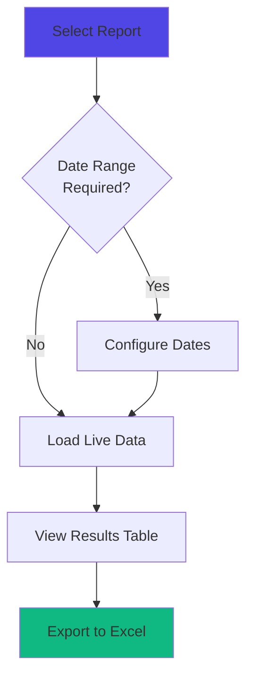
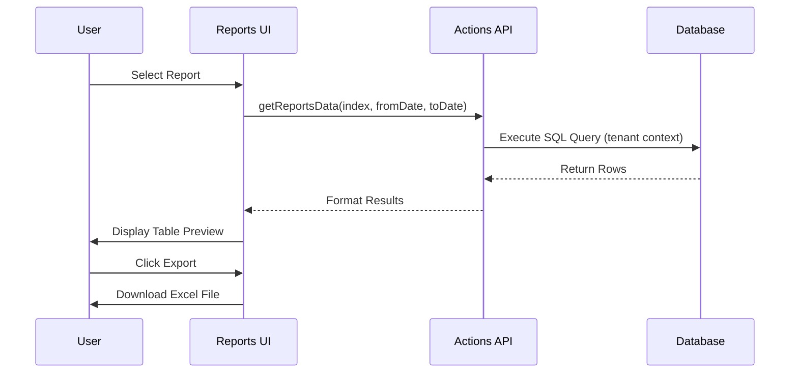

## Overview

Journey's reporting system transforms raw transactional data into actionable business insights. The platform includes 8 pre-built reports covering critical business metrics, with the ability to create custom reports using simple SQL queries.

<Info>
All reports are multi-tenant aware and automatically filtered to your merchant's data. Export any report to Excel for further analysis.
</Info>

## Why Reports Matter

Reports provide the data-driven insights needed to:

- **Optimize revenue**: Identify high-value customer segments and products
- **Reduce churn**: Track dunning subscriptions and payment failures before they become cancellations
- **Improve operations**: Monitor delivery performance and fulfillment efficiency
- **Recover revenue**: Reach out to abandoned cart customers with targeted campaigns
- **Forecast growth**: Analyze subscription signup trends and customer lifetime value


## Pre-Built Reports

Journey includes 8 production-ready reports that cover the most common business intelligence needs.

<AccordionGroup>
<Accordion title="Abandoned Cart">

Track potential customers who started but didn't complete their subscription signup.

**Use Cases:**
- Email marketing campaigns to recover lost sales
- Identify friction points in checkout flow
- A/B test recovery messaging strategies

**Includes:**
- Customer name and email
- Product they were interested in
- Date of abandonment (configurable date range)

**Business Impact:** Typical abandoned cart recovery campaigns achieve 10-15% conversion rates, directly recovering lost revenue.

</Accordion>

<Accordion title="Delivery Date Changes">

Monitor when customers reschedule their deliveries and understand demand patterns.

**Use Cases:**
- Identify delivery timing preferences
- Optimize delivery route planning
- Detect seasonal demand shifts

**Includes:**
- Original vs. new delivery date
- Customer details
- Date when change was made (configurable date range)

**Business Impact:** Understanding delivery date change patterns helps optimize inventory management and reduce fulfillment costs.

</Accordion>

<Accordion title="Dunning Subscriptions">

Real-time view of subscriptions with payment failures, sorted by retry attempts.

**Use Cases:**
- Proactive customer outreach before cancellation
- Payment method update campaigns
- Revenue recovery prioritization

**Includes:**
- Subscription status (past_due or error)
- Number of settling attempts
- Customer contact information
- Subscription ID for quick lookup

**Business Impact:** Early intervention on dunning subscriptions can recover 60-70% of at-risk revenue.

<Tip>
This report is always live (no date filtering) to show current at-risk subscriptions. Sort by "Settling attempts" to prioritize customers closest to expiration.
</Tip>

</Accordion>

<Accordion title="Paused Subscriptions">

Find valuable customers who paused their subscriptions after making successful payments.

**Use Cases:**
- Win-back campaigns targeting engaged customers
- Identify pause reasons through customer interviews
- Re-engagement email sequences

**Includes:**
- Customer details
- Count of successful payments before pause
- Current subscription status (on_hold or cancelled)

**Business Impact:** Customers with payment history are 3x more likely to reactivate than new signups, making them high-value targets.

</Accordion>

<Accordion title="Paid Orders">

Complete transaction history with product-level detail.

**Use Cases:**
- Revenue reporting and reconciliation
- Product performance analysis
- Customer purchase behavior tracking

**Includes:**
- Customer information
- Product variations purchased
- Order date and item count
- Configurable date range filtering

**Business Impact:** Essential for financial reporting, tax compliance, and understanding which products drive revenue.

</Accordion>

<Accordion title="Payments Export">

Detailed payment data with line items, VAT breakdown, and customer information.

**Use Cases:**
- Accounting system integration
- Tax reporting and compliance
- Revenue recognition
- Financial audits

**Includes:**
- Payment ID and status
- Customer details including SSN (for tax reporting)
- Line item details with quantities and amounts
- VAT totals by rate
- Created and last attempt timestamps

**Business Impact:** Streamlines financial operations and ensures tax compliance with detailed VAT breakdowns.

</Accordion>

<Accordion title="Subscription Customers and Statuses">

Complete customer subscription overview with product details.

**Use Cases:**
- Customer success outreach prioritization
- Product mix analysis per customer
- Subscription health monitoring

**Includes:**
- Customer contact details
- All subscription order items
- Current subscription status
- Subscription ID for quick access

**Business Impact:** Helps customer success teams prioritize high-value customers and identify upsell opportunities.

</Accordion>

<Accordion title="Subscription Statuses per Product">

Product-level subscription health metrics.

**Use Cases:**
- Product performance benchmarking
- Inventory planning by subscription status
- Identify products with high churn rates

**Includes:**
- Product and product variation names
- Subscription counts by status (active, past_due, expired, on_hold, error, cancelled)
- Grouped by product for easy comparison

**Business Impact:** Identifies which products retain customers best and which need improvement.

</Accordion>
</AccordionGroup>

## Report Interface

The reporting dashboard provides an intuitive interface for exploring your business data.

### Interactive Features

<Steps>
<Step title="Select a Report">
Click any report from the accordion list on the left sidebar. The report automatically loads with live data from your database.
</Step>

<Step title="Configure Date Range">
For time-based reports, use the date range picker to filter results:
- **Last 7 days**: Quick view of recent activity
- **Last 30 days**: Monthly performance
- **Last 90 days**: Quarterly trends
- **Custom range**: Any date range for specific analysis
</Step>

<Step title="Review Results">
Results display in a sortable table showing the first 5 rows. The total row count appears at the bottom.
</Step>

<Step title="Export to Excel">
Click the "Download Excel" button to export the complete dataset (not just the preview rows) for deeper analysis in Excel, Google Sheets, or your BI tool.
</Step>
</Steps>

### Data Visualization



<Info>
All reports show a live preview of your data. The table displays the first 5 rows, but Excel exports include all matching records.
</Info>

## Dashboard Analytics

Beyond custom reports, Journey provides real-time analytics on the dashboard overview page:

### Key Metrics

<Tabs>
<Tab title="Subscription Health">

**Active Subscriptions Count**
- Total number of subscriptions with `status='active'`
- Real-time count from your subscription table

**Average Deliveries per Subscription**
- Calculated across all subscription-based orders
- Indicates customer retention and lifetime value

**Average Lifetime Value (LTV)**
- Total settled payment value divided by active subscriptions
- Critical metric for customer acquisition cost (CAC) optimization

</Tab>

<Tab title="Delivery Metrics">

**Successful Deliveries by Product**
- Breakdown of subscription vs. one-off deliveries
- Filterable by date range
- Grouped by product and variation

**Deliveries per Day/Week**
- Time-series visualization of delivery volume
- Helps identify operational capacity needs
- Supports route planning optimization

</Tab>

<Tab title="Signup Analytics">

**New Subscription Signups**
- Daily/weekly/monthly signup counts (auto-adjusts based on date range)
- Product-level breakdown showing which products drive growth
- Excludes incomplete subscriptions

**Daily Signup Chart**
- Visual trend line of subscription growth
- Automatically switches between daily, weekly, or monthly buckets based on date range selected

</Tab>

<Tab title="Activity Tracking">

**Recent Customer Activity**
- New customer signups
- Delivery date changes
- Subscription status changes (pause, resume, cancel)
- Subscription frequency modifications

**Production Events** (for relevant merchants)
- Filling events for tracked products
- Tank changes and capacity monitoring
- Weight tracking per filling

</Tab>
</Tabs>

<Warning>
Dashboard metrics are calculated in real-time from your database. For large date ranges (90+ days), some queries may take a few seconds to load.
</Warning>

## Creating Custom Reports

Adding a new report to Journey requires minimal code and can be done in minutes.

### How Easy It Is

Journey's reporting system is built on a simple, declarative architecture. Each report is defined by:

1. **Title** - Display name for the report
2. **Date Range Toggle** - Whether to show date picker (true/false)
3. **SQL Query** - A single SQL query that returns the data

<Steps>
<Step title="Define Your Report">

Add a new object to the `reports` array in `apps/me/app/dashboard/(main)/overview/actions.ts`:

```typescript
{
  title: "Your Report Name" as const,
  dateRangePicker: true, // or false
  sql: (fromDate: Date, toDate: Date) => sql`
    SELECT
      column1,
      column2,
      COUNT(*) as count
    FROM your_table
    WHERE created_at >= ${fromDate}
    AND created_at < (${toDate}::date + INTERVAL '1 day')
    GROUP BY column1, column2
    ORDER BY count DESC
  `
}
```

</Step>

<Step title="Add Translations (Optional)">

Add display names and descriptions in the translation files:

```typescript
// In Reports.tsx
const titleI18nLut = {
  // ... existing reports
  "Your Report Name": t("your-report-name"),
}

const descriptionI18nLut = {
  // ... existing reports
  "Your Report Name": t("your-report-description"),
}
```

</Step>

<Step title="Test and Deploy">

The report automatically appears in the reports sidebar. Click it to test:
- Verify SQL query returns expected columns
- Test date range filtering (if enabled)
- Export to Excel to confirm data export works

</Step>
</Steps>

### Best Practices for Custom Reports

<AccordionGroup>
<Accordion title="Query Performance">

**Use Indexes:**
- Ensure frequently queried columns have database indexes
- Pay special attention to date columns used in WHERE clauses

**Limit Results:**
- Consider adding `LIMIT` clauses for very large datasets
- The UI shows first 5 rows, but Excel exports all rows

**Aggregate When Possible:**
- Use `GROUP BY` and aggregation functions (COUNT, SUM, AVG)
- Reduces result set size and improves readability

</Accordion>

<Accordion title="Multi-Tenant Awareness">

All reports automatically execute within the merchant's tenant context. You don't need to manually filter by `merchant_id`.

**Automatic Tenant Isolation:**
```typescript
// Journey automatically handles this
// You write:
SELECT * FROM order_subscription WHERE subscription_status = 'active'

// Behind the scenes, queries execute within tenant schema
// Result: Only your merchant's data is returned
```

**Cross-Schema Queries:**
If you need to query across tenants (superuser reports only), use the statistics endpoint instead of the reports system.

</Accordion>

<Accordion title="Data Privacy">

**Customer PII:**
- Be mindful of including sensitive data (SSN, payment details)
- Consider access controls for reports containing PII
- Use reports for internal business analysis only

**Export Security:**
- Excel exports contain full datasets
- Educate users about secure file handling
- Consider implementing audit logs for report access

</Accordion>
</AccordionGroup>

### Example: Custom Report

Let's create a report showing "High-Value Customers" (customers with 5+ successful payments):

```typescript
{
  title: "High-Value Customers" as const,
  dateRangePicker: false,
  sql: (fromDate: Date, toDate: Date) => sql`
    SELECT
      c.full_name AS "Customer Name",
      c.email AS "Email",
      COUNT(DISTINCT p.id) AS "Successful Payments",
      SUM(
        (line_items->>'amount')::numeric
      ) AS "Total Revenue",
      MAX(p.created) AS "Last Payment Date"
    FROM order_customer c
    JOIN order_order o ON o.customer_id_id = c.id
    JOIN order_payment p ON p.order_id_id = o.id
    WHERE p.payment_status = 'settled'
    GROUP BY c.id, c.full_name, c.email
    HAVING COUNT(DISTINCT p.id) >= 5
    ORDER BY "Total Revenue" DESC
  `
}
```

This report:
- ✅ Uses clear column aliases with proper casing
- ✅ Aggregates data to reduce result size
- ✅ Sorts by most important metric (revenue)
- ✅ Filters for business-relevant threshold (5+ payments)
- ✅ Doesn't need date range (analyzing all-time data)

## Technical Architecture

<Tabs>
<Tab title="Data Flow">



</Tab>

<Tab title="Tech Stack">

**Frontend:**
- **React Query**: Data fetching and caching
- **Tremor UI**: Date range picker component
- **Radix UI**: Accordion navigation
- **Excel.js**: Client-side Excel generation

**Backend:**
- **SQL Template Tags**: Parameterized query construction
- **Multi-Tenant Context**: Automatic schema isolation
- **Drizzle ORM**: Type-safe database queries

**Query Execution:**
```typescript
// Type-safe query with automatic tenant isolation
const result = await query<ReportData>(
  sql`SELECT * FROM order_subscription WHERE ...`
)
```

</Tab>

<Tab title="Performance">

**Caching Strategy:**
- Report metadata (`getReportsOverview`) cached indefinitely
- Report data (`getReportsData`) cached per report + date range
- React Query automatically deduplicates concurrent requests

**Query Optimization:**
- All date columns indexed for fast filtering
- Aggregate queries use database-level grouping
- Large datasets stream to Excel without memory overflow

**Scalability:**
- Queries execute per tenant (smaller datasets)
- No cross-tenant joins (maintains performance)
- Date range limits prevent unbounded queries

</Tab>
</Tabs>

## Analytics Snapshots

Journey includes a scheduled job that captures daily snapshots of key metrics for historical trend analysis.

<Info>
**Automated Tracking:** The `take_analytics_snapshot` command runs daily via cron to record:
- Subscription status distribution (active, past_due, on_hold)
- Total customer count
- Stored in `statistic_timestampevent` table
</Info>

### Snapshot Data

**Subscription Status Snapshots:**
```json
{
  "title": "subscription_status_snapshot",
  "data": [
    {"subscription_status": "active", "count": 1247},
    {"subscription_status": "past_due", "count": 89},
    {"subscription_status": "on_hold", "count": 45}
  ]
}
```

**Customer Count Snapshots:**
```json
{
  "title": "customer_count",
  "data": 3542
}
```

### Using Snapshots in Reports

Snapshots enable trend analysis over time. Example query:

```sql
SELECT
  s.timestamp as date,
  s.entry->>'subscription_status' as status,
  s.entry->>'count' as count
FROM (
  SELECT t.timestamp, jsonb_array_elements(t.data) as entry
  FROM statistic_timestampevent t
  WHERE t.title = 'subscription_status_snapshot'
) as s
WHERE s.entry->>'subscription_status' IN ('active', 'past_due', 'on_hold')
  AND s.timestamp >= '2024-01-01'
ORDER BY s.timestamp
```

## Multi-Tenant Statistics

For superusers managing multiple merchants, Journey provides a cross-tenant statistics view.

<Warning>
**Superuser Access Required:** This view is restricted to superusers and shows aggregated metrics across all tenants.
</Warning>

### Statistics Dashboard

Access at `/admin/stats/` to view:

**Per-Tenant Metrics:**
- Active subscriptions count
- Total subscriptions (all statuses)
- Total deliveries (all time)
- Deliveries this week vs. last week
- Deliveries this month vs. last month
- Deliveries this year vs. last year
- Percentage change calculations

**Aggregate Metrics:**
- "Total" row showing sum across all tenants
- Delta calculations for growth tracking

### Implementation

```python
# apps/statistic/views.py
def stats_per_tenant(tenant):
    with tenant_context(tenant):
        active_subscriptions = subscription.objects.filter(
            subscription_status='active'
        ).count()

        # Weekly deliveries
        start_this_week, end_this_week = get_start_end_of_week(today)
        deliveries_this_week = delivery.objects.filter(
            delivery_date__date__range=[start_this_week, end_this_week]
        ).count()

        # ... more metrics

    return {
        'active_subscriptions': active_subscriptions,
        'deliveries_this_week': deliveries_this_week,
        # ... more data
    }
```

## Best Practices

<AccordionGroup>
<Accordion title="Report Usage">

**For Merchants:**
- Review dunning report weekly to recover at-risk revenue
- Export payment data monthly for accounting reconciliation
- Track abandoned carts weekly for marketing campaigns
- Monitor delivery changes to optimize fulfillment

**For Developers:**
- Keep SQL queries focused and performant
- Use meaningful column aliases for exported Excel files
- Test reports with large date ranges before deploying
- Document business logic in SQL comments

</Accordion>

<Accordion title="Data Accuracy">

**Query Construction:**
- Always use parameterized queries (SQL template tags)
- Handle NULL values explicitly in aggregations
- Use proper date truncation for time-series data
- Test edge cases (empty results, single row, millions of rows)

**Date Handling:**
- Use `(toDate::date + INTERVAL '1 day')` for inclusive date ranges
- Always filter on indexed timestamp columns
- Consider timezone implications for global merchants

</Accordion>

<Accordion title="User Experience">

**Report Design:**
- Limit columns to essential information (10-15 max)
- Sort results by most actionable metric (revenue, attempt count, etc.)
- Use clear column names that make sense in Excel exports
- Provide descriptions explaining report purpose and use cases

**Performance:**
- Target <2 second query execution time
- Show loading states for long-running queries
- Consider pagination for reports with 10,000+ rows
- Cache results when data doesn't change frequently

</Accordion>
</AccordionGroup>

## Troubleshooting

<AccordionGroup>
<Accordion title="Report Not Loading">

**Symptoms:** Report shows loading state indefinitely

**Solutions:**
1. Check browser console for JavaScript errors
2. Verify SQL query syntax is correct
3. Test query directly in database with tenant context
4. Check for missing indexes on filtered columns
5. Verify date range parameters are valid

</Accordion>

<Accordion title="Empty Results">

**Symptoms:** Report loads but shows "No data found"

**Solutions:**
1. Verify data exists in database for selected date range
2. Check tenant context is correct (not querying wrong merchant)
3. Review WHERE clause conditions (too restrictive?)
4. Test query without date filters to isolate issue
5. Confirm report is configured for correct dateRangePicker setting

</Accordion>

<Accordion title="Export Fails">

**Symptoms:** Excel download button doesn't work or file is corrupted

**Solutions:**
1. Check browser console for download errors
2. Verify report data contains no invalid characters
3. Test with smaller date range (large datasets may timeout)
4. Ensure `downloadExcel` utility handles all data types in results
5. Check for NULL values or special characters in string columns

</Accordion>

<Accordion title="Slow Query Performance">

**Symptoms:** Report takes >10 seconds to load

**Solutions:**
1. Add database indexes on filtered/joined columns
2. Review query execution plan (`EXPLAIN ANALYZE`)
3. Consider pre-aggregating data in materialized view
4. Reduce date range to smaller time windows
5. Add LIMIT clause if full dataset isn't needed

</Accordion>
</AccordionGroup>

## Related Concepts

<CardGroup cols={2}>
<Card title="Communication System" icon="envelope" href="/concepts/communication">
Learn how reports integrate with automated customer notifications
</Card>

<Card title="Recurring Payments" icon="credit-card" href="/concepts/recurring-payments">
Understand the payment data that powers financial reports
</Card>

<Card title="Dunning" icon="bell" href="/concepts/dunning">
Deep dive into the dunning report and payment recovery strategies
</Card>

<Card title="Subscriptions" icon="repeat" href="/concepts/subscriptions">
Explore subscription statuses and lifecycle management
</Card>
</CardGroup>

