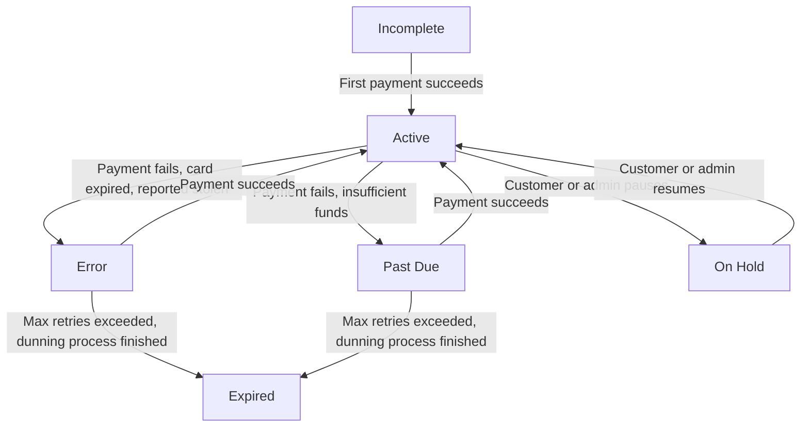

## What is a Subscription?

A **subscription** in Journey is a recipe-based recurring billing container that automatically generates orders and processes payments based on defined frequencies. Unlike traditional subscription systems, Journey supports different billing frequencies for each item within a single subscription.

<Info>
  **Key Innovation:** Journey's multi-frequency system allows items like "milk weekly, eggs bi-weekly, and coffee monthly" to coexist in one subscription, with intelligent delivery synchronization to minimize shipping costs.
</Info>

## The Recipe Model

Journey's subscription system works like a recipe:

<Steps>
  <Step title="Subscription = Container">
    Holds customer information, delivery preferences, and payment processor configuration
  </Step>
  <Step title="Subscription Order Items = Recipe">
    Defines what products to deliver and how often (the "ingredients")
  </Step>
  <Step title="Orders = Execution">
    Created automatically from the recipe on each billing cycle
  </Step>
  <Step title="Deliveries = Charging Events">
    Represent when the order will be delivered AND charged (dual purpose)
  </Step>
  <Step title="Payments = Financial Tracking">
    Track the transaction status for each order
  </Step>
</Steps>

### Example: Multi-Frequency Subscription

```json
{
  "subscription_id": 789,
  "customer_id": 42,
  "subscription_status": "active",
  "order_items": [
    {
      "product_variation_id": 5,  // Milk
      "quantity": 2,
      "subscription_frequency_id": 1  // Every 7 days (weekly)
    },
    {
      "product_variation_id": 8,  // Eggs
      "quantity": 1,
      "subscription_frequency_id": 2  // Every 14 days (bi-weekly)
    },
    {
      "product_variation_id": 12, // Coffee
      "quantity": 1,
      "subscription_frequency_id": 3  // Every 30 days (monthly)
    }
  ]
}
```

## Subscription States

### Status Definitions

<AccordionGroup>
  <Accordion title="Incomplete" icon="circle-pause">
    Customer information and subscription created but missing payment information. No charges attempted until payment method is added.
  </Accordion>
  <Accordion title="Active" icon="circle-check">
    The subscription is processing normally. Orders are created and payments are charged according to each item's billing frequency. This is the healthy state.
  </Accordion>
  <Accordion title="Past Due" icon="circle-exclamation">
    A recent payment failed with a retryable error (insufficient funds, card declined). The dunning process has started and will retry daily.

    **Trigger:** Payment declined with error codes like `insufficient_funds`, `card_declined`
  </Accordion>
  <Accordion title="Error" icon="circle-xmark">
    Payment failed with a card-related error (expired card, invalid card, fraud detection). Journey retries daily to settle payment but the error requires manual intervention or customer action, such as update payment method.

    **Trigger:** Technical payment errors or card issues
  </Accordion>
  <Accordion title="On Hold" icon="pause">
    The subscription is  paused by customer or merchant. No new orders or charges occur. Can be resumed (on my pages and/or Journey admin) at any time without losing configuration. We encourage merchants to use on hold if the customer requests to stop subcription.

    **Use Cases:** Vacation, temporary or permanent financial hardship, seasonal or permanent pause.
  </Accordion>
  <Accordion title="Expired" icon="ban">
    The subscription has been automatically put to status expired after extended payment failure (exceeding `failed_payment_cancelled_days`, default 20 days). All pending deliveries are cancelled and the past due process has finished.

    **Final State:** Cannot be reactivated except with manual intervention by admin
  </Accordion>
</AccordionGroup>

Subscriptions progress through clearly defined states with automatic or manually triggered (on my pages) transitions:



## Subscription Frequencies

Each subscription item can have its own billing frequency:

| Frequency   | Description    | Interval  | Common Use Cases           |
| ----------- | -------------- | --------- | -------------------------- |
| Weekly      | Every 7 days   | 7 days    | Fresh groceries, meal kits |
| Bi-weekly   | Every 14 days  | 14 days   | Household supplies         |
| Monthly     | Every 30 days  | 1 month   | Insurance premiums, SaaS   |
| Bi-monthly  | Every 60 days  | 60 days   | Quarterly-lite products    |
| Quarterly   | Every 90 days  | 3 months  | Seasonal items, insurance  |
| Semi-Annual | Every 180 days | 6 months  | Long-term services         |
| Annual      | Every 365 days | 12 months | Annual memberships         |

<Info>
  Each business can customize which frequency options are available for their subscriptions. This allows you to offer only the delivery schedules that make sense for your business model.
</Info>

### How Delivery Dates Are Calculated

The system automatically calculates when each item should be delivered next, based on its frequency. This calculation is more sophisticated than it might seem, especially for monthly deliveries.

**Examples:**

| Frequency     | How It Works                                                                                                           |
| ------------- | ---------------------------------------------------------------------------------------------------------------------- |
| **Weekly**    | Each delivery is exactly 7 days after the previous one                                                                 |
| **Monthly**   | Delivered on the same date each month (e.g., always on the 15th), accounting for months with different numbers of days |
| **Quarterly** | Delivered every 3 months on the same day of the month                                                                  |

For instance, if a customer's monthly delivery is on the 31st and one month only has 30 days, the system intelligently handles this edge case. This accuracy is critical for building customer trust and ensuring consistent, predictable billing.

This ensures that subscriptions created on Jan. 31 will be billed on Feb. 28 (not March 3).

## Delivery Synchronization Algorithm

### The Problem

With multi-frequency subscriptions, you could end up with many small, inefficient deliveries:

- **Monday:** Milk only (weekly)
- **Tuesday:** Eggs only (bi-weekly)
- **Friday:** Coffee only (monthly)

**Result:** High shipping costs, poor customer experience, increased carbon footprint.

If this is something that the merchant wants to avoid, they can turn on the join-by-week feature.

### The Join-by-Week Algorithm

Journey automatically merges deliveries that are **within 5 days** of each other into a single shipment.

#### How It Works

<Steps>
  <Step title="Calculate Next Date for Each Item">
    For each product in the subscription, Journey calculates when it's next due based on its frequency:

    ```
    Milk (weekly):    Last delivered Oct 1 → Next: Oct 8
    Eggs (bi-weekly): Last delivered Oct 1 → Next: Oct 15
    Coffee (monthly): Last delivered Sep 1 → Next: Oct 1
    ```
  </Step>
  <Step title="Find Earliest Date">
    Which item is due first is identified:

    ```
    Earliest: Oct 1 (Coffee)
    ```
  </Step>
  <Step title="Check 5-Day Window">
    We check which other items are due within 5 days of the earliest date:

    ```
    Coffee:  0 days away → Include ✅
    Milk:    7 days away → Don't include (outside window)
    Eggs:    14 days away → Don't include
    ```

    **Result:** Ship only Coffee on Oct 1
  </Step>
  <Step title="Repeat for Next Batch">
    On Oct 8, the process is repeated:

    ```
    Milk:    0 days away → Include ✅
    Eggs:    7 days away → Don't include (but getting close!)
    Coffee:  Already fulfilled
    ```

    **Result:** Only milk is shipped on Oct 8

    On Oct 15:

    ```
    Eggs:    0 days away → Include ✅
    Milk:    Already fulfilled (next due Oct 15)
    ```

    Wait! Milk is also due Oct 15. Both within window:

    ```
    Eggs:    0 days away → Include ✅
    Milk:    0 days away → Include ✅
    ```

    **Result:** Milk + Eggs are shipped together on Oct 15
  </Step>
</Steps>

### Weekday Alignment

If you are shipping physical deliveries, all deliveries can be aligned to postal code delivery schedules with cutoff days for packing:

**Example: Postal Code 101 (Reykjavík)**

```json
{
  "postal_code": "101",
  "weekday_delivery": [2, 4],  // Wednesday (2), Friday (4)
  "cutoff_days": 3  // 3 days for packing
}
```

If the algorithm calculates delivery for **Monday**, it's automatically shifted to **Wednesday** (next available delivery day for postal code 101).

**Calculation:**

```
Calculated date: Monday, Oct 8
+ 3 days cutoff: Thursday, Oct 11
Next allowed weekday: Friday, Oct 12
Final delivery date: Friday, Oct 12
```

## Subscription Data Model

### Core Fields

```json
{
  "id": 789,
  "customer_id": 42,
  "customer_receiver_id": null,  // For gift subscriptions
  "subscription_status": "active",
  "delivery_option_id": 3,
  "delivery_option_location_json": {},  // Dropp locations, etc.
  "delivery_custom_data": {},
  "payment_processor_id": 1,
  "created": "2025-10-09T14:30:00Z"
}
```

### Subscription Order Items (Recipe)

```json
{
  "order_items": [
    {
      "id": 101,
      "subscription_id": 789,
      "product_variation_id": 5,
      "quantity": 2,
      "subscription_frequency_id": 1
    }
  ]
}
```

### Generated Orders

When the system processes the subscription, it creates orders from the recipe:

```json
{
  "id": 456,
  "subscription_id": 789,
  "customer_id": 42,
  "date_time": "2025-11-01T00:00:00Z",
  "fullfills_subscription_until": "2025-11-08T00:00:00Z",
  "subscription_data": {
    // Snapshot of recipe at time of order creation
  },
  "order_items": [
    {
      "product_variation_id": 5,
      "quantity": 2
    }
  ]
}
```

## Automated Processing

### Daily Billing Process

The system runs a completely automated billing process every day to handle subscription payments. This ensures that recurring revenue is processed consistently without manual intervention, giving your team more time to focus on customer relationships and growth.

<Steps>
  <Step title="Process Scheduled Deliveries">
    The system identifies all subscriptions with deliveries scheduled for today and automatically charges the customer's payment method.
  </Step>
  <Step title="Recover Failed Payments">
    If a payment fails, the system automatically retries the charge. This recovery process (called dunning) helps maximize revenue by giving customers multiple opportunities to update their payment information before their subscription is interrupted.
  </Step>
  <Step title="Monitor Subscription Health">
    Subscriptions that encounter payment issues are flagged as "at-risk" so your team can proactively reach out to customers before their service is disrupted. Automatic messages (email and SMS) can be configured that get sent to these customers. These messages can e.g. navigate customers to their my pages where they can update their payment information.
  </Step>
  <Step title="Enforce Payment Deadlines">
    After a configurable grace period (default: 20 days), unpaid subscriptions are automatically cancelled. This protects your business from unlimited payment failures while giving customers a fair window to resolve billing issues.
  </Step>
  <Step title="Complete Digital Fulfillment">
    For digital products and automated fulfillment integrations, deliveries are automatically marked as complete when no manual action is required.
  </Step>
</Steps>

### Key Business Outcomes

When a payment is processed, the system automatically updates the subscription status based on the result. Successful charges keep the subscription active and the customer's service flowing uninterrupted. Failed charges transition the subscription to a "past due" state, triggering your retention workflows and giving you time to recover the revenue. This automated cycle ensures predictable recurring revenue while minimizing churn from payment failures.

## Dunning Management

Journey automatically handles failed payments with configurable retry logic.

### Configuration (Per Merchant)

The merchant can configure how many times a payment is attempted.

<Warning>
  Skoða Janus
</Warning>

```json
{
  "dunning_settling_attempts": 20,  // Max retry count (1 per day)
  "failed_payment_cancelled_days": 20  // Days before cancellation
}
```

### Dunning Timeline

<Steps>
  <Step title="Day 1: Payment Fails">
    ```
    Subscription: active → past_due
    Payment: settled → failed
    settling_attempts: 0 → 1
    Event: Triggers SMS or Email reminder
    SMS/Email: "Your payment failed, will retry tomorrow" - Your custom text
    ```
  </Step>
  <Step title="Days 2-19: Daily Retries">
    ```
    Each day at midnight:
    - Check: settling_attempts < 20?
    - If yes: Retry payment
      - Success: past_due → active ✅
      - Fail: settling_attempts += 1, try again tomorrow
    ```

    **Customer can update payment method during this period** - next retry uses new card automatically.
  </Step>
  <Step title="Day 20: Final Attempt">
    ```
    settling_attempts: 19 → 20
    If still fails:
    - Subscription: past_due → error
    - Event: SUBSCRIPTION_STATUS_SET_TO_ERROR_FOR_THE_FIRST_TIME
    - Email: "Final attempt failed, please update payment method"
    ```
  </Step>
  <Step title="Day 21: Cancellation">
    ```
    Time since first failure > failed_payment_cancelled_days (20):
    - Payment: failed → cancelled
    - Delivery: cancelled = true
    - Subscription: error → expired
    - Event: SUBSCRIPTION_STATUS_SET_TO_EXPIRED
    - Email: "Subscription cancelled due to payment failure"
    ```
  </Step>
</Steps>

### Error Code Classification

Journey categorizes payment failures as either **retryable** (past_due) or **requires intervention** (error):

| Error Type         | Error Codes                                | State    | Retry? |
| ------------------ | ------------------------------------------ | -------- | ------ |
| Insufficient Funds | `insufficient_funds`, `51`, `do_not_honor` | PAST_DUE | Yes ✅  |
| Card Declined      | `card_declined`, `05`, `04`                | PAST_DUE | Yes ✅  |
| Expired Card       | `expired_card`, `54`                       | ERROR    | No ❌   |
| Invalid Card       | `invalid_card_number`, `14`                | ERROR    | No ❌   |
| Fraud Detected     | `fraud_detected`, `fraud`                  | ERROR    | No ❌   |
| Technical Error    | `gateway_timeout`, `500`                   | ERROR    | No ❌   |

## Creating a Subscription

Setting up a new subscription follows a straightforward four-step process. Each step ensures the customer is verified, their payment method is secured, and their recurring order preferences are captured.

<Steps>
  <Step title="Capture Customer Information">
    Collect the customer's basic information including name, email, phone number, and delivery address. This information is used for billing, customer communication, and order fulfillment.
  </Step>
  <Step title="Secure Payment Method">
    The customer adds and verifies a payment method (typically a credit or debit card). This is handled through a secure payment interface that keeps sensitive payment data protected while confirming the card is valid and active.
  </Step>
  <Step title="Create the Subscription">
    Once customer details and payment are confirmed, the subscription is activated. You can specify the start date and choose which delivery schedule option the customer prefers (e.g., weekly, bi-weekly, monthly).
  </Step>
  <Step title="Configure Recurring Items">
    The customer selects which products they want to receive and how frequently. For example, they might want item A delivered weekly and item B delivered bi-weekly. The system tracks these preferences and uses them during each automated billing cycle.
  </Step>
  <Step title="System Auto-Generates Orders">
    Once the subscription is live, the system automatically handles the rest:

    1. Calculates when each item needs to be delivered based on the customer's chosen frequency
    2. Optimizes delivery dates to consolidate multiple items when possible
    3. Coordinates with regional delivery schedules for efficiency
    4. Creates orders and schedules deliveries
    5. Charges the customer on their delivery date
  </Step>
</Steps>

## Managing Subscriptions

Your team has full flexibility to manage active subscriptions, making it easy to retain customers through life changes and evolving needs.

### Pause a Subscription

Allow customers to temporarily stop their subscriptions without canceling. This is useful for vacations, budget constraints, or seasonal needs.

<Warning>
  Janus fjalla örlítið um ástæður pásu í gegnum mínar síður, getum líka lagt til að þú frekar seinkir eða hægir á.\
  \
  Einnig að þú getur stillt hvort að viðskiptavinurinn geti pásað eða ekki
</Warning>

**What Happens:**

- The subscription is placed on hold
- No new charges occur
- Customers can resume at any time without signing up again
- Optionally, any pending deliveries can be cancelled if the customer prefers

**Business Impact:** Pause functionality significantly reduces churn because customers can easily come back without friction.

### Resume a Subscription

When customers are ready to restart, they can resume their subscription instantly.

**What Happens:**

- The subscription becomes active again
- The system recalculates delivery dates based on the resumed date
- New orders begin generating immediately
- You can optionally apply a "welcome back" discount to encourage re-engagement

**Business Impact:** Reactivating paused subscriptions is pure revenue recovery with minimal effort.

### Update Product Selections

Customers can change which products they want to receive or adjust quantities at any time.

**What Happens:**

- New product preferences take effect immediately for future deliveries
- Any orders already paid continue as-is (no disruption)
- Changes only apply to upcoming deliveries, protecting your revenue pipeline

**Business Impact:** Flexibility here reduces churn from customers with changing preferences.

### Adjust Delivery Frequency

Customers can change how often they receive deliveries (e.g., switching from weekly to bi-weekly).

**What Happens:**

- The new frequency applies to all future orders
- The system recalculates delivery schedules based on the new cadence
- 

  <Danger>
    Janus fara yfir hvernig þetta er og bæta við dæmi
  </Danger>

<Warning>
  Frequency changes affect the next billing date calculation. The system recalculates based on the last successful charge plus the new frequency interval.
</Warning>

## Edge Cases & Special Scenarios

### Customer Updates Payment Method During Dunning

**Scenario:** A payment fails, but the customer quickly updates their payment information.

**What Happens:**

- The customer adds and verifies a new payment method
- The system automatically uses this updated method on the next retry
- If the charge succeeds, the subscription returns to active status immediately
- No deliveries are missed and the system continues seamlessly

**Business Impact:** Self-service payment recovery removes friction and significantly improves retention. Many customers just need an easy way to update their card, and the system handles it automatically from there.

### Changing Frequency Mid-Subscription

**Scenario:** A customer decides to change how often they receive an item mid-cycle.

**What Happens:**

- Already paid deliveries continue unchanged (protecting your revenue)
- The new frequency takes effect starting with the next order cycle
- The system recalculates future delivery dates based on when the last delivery occurred

<Danger>
  Bæta við dæmi, mögulega visual
</Danger>

**Business Impact:** Committed deliveries stay in place for predictable revenue, while future deliveries adapt to the customer's changing needs.

### Managing Out-of-Stock Situations

**Current Behavior:** Users can track the stock count and can review when products become low in stock and out of stock and handle the situation accordingly. For example:

- Skip the item for this cycle only
- Reschedule it for a future delivery
- Substitute with an alternative product

**Business Impact:** Proactive inventory management prevents service interruptions and maintains customer satisfaction without requiring complex automation.

## Common Use Cases

### Insurance Premium Subscriptions

Perfect for recurring fees or premium charges with no physical product involved.

| Aspect        | Details                                       |
| ------------- | --------------------------------------------- |
| **Items**     | 1 monthly premium charge                      |
| **Frequency** | Monthly                                       |
| **Example**   | Car insurance premium auto-renewed each month |

### SaaS Subscriptions

Ideal for SaaS platforms offering tiered access or service levels.

| Aspect        | Details                                       |
| ------------- | --------------------------------------------- |
| **Items**     | 1 software plan/tier                          |
| **Frequency** | Monthly or annually                           |
| **Example**   | Pro Plan subscription renewed every 12 months |

### E-commerce Box Subscriptions

Curated collections delivered as a complete package each month.

| Aspect        | Details                                                       |
| ------------- | ------------------------------------------------------------- |
| **Items**     | Multiple curated products (e.g., 2 full-size + 1 sample item) |
| **Delivery**  | Monthly shipment                                              |
| **Frequency** | All items ship together monthly                               |
| **Example**   | Beauty box with 3 items arriving together each month          |

### Mixed-Frequency Grocery Subscription

The most powerful example: a single subscription with items delivered at different frequencies, all intelligently synchronized.

**Subscription Contents:**

| Item       | Quantity  | Delivery Frequency |
| ---------- | --------- | ------------------ |
| Fresh Milk | 2 bottles | Every week         |
| Eggs       | 1 dozen   | Every 2 weeks      |
| Coffee     | 1 bag     | Every month        |

**How it Works:**

The system automatically orchestrates these different schedules. Some weeks the customer receives just milk. Other weeks, milk arrives with eggs. Once a month, all three items come together. The customer never has to think about it and the system coordinates everything automatically.

**Timeline Example:**

- **Week 1:** Milk arrives (charged) + Coffee arrives (charged)
- **Week 2:** Milk arrives (charged) + Eggs arrive (charged)
- **Week 3:** Milk arrives (charged)
- **Week 4:** Milk arrives (charged) + Eggs arrive (charged)
- **Week 5:** Milk arrives (charged) + Coffee arrives (charged)
- _(pattern repeats)_

This is where Journey's intelligence shines, managing complex recurring orders that would otherwise frustrate customers or require manual coordination.

## Related Concepts

<CardGroup cols={2}>
  <Card title="Dunning & Payment Recovery" icon="credit-card" href="/concepts/dunning">
    Learn about payment retry logic and failed payment handling
  </Card>
  <Card title="Recurring Payments" icon="repeat" href="/concepts/recurring-payments">
    Understand payment processing and billing cycles
  </Card>
</CardGroup>