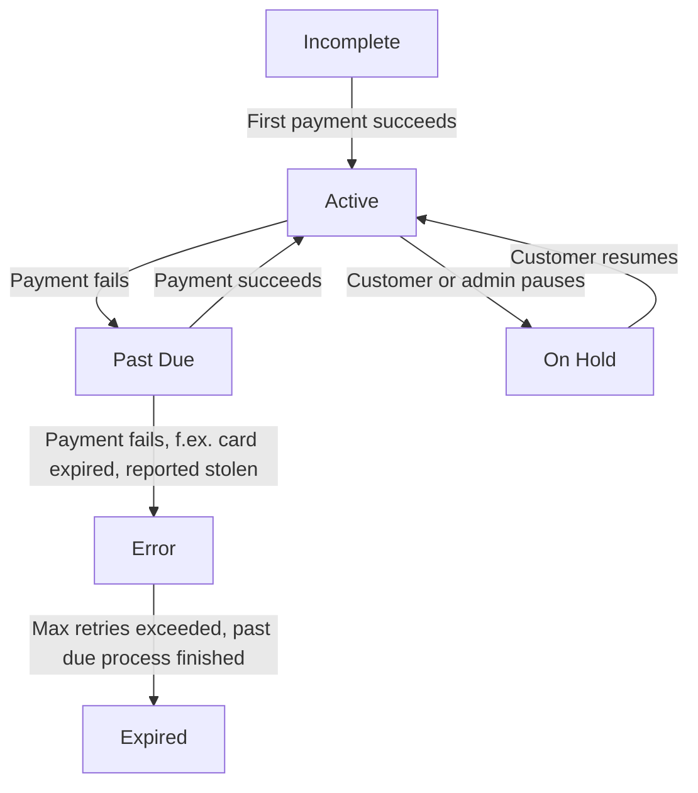

## What is a Subscription?

A **subscription** in Journey is a recipe-based recurring billing container that automatically generates orders and processes payments based on defined frequencies. Unlike traditional subscription systems, Journey supports different billing frequencies for each item within a single subscription.

<Info>
  **Key Innovation:** Journey's multi-frequency system allows items like "milk weekly, eggs bi-weekly, and coffee monthly" to coexist in one subscription, with intelligent delivery synchronization to minimize shipping costs.
</Info>

## The Recipe Model

Journey's subscription system works like a recipe:

<Steps>
  <Step title="Subscription = Container">
    Holds customer information, delivery preferences, and payment processor configuration
  </Step>
  <Step title="Subscription Order Items = Recipe">
    Defines what products to deliver and how often (the "ingredients")
  </Step>
  <Step title="Orders = Execution">
    Created automatically from the recipe on each billing cycle
  </Step>
  <Step title="Deliveries = Charging Events">
    Represent when the order will be delivered AND charged (dual purpose)
  </Step>
  <Step title="Payments = Financial Tracking">
    Track the transaction status for each order
  </Step>
</Steps>

### Example: Multi-Frequency Subscription

```json
{
  "subscription_id": 789,
  "customer_id": 42,
  "subscription_status": "active",
  "order_items": [
    {
      "product_variation_id": 5,  // Milk
      "quantity": 2,
      "subscription_frequency_id": 1  // Every 7 days (weekly)
    },
    {
      "product_variation_id": 8,  // Eggs
      "quantity": 1,
      "subscription_frequency_id": 2  // Every 14 days (bi-weekly)
    },
    {
      "product_variation_id": 12, // Coffee
      "quantity": 1,
      "subscription_frequency_id": 3  // Every 30 days (monthly)
    }
  ]
}
```

## Subscription States

### Status Definitions

<AccordionGroup>
  <Accordion title="Incomplete" icon="circle-pause">
    Customer information and subscription created but missing payment information. No charges attempted until payment method is added.
  </Accordion>
  <Accordion title="Active" icon="circle-check">
    The subscription is processing normally. Orders are created and payments are charged according to each item's billing frequency. This is the healthy state.
  </Accordion>
  <Accordion title="Past Due" icon="circle-exclamation">
    A recent payment failed with a retryable error (insufficient funds, card declined). The dunning process has started and will retry daily.

    **Trigger:** Payment declined with error codes like `insufficient_funds`, `card_declined`
  </Accordion>
  <Accordion title="Error" icon="circle-xmark">
    Payment failed with a card-related error (expired card, invalid card, fraud detection). Journey retries daily to settle payment but the error requires manual intervention or customer action, such as update payment method.

    **Trigger:** Technical payment errors or card issues
  </Accordion>
  <Accordion title="On Hold" icon="pause">
    The subscription is  paused by customer or merchant. No new orders or charges occur. Can be resumed (on my pages and/or Journey admin) at any time without losing configuration. We encourage merchants to use on hold if the customer requests to stop subcription.

    **Use Cases:** Vacation, temporary or permanent financial hardship, seasonal or permanent pause.
  </Accordion>
  <Accordion title="Expired" icon="ban">
    The subscription has been automatically put to status expired after extended payment failure (exceeding `failed_payment_cancelled_days`, default 20 days). All pending deliveries are cancelled and the past due process has finished.

    **Final State:** Cannot be reactivated except with manual intervention by admin
  </Accordion>
</AccordionGroup>

Subscriptions progress through clearly defined states with automatic or manually triggered (on my pages) transitions:



## Subscription Frequencies

Each subscription item can have its own billing frequency:

| Frequency   | Description    | Interval  | Common Use Cases           |
| ----------- | -------------- | --------- | -------------------------- |
| Weekly      | Every 7 days   | 7 days    | Fresh groceries, meal kits |
| Bi-weekly   | Every 14 days  | 14 days   | Household supplies         |
| Monthly     | Every 30 days  | 1 month   | Insurance premiums, SaaS   |
| Bi-monthly  | Every 60 days  | 60 days   | Quarterly-lite products    |
| Quarterly   | Every 90 days  | 3 months  | Seasonal items, insurance  |
| Semi-Annual | Every 180 days | 6 months  | Long-term services         |
| Annual      | Every 365 days | 12 months | Annual memberships         |

<Info>
  Frequencies are configured at the merchant level. Use `GET /api/v1/merchant/{id}/subscription_frequencies/` to retrieve available options for your tenant.
</Info>

### Frequency Calculations

Journey uses `relativedelta` for accurate date arithmetic:

```python
# Weekly (7 days)
next_date = last_delivery_date + timedelta(days=7)

# Monthly (1 month) - handles varying month lengths
next_date = last_delivery_date + relativedelta(months=1)

# Quarterly (3 months)
next_date = last_delivery_date + relativedelta(months=3)
```

This ensures subscriptions created on Jan 31 will bill on Feb 28 (not March 3).

## Delivery Synchronization Algorithm

### The Problem

With multi-frequency subscriptions, you could end up with many small, inefficient deliveries:

- **Monday:** Milk only (weekly)
- **Tuesday:** Eggs only (bi-weekly)
- **Friday:** Coffee only (monthly)

**Result:** High shipping costs, poor customer experience, increased carbon footprint.

### The Solution: Join-by-Week Algorithm

Journey automatically merges deliveries that are **within 5 days** of each other into a single shipment.

#### How It Works

<Steps>
  <Step title="Calculate Next Date for Each Item">
    For each product in the subscription, calculate when it's next due based on its frequency:

    ```
    Milk (weekly):    Last delivered Oct 1 → Next: Oct 8
    Eggs (bi-weekly): Last delivered Oct 1 → Next: Oct 15
    Coffee (monthly): Last delivered Sep 1 → Next: Oct 1
    ```
  </Step>
  <Step title="Find Earliest Date">
    Identify which item is due first:

    ```
    Earliest: Oct 1 (Coffee)
    ```
  </Step>
  <Step title="Check 5-Day Window">
    See which other items are due within 5 days of the earliest date:

    ```
    Coffee:  0 days away → Include ✅
    Milk:    7 days away → Don't include (outside window)
    Eggs:    14 days away → Don't include
    ```

    **Result:** Ship only Coffee on Oct 1
  </Step>
  <Step title="Repeat for Next Batch">
    On Oct 8, repeat the process:

    ```
    Milk:    0 days away → Include ✅
    Eggs:    7 days away → Don't include (but getting close!)
    Coffee:  Already fulfilled
    ```

    **Result:** Ship only Milk on Oct 8

    On Oct 15:

    ```
    Eggs:    0 days away → Include ✅
    Milk:    Already fulfilled (next due Oct 15)
    ```

    Wait! Milk is also due Oct 15. Both within window:

    ```
    Eggs:    0 days away → Include ✅
    Milk:    0 days away → Include ✅
    ```

    **Result:** Ship Milk + Eggs together on Oct 15
  </Step>
</Steps>

### Weekday Alignment

Deliveries are aligned to postal code delivery schedules with cutoff days for packing:

**Example: Postal Code 101 (Reykjavík)**

```json
{
  "postal_code": "101",
  "weekday_delivery": [2, 4],  // Wednesday (2), Friday (4)
  "cutoff_days": 3  // 3 days for packing
}
```

If the algorithm calculates delivery for **Monday**, it's automatically shifted to **Wednesday** (next available delivery day).

**Calculation:**

```
Calculated date: Monday, Oct 8
+ 3 days cutoff: Thursday, Oct 11
Next allowed weekday: Friday, Oct 12
Final delivery date: Friday, Oct 12
```

## Subscription Data Model

### Core Fields

```json
{
  "id": 789,
  "customer_id": 42,
  "customer_receiver_id": null,  // For gift subscriptions
  "subscription_status": "active",
  "delivery_option_id": 3,
  "delivery_option_location_json": {},  // Dropp locations, etc.
  "delivery_custom_data": {},
  "payment_processor_id": 1,
  "created": "2025-10-09T14:30:00Z"
}
```

### Subscription Order Items (Recipe)

```json
{
  "order_items": [
    {
      "id": 101,
      "subscription_id": 789,
      "product_variation_id": 5,
      "quantity": 2,
      "subscription_frequency_id": 1
    }
  ]
}
```

### Generated Orders

When the system processes the subscription, it creates orders from the recipe:

```json
{
  "id": 456,
  "subscription_id": 789,
  "customer_id": 42,
  "date_time": "2025-11-01T00:00:00Z",
  "fullfills_subscription_until": "2025-11-08T00:00:00Z",
  "subscription_data": {
    // Snapshot of recipe at time of order creation
  },
  "order_items": [
    {
      "product_variation_id": 5,
      "quantity": 2
    }
  ]
}
```

## Automated Processing

### Daily Billing Cron

Journey runs a scheduled task every day at midnight:

```bash
python manage.py payment_for_delivery
```

This cron job handles all subscription billing automatically:

<Steps>
  <Step title="Process New Deliveries">
    Find deliveries whose `delivery_date` has arrived and charge them
  </Step>
  <Step title="Retry Failed Payments">
    Attempt to charge past_due subscriptions (dunning process)
  </Step>
  <Step title="Handle Error Subscriptions">
    Process subscriptions in error state that need attention
  </Step>
  <Step title="Cancel Old Failed Invoices">
    After `failed_payment_cancelled_days` (default 20), cancel delivery and expire subscription
  </Step>
  <Step title="Auto-Mark Delivered">
    For digital products or auto-delivery integrations
  </Step>
</Steps>

### What Happens During Billing

```python
# 1. Find deliveries due today
deliveries = delivery.objects.filter(
    delivery_date=today,
    delivered=False,
    cancelled=False
)

# 2. For each delivery:
for delivery_item in deliveries:
    # Create payment if doesn't exist
    if not delivery_item.order_id.payment_id:
        create_payment(delivery_item)

    # Charge the customer
    result = charge_payment_method(
        payment_method=customer.primary_payment_method,
        amount=calculate_total(delivery_item.order_id)
    )

    # Update subscription status based on result
    if result.success:
        subscription.subscription_status = "active"
    else:
        subscription.subscription_status = "past_due"
```

## Dunning Management

Journey automatically handles failed payments with configurable retry logic.

### Configuration (Per Merchant)

```json
{
  "dunning_settling_attempts": 20,  // Max retry count (1 per day)
  "failed_payment_cancelled_days": 20  // Days before cancellation
}
```

### Dunning Timeline

<Steps>
  <Step title="Day 1: Payment Fails">
    ```
    Subscription: active → past_due
    Payment: settled → failed
    settling_attempts: 0 → 1
    Event: SUBSCRIPTION_STATUS_SET_TO_PAST_DUE_FOR_THE_FIRST_TIME
    Email: "Your payment failed, will retry tomorrow"
    ```
  </Step>
  <Step title="Days 2-19: Daily Retries">
    ```
    Each day at midnight:
    - Check: settling_attempts < 20?
    - If yes: Retry payment
      - Success: past_due → active ✅
      - Fail: settling_attempts += 1, try again tomorrow
    ```

    **Customer can update payment method during this period** - next retry uses new card automatically.
  </Step>
  <Step title="Day 20: Final Attempt">
    ```
    settling_attempts: 19 → 20
    If still fails:
    - Subscription: past_due → error
    - Event: SUBSCRIPTION_STATUS_SET_TO_ERROR_FOR_THE_FIRST_TIME
    - Email: "Final attempt failed, please update payment method"
    ```
  </Step>
  <Step title="Day 21: Cancellation">
    ```
    Time since first failure > failed_payment_cancelled_days (20):
    - Payment: failed → cancelled
    - Delivery: cancelled = true
    - Subscription: error → expired
    - Event: SUBSCRIPTION_STATUS_SET_TO_EXPIRED
    - Email: "Subscription cancelled due to payment failure"
    ```
  </Step>
</Steps>

### Error Code Classification

Journey categorizes payment failures as either **retryable** (past_due) or **requires intervention** (error):

| Error Type         | Error Codes                                | State    | Retry? |
| ------------------ | ------------------------------------------ | -------- | ------ |
| Insufficient Funds | `insufficient_funds`, `51`, `do_not_honor` | PAST_DUE | Yes ✅  |
| Card Declined      | `card_declined`, `05`, `04`                | PAST_DUE | Yes ✅  |
| Expired Card       | `expired_card`, `54`                       | ERROR    | No ❌   |
| Invalid Card       | `invalid_card_number`, `14`                | ERROR    | No ❌   |
| Fraud Detected     | `fraud_detected`, `fraud`                  | ERROR    | No ❌   |
| Technical Error    | `gateway_timeout`, `500`                   | ERROR    | No ❌   |

## Creating a Subscription

<Steps>
  <Step title="Create Customer">
    ```bash
    POST /api/v1/customer/
    {
      "full_name": "Jón Jónsson",
      "email": "jon@example.is",
      "phone_number": "7771234",
      "address": "Laugavegur 1",
      "postal_code": "101",
      "city": "Reykjavík"
    }
    ```

    See [Create Customer API](/api/customers/create)
  </Step>
  <Step title="Add Payment Method">
    ```bash
    POST /api/v1/straumur/create-session-add-card/
    {
      "customer_id": 42,
      "return_url": "https://yoursite.com/success"
    }
    ```

    Redirect customer to the returned `checkoutUrl` to complete card verification.

    See [Payment Providers](/api/providers/straumur)
  </Step>
  <Step title="Create Subscription">
    ```bash
    POST /api/v1/subscription/
    {
      "customer_id": 42,
      "subscription_status": "active",
      "delivery_option_id": 3,
      "start_date": "2025-11-01"
    }
    ```

    See [Create Subscription API](/api/subscriptions/create)
  </Step>
  <Step title="Add Recipe Items">
    ```bash
    POST /api/v1/subscription/789/update_cart/
    {
      "order_items": [
        {
          "product_variation_id": 5,
          "quantity": 2,
          "subscription_frequency_id": 1  // Weekly
        },
        {
          "product_variation_id": 8,
          "quantity": 1,
          "subscription_frequency_id": 2  // Bi-weekly
        }
      ]
    }
    ```

    See [Update Cart API](/api/subscriptions/update-cart)
  </Step>
  <Step title="System Auto-Generates Orders">
    Journey automatically:

    1. Calculates next delivery dates for each item based on frequency
    2. Applies the 5-day synchronization algorithm
    3. Aligns with postal code delivery schedules
    4. Creates orders and deliveries
    5. Charges on the delivery date
  </Step>
</Steps>

## Managing Subscriptions

### Pause a Subscription

```bash
POST /api/v1/subscription/{id}/pause/
{
  "reason": "Customer going on vacation"
}
```

**Effects:**

- Status changes to `on_hold`
- No new orders are generated
- Pending deliveries remain scheduled (optionally cancel them separately)
- Can be resumed at any time

### Resume a Subscription

```bash
POST /api/v1/subscription/{id}/resume/
{
  "coupon_code": "WELCOME_BACK10"  // Optional
}
```

**Effects:**

- Status changes back to `active`
- System re-syncs all items to calculate next delivery dates
- New orders are generated starting from today
- Optional coupon can be applied for retention

### Update Cart Contents

```bash
POST /api/v1/subscription/{id}/update_cart/
{
  "order_items": [
    {
      "product_variation_id": 12,
      "quantity": 3,
      "subscription_frequency_id": 3
    }
  ]
}
```

**Effects:**

- Recipe is updated immediately
- Existing scheduled orders are NOT modified
- Future orders use the new recipe

### Change Frequency

```bash
POST /api/v1/subscription/{id}/update_frequency/
{
  "subscription_frequency_id": 3  // Change to monthly
}
```

<Warning>
  Frequency changes affect the next billing date calculation. The system recalculates based on the last successful charge plus the new frequency interval.
</Warning>

## Edge Cases & Special Scenarios

### Customer Updates Payment Method During Dunning

**Scenario:** Payment fails on Day 1, customer adds new card on Day 5.

**What Happens:**

1. Customer adds new payment method via Straumur/Reepay/Rapyd
2. New card is marked as `primary_payment_method`
3. Next retry (Day 6) automatically uses the new card
4. If successful, subscription returns to `active` status
5. No missed deliveries - everything continues seamlessly

### Subscription with Already-Delivered Unpaid Order

**Scenario:** Order was delivered but payment failed (e.g., card declined after delivery).

**Journey's Rule:** Must continue retrying regardless of retry limit because customer received the goods.

```python
if delivery_item.delivered == True:
    # Force charge even if retry limit reached
    charge_for_delivery(delivery_item)
else:
    # Can reschedule if not yet delivered
    reschedule_delivery(delivery_item)
```

### Frequency Change Mid-Cycle

**Scenario:** Customer changes milk from weekly to bi-weekly after 3 deliveries.

**Behavior:**

- Already-scheduled deliveries are NOT updated
- Next order generation uses the new frequency
- Calculation: `last_delivery_date + new_frequency_interval`

### Product Out of Stock

**Current Behavior:** No automatic handling. Merchants must manually:

1. Check stock availability before order creation
2. Notify customer
3. Skip item, reschedule, or substitute product

**Proposed Enhancement:** Auto-skip out-of-stock items with customer notification.

## Common Use Cases

### Insurance Premium Subscriptions

Monthly premium billing with no physical delivery:

```json
{
  "customer_id": 42,
  "subscription_status": "active",
  "delivery_option_id": 1,  // Digital delivery
  "order_items": [{
    "product_variation_id": 101,  // Car insurance premium
    "quantity": 1,
    "subscription_frequency_id": 3  // Monthly
  }]
}
```

### SaaS Subscriptions

Annual billing with proration support:

```json
{
  "customer_id": 42,
  "subscription_status": "active",
  "start_date": "2025-11-01",
  "delivery_option_id": 1,  // Digital delivery
  "order_items": [{
    "product_variation_id": 205,  // Pro Plan
    "quantity": 1,
    "subscription_frequency_id": 7  // Annual
  }]
}
```

### E-commerce Box Subscriptions

Multi-item monthly box with physical delivery:

```json
{
  "customer_id": 42,
  "subscription_status": "active",
  "delivery_option_id": 5,  // Home delivery
  "order_items": [
    {"product_variation_id": 301, "quantity": 2, "subscription_frequency_id": 3},
    {"product_variation_id": 302, "quantity": 1, "subscription_frequency_id": 3},
    {"product_variation_id": 303, "quantity": 3, "subscription_frequency_id": 3}
  ]
}
```

### Mixed-Frequency Grocery Subscription

Weekly milk, bi-weekly eggs, monthly coffee - all synchronized:

```json
{
  "customer_id": 42,
  "subscription_status": "active",
  "delivery_option_id": 8,
  "order_items": [
    {"product_variation_id": 401, "quantity": 2, "subscription_frequency_id": 1},  // Weekly milk
    {"product_variation_id": 402, "quantity": 1, "subscription_frequency_id": 2},  // Bi-weekly eggs
    {"product_variation_id": 403, "quantity": 1, "subscription_frequency_id": 3}   // Monthly coffee
  ]
}
```

## Best Practices

<AccordionGroup>
  <Accordion title="Always Validate Payment Methods" icon="credit-card">
    Before creating or activating a subscription, verify the customer has a valid, verified payment method. Use payment provider verification endpoints before setting status to `active`.
  </Accordion>
  <Accordion title="Set Appropriate Start Dates" icon="calendar">
    For physical products, set `start_date` far enough in the future to allow for production and shipping. For insurance/SaaS, you can start immediately.
  </Accordion>
  <Accordion title="Monitor Status Transitions" icon="arrows-spin">
    Watch for transitions to `past_due` and `error` states. Implement webhooks (when available) or polling to notify customers and take action.
  </Accordion>
  <Accordion title="Leverage Multi-Frequency Capability" icon="layer-group">
    Take advantage of Journey's unique ability to mix frequencies. This enables sophisticated subscription models that match actual consumption patterns.
  </Accordion>
  <Accordion title="Use Postal Code Delivery Schedules" icon="map">
    Configure delivery schedules per postal code to optimize logistics and ensure deliveries align with carrier availability.
  </Accordion>
  <Accordion title="Provide Self-Service Management" icon="user-gear">
    Build customer portals that allow pause, resume, and cart modifications. This reduces churn and support burden significantly.
  </Accordion>
  <Accordion title="Implement Retention Flows" icon="hand-holding-dollar">
    When customers pause or attempt to cancel, offer coupons via the `resume` endpoint. This can recover 15-30% of churning subscriptions.
  </Accordion>
  <Accordion title="Track Delivery History" icon="clock-rotate-left">
    Use `GET /api/v1/subscription/{id}/deliveries/` to show customers their full delivery history and upcoming schedule. Transparency builds trust.
  </Accordion>
</AccordionGroup>

## API Reference

<CardGroup cols={3}>
  <Card title="List Subscriptions" icon="list" href="/api/subscriptions/list">
    Get all subscriptions
  </Card>
  <Card title="Create Subscription" icon="plus" href="/api/subscriptions/create">
    Create new subscription
  </Card>
  <Card title="Get Subscription" icon="eye" href="/api/subscriptions/get">
    Retrieve details
  </Card>
  <Card title="Update Subscription" icon="pen" href="/api/subscriptions/update">
    Modify subscription
  </Card>
  <Card title="Pause Subscription" icon="pause" href="/api/subscriptions/pause">
    Temporarily stop billing
  </Card>
  <Card title="Resume Subscription" icon="play" href="/api/subscriptions/resume">
    Restart subscription
  </Card>
  <Card title="Update Cart" icon="cart-shopping" href="/api/subscriptions/update-cart">
    Modify items and frequencies
  </Card>
  <Card title="Update Frequency" icon="clock" href="/api/subscriptions/update-frequency">
    Change billing frequency
  </Card>
  <Card title="Get Deliveries" icon="truck" href="/api/subscriptions/get">
    View delivery schedule
  </Card>
</CardGroup>

## Related Concepts

<CardGroup cols={2}>
  <Card title="Dunning & Payment Recovery" icon="credit-card" href="/concepts/dunning">
    Learn about payment retry logic and failed payment handling
  </Card>
  <Card title="Recurring Payments" icon="repeat" href="/concepts/recurring-payments">
    Understand payment processing and billing cycles
  </Card>
</CardGroup>