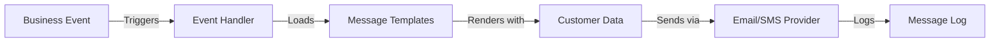
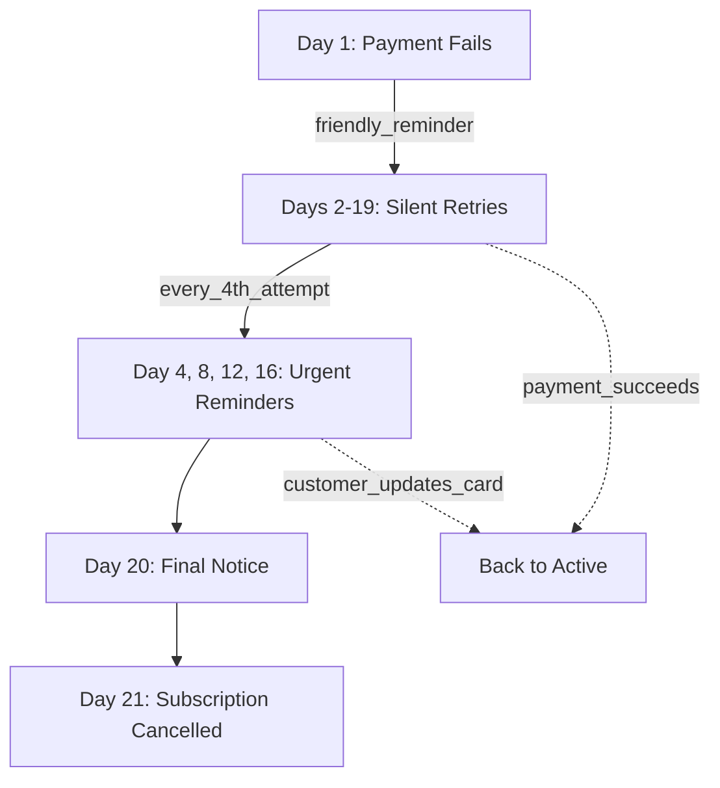
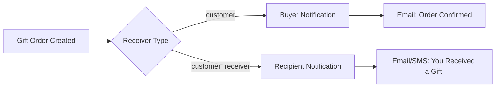

## What are Communications?

**Communications** in Journey are event-driven messages automatically sent to customers at key moments in their journey. Journey's system supports multi-channel delivery (email, SMS), dynamic template rendering, and intelligent dunning sequences, all managed through a simple event-based API.

<Info>
**Key Innovation:** Journey's communication system automatically enriches messages with contextual data (customer, order, subscription) and supports separate messaging for gift recipients, making complex notification flows simple to implement.
</Info>

## The Event-Driven Model

Journey's communications work through a trigger-based system:

<Steps>
<Step title="Events = Triggers">
Moments in the customer journey (payment succeeds, delivery scheduled, payment fails)
</Step>

<Step title="Messages = Templates">
Define what gets sent using Django template syntax with access to customer and order data
</Step>

<Step title="Providers = Delivery">
Email (Postmark) and SMS (Twilio/Nova) handle actual message delivery
</Step>

<Step title="Logs = Audit Trail">
Complete history of every communication with provider responses
</Step>
</Steps>

### Communication Flow



## Built-in Events

Journey includes pre-configured events for common scenarios:

| Event | Trigger Point | Channel | Purpose |
|-------|--------------|---------|---------|
| `subscription_payment_authorized` | Payment succeeds | Email | Welcome new subscribers |
| `oneoff_payment_authorized` | One-time purchase | Email | Order confirmation |
| `delivery_complete` | Driver marks delivered | Email/SMS | Delivery confirmation |
| `driver_starts_route` | Driver begins route | SMS | Pre-delivery notification |
| `inform_future_event` | Scheduled (cron) | Email/SMS | Delivery reminders |
| `past_due_first_time` | First payment failure | Email | Friendly dunning notice |
| `still_on_error_every_fourth` | Every 4 retry attempts | Email | Urgent payment reminder |
| `subscription_expired` | Max retries reached | Email | Cancellation notice |
| `invoice_sent_automatically` | Payment settles | Email | PDF invoice delivery |

<Info>
Events can be triggered programmatically via the `event_handler()` function or run automatically on a schedule via cron jobs.
</Info>

## Message Templates

### Template Structure

Messages define the content sent when an event triggers:

```typescript
{
  id: string;
  event_id: string;
  provider: 'email' | 'sms';
  subject?: string;           // Email only
  content: string;            // HTML (email) or plain text (SMS)
  content_text: string;       // Plain text version (email)
  receiver: 'customer' | 'customer_receiver';
}
```

### Template Variables

Templates have access to contextual data using Django template syntax:

<AccordionGroup>
  <Accordion title="Customer Data" icon="user">
    ```django
    {{ customer_object.full_name }}
    {{ customer_object.email }}
    {{ customer_object.phone_number }}
    {{ customer_object.address }}
    {{ customer_object.postal_code }}
    {{ customer_object.city }}
    ```
  </Accordion>

  <Accordion title="Order & Delivery" icon="box">
    ```django
    {{ order_object.id }}
    {{ product_variation_object.name }}
    {{ delivery_object.delivery_date|date:"F j, Y" }}
    {{ delivery_option_object.name }}
    ```
  </Accordion>

  <Accordion title="Subscription" icon="repeat">
    ```django
    {{ subscription_object.id }}
    {{ subscription_object.subscription_status }}
    ```
  </Accordion>

  <Accordion title="Merchant Branding" icon="store">
    ```django
    {{ merchant_object.name }}
    {{ merchant_object.from_email }}
    {{ merchant_object.reply_to_email }}
    ```
  </Accordion>

  <Accordion title="Special Variables" icon="sparkles">
    ```django
    {{ login_code }}              // 6-digit auth code
    {{ magic_url }}               // One-click login link
    {{ delivery_window_start }}   // Estimated time window
    {{ delivery_window_end }}
    {{ greeting_card_text }}      // Gift message
    ```
  </Accordion>
</AccordionGroup>

### Example: Order Confirmation Email

```django
Subject: Your {{ product_variation_object.name }} is on the way!

Hi {{ customer_object.full_name }},

Great news! Your order #{{ order_object.id }} is confirmed and will be
delivered on {{ delivery_object.delivery_date|date:"l, F j" }}.

Delivery address:
{{ customer_receiver_object.address }}
{{ customer_receiver_object.postal_code }} {{ customer_receiver_object.city }}

Track your order: https://{{ merchant_object.name }}.getjourney.io/orders/{{ order_object.id }}

Questions? Reply to this email or contact {{ merchant_object.reply_to_email }}.

Best,
The {{ merchant_object.name }} Team
```

### Example: Delivery Reminder SMS

```django
Hi {{ customer_object.full_name }}! Your {{ merchant_object.name }} delivery
arrives {{ delivery_object.delivery_date|date:"M j" }}.
Track: {{ merchant_object.name }}.getjourney.io/me
```

<Tip>
**SMS Best Practices:** Keep messages under 160 characters, include merchant name, add tracking link if relevant, and use concise language.
</Tip>

## Dunning (Payment Failures)

Journey includes intelligent dunning that automatically manages payment failure communications.

### Dunning Flow



### Dunning Events

<AccordionGroup>
  <Accordion title="past_due_first_time" icon="circle-exclamation">
    **Trigger:** First payment failure (Day 1)

    **Tone:** Friendly and informative

    **Message:**
    ```
    Subject: Quick heads up about your subscription

    We tried to process your payment but it didn't go through.
    No worries - this happens sometimes!

    We'll automatically retry tomorrow. If your card needs updating,
    you can do that here: [link]
    ```
  </Accordion>

  <Accordion title="still_on_error_every_fourth" icon="triangle-exclamation">
    **Trigger:** Every 4th retry attempt (Days 4, 8, 12, 16)

    **Tone:** More urgent with each iteration

    **Message (Day 8):**
    ```
    Subject: Action needed: Payment still pending

    We've tried several times to process your subscription payment.

    Please update your payment method to avoid service interruption:
    [link]

    Questions? Reply to this email.
    ```
  </Accordion>

  <Accordion title="error_first_time" icon="xmark">
    **Trigger:** Max retries reached (Day 20)

    **Tone:** Final warning, clear consequences

    **Message:**
    ```
    Subject: Final notice: Subscription will be cancelled

    After 20 attempts, we haven't been able to process your payment.

    Your subscription will be cancelled in 24 hours unless you
    update your payment details: [link]

    We'd love to keep you as a customer!
    ```
  </Accordion>

  <Accordion title="subscription_expired" icon="ban">
    **Trigger:** Subscription cancelled (Day 21)

    **Tone:** Professional, offer to reactivate

    **Message:**
    ```
    Subject: Subscription cancelled

    Your subscription has been cancelled due to payment failure.

    To reactivate, simply update your payment method and
    restart your subscription: [link]

    We hope to see you again soon!
    ```
  </Accordion>
</AccordionGroup>

### Dunning Configuration

Configure per merchant:

```json
{
  "dunning_settling_attempts": 20,        // Max retries
  "failed_payment_cancelled_days": 20     // Days until cancel
}
```

<Info>
Customers can update payment methods during the dunning period. The next retry automatically uses the new card, recovering the subscription. See the [Delivery & Fulfillment](/subscriptions/delivery-fulfillment) page for more details on how dunning is managed end-to-end.
</Info>

## Gift Orders

When customers send gifts, Journey can notify both the buyer and recipient separately.

### How It Works



### Receiver Types

Specify who receives each message:

- **Receiver: customer** - The person who placed the order
- **Reveiver: customer_receiver** - The delivery recipient

### Example: Gift Notifications

<Tabs>
  <Tab title="To Buyer">
    ```django
    Subject: Your gift order is confirmed

    Hi {{ customer_object.full_name }},

    Your gift order for {{ customer_receiver_object.full_name }}
    is confirmed!

    Delivery date: {{ delivery_object.delivery_date|date:"F j, Y" }}
    Delivery to: {{ customer_receiver_object.address }}

    We'll notify them on the delivery day.
    ```
  </Tab>

  <Tab title="To Recipient">
    ```django
    Subject: You received a gift!

    Hi {{ customer_receiver_object.full_name }},

    Someone special sent you a gift!

    {{ product_variation_object.name }} will be delivered on
    {{ delivery_object.delivery_date|date:"F j, Y" }}.

    
    Message from sender:
    "{{ greeting_card_text }}"
    

    Enjoy!
    ```
  </Tab>
</Tabs>

<Warning>
When `customer_receiver_object` equals `customer_object` (self-gift), Journey automatically sends only one message to avoid duplicate notifications.
</Warning>

## Invoice Delivery

Customers can choose to receive automatic PDF invoices via email after each payment settles.

### How It Works

**Enabling Automatic Invoices:**
- Customers go to their **My Pages** settings
- Check the option to "Send me invoices automatically"
- After each payment processes, they receive an email with the invoice PDF attached

**Accessing Invoice History:**
- All previous invoices are available in the **Order History** section of My Pages
- Customers can view, download, and print invoices anytime without needing to search their email

<Info>
This gives customers flexibility: they can choose email delivery for immediate access, or access all invoices later through their account history on My Pages.
</Info>

## Message Logs

Every email and SMS sent to customers is logged so you can track delivery and troubleshoot issues.

### What Gets Logged

For each message sent, the system records:
- **Recipient** - Customer email or phone number
- **Content** - What was sent
- **Status** - Whether it was successfully delivered or failed
- **Timestamp** - When it was sent
- **Reason for message** - Which event triggered it (e.g., payment received, delivery arriving tomorrow)

### Viewing Delivery Status

You can check whether a message was successfully delivered or if there was an issue:
- **Sent** - Message delivered to the provider (email/SMS carrier)
- **Failed** - Message couldn't be delivered (e.g., invalid email address, carrier rejected SMS)

If a message fails, you can investigate why and take action—like requesting an updated email address from the customer or checking if their phone number is correct.

<Info>
Message logs help you ensure customers are receiving important notifications about their orders, payments, and deliveries. Use them to troubleshoot communication issues and improve delivery rates.
</Info>

## White-Label Support

Journey's communication system supports complete white-labeling for each merchant.

### Your Brand, Your Communications

Each merchant can customize their communications completely:
- **Send from your email address** - Customers see your brand, not Journey's
- **Use your support email** - Replies go directly to your support team
- **Choose your email provider** - Use your preferred email service provider (e.g., Postmark, SendGrid)
- **Choose your SMS provider** - Use your preferred SMS provider (e.g., Twilio, Plivo)
- **Private message logs** - All communications are kept separate and private to your account

### Example

**Store A** sends emails from `hello@storea.com` and uses their own email service.

**Store B** sends emails from `hi@storeb.com` and uses a different email service.

Both operate independently in Journey—each managing their own communications, templates, and customer data without any overlap.

<Info>
White-label communications mean your customers see only your brand in every message they receive. They never know Journey is powering the platform behind the scenes.
</Info>

## Common Use Cases

### Passwordless Authentication

When a customer logs into My Pages, they receive an SMS or email with a one-time code. They enter the code to verify their identity—no password needed.

**Example Message:**
```
Your Fresh Market login code: 847293
This code expires in 10 minutes. Don't share it with anyone.
```

### Subscription Welcome Email

After a customer's first payment processes successfully, they receive a welcome email with their subscription details, next delivery date, and how to manage their account on My Pages.

**Example Message:**
```
Subject: Welcome to Your Fresh Market Subscription!

Hi Sarah,

Your subscription is active! Here's what to expect:

📦 First Delivery: Thursday, December 12 at 6-8 PM
Items: Organic Milk, Farmer's Eggs, Fresh Bread

Manage your subscription anytime: https://yoursite.getjourney.io/me

You can change frequencies, swap products, or pause anytime.

Questions? Reply to this email or check our FAQ.

Thanks for subscribing!
The Fresh Market Team
```

### Delivery Tracking Updates

As a delivery gets closer, customers receive notifications with their delivery window. If the driver is nearby, they get a final update.

**Example Messages:**
```
Your Fresh Market delivery arrives tomorrow, Dec 12, between 6-8 PM
You can change your delivery before midnight on My PAges: https://yoursite.getjourney.io/me
```

Later that day:
```
Your package has been delivered!
See your order on https://yoursite.getjourney.io/me
```

### Payment Failure Recovery

If a payment fails, the customer automatically receives a message asking them to update their payment method on My Pages. This helps recover the failed subscription without losing the customer.

**Example Message:**
```
Your Fresh Market payment didn't go through. Your subscription is on hold.

Update your payment method: https://yoursite.getjourney.io/me

Once updated, your next delivery will proceed normally.

Questions? Contact us: support@freshmarket.com
```

## Related Concepts

<CardGroup cols={2}>
  <Card
    title="Subscriptions"
    icon="repeat"
    href="/subscriptions/subscriptions"
  >
    Understand subscription lifecycle and automated billing that triggers communications
  </Card>
  <Card
    title="Dunning & Payment Recovery"
    icon="credit-card"
    href="/payments/dunning"
  >
    Learn about payment retry logic and dunning communication sequences
  </Card>
  <Card
    title="Reports"
    icon="chart-bar"
    href="/analytics/reports"
  >
    Monitor business performance with built-in reports
  </Card>
  <Card
    title="Recurring Payments"
    icon="credit-card"
    href="/payments/recurring-payments"
  >
    Understand payment processing and billing cycles
  </Card>
</CardGroup>
