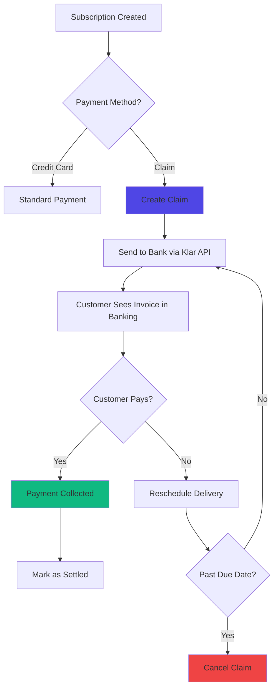

## Overview

Journey's claims system integrates with Icelandic banking infrastructure (via **Klar API**) to issue formal invoices (claims) to customers. Instead of charging credit cards directly, merchants can send invoices through the banking system that customers pay via their online banking portal or automatic bill pay.

<Info>
**What is a Claim?** In Icelandic banking, a "claim" (kröfugagnaskilaboð) is a formal invoice sent through the banking system. Customers see these claims in their online banking and can pay them like any other bill.
</Info>

## Why Use Claims?

Claims provide an alternative payment method that's particularly useful for:

**B2B Customers:**
- Companies often prefer invoice payments over credit cards
- Easier accounting and reconciliation
- Better cash flow management (pay later)

**High-Value Orders:**
- Customers may not want to use credit cards for large amounts
- Bank invoices feel more official and trustworthy
- Lower risk of card declines

**Recurring Subscriptions:**
- Some customers prefer monthly invoices over automatic charges
- Provides transparency into what they're paying for
- Easier to pause or adjust payments

**Payment Flexibility:**
- Customers get due dates (typically 10-30 days)
- Can pay via any bank account
- No need for credit card on file



## Key Concepts

<AccordionGroup>
<Accordion title="Claim - The Invoice">

**Definition:** A formal invoice created in the banking system that appears in the customer's online banking portal.

**Unique Identifier:**
- **Claim Number:** Format `{bank_number}{ledger}{auto_number}`
  - Example: `0515660000123` (Islandsbanki + Ledger 66 + Claim 123)
- **Due Date:** When the claim must be paid
- **Claimant:** Your company's SSN (kennitala)

**Key Fields:**
- **Amount:** Total to be charged (includes other costs)
- **PayorID:** Customer's SSN (kennitala)
- **DueDate:** Initial payment deadline (typically +10 days)
- **FinalDueDate:** Extended deadline before penalties (typically +30 days)
- **CancellationDate:** When claim is automatically cancelled (typically +100 days)
- **OtherCosts:** Processing fees added to the invoice

**Lifecycle:**
```
NEW → UNPAID → PAID (or CANCELLED)
```

</Accordion>

<Accordion title="ClaimSpec - Configuration Template">

**Definition:** A reusable configuration that defines how claims are created and managed.

**Purpose:** Different customer segments may need different claim configurations:
- **Standard customers:** 10 day due, 30 day final due
- **B2B customers:** 30 day due, 60 day final due
- **Pre-paid:** Claims created before delivery, auto-deliver after due date

**Key Settings:**
- `cron_spec`: When to create claims (e.g., "0 0 * * *" = daily)
- `claim_zone_days`: How many days before delivery to create claim (default: 5)
- `due_days`: Days until initial due date (default: 10)
- `final_due_days`: Days until final due date (default: 30)
- `cancellation_days`: Days until auto-cancellation (default: 100)
- `other_cost_prc`: Processing fee percentage (default: 2.7%)
- `auto_delivery_after_due_date`: Deliver even if unpaid (for pre-payment models)

**Multiple Specs:**
You can create multiple ClaimSpecs and assign them to different payment methods/customers.

</Accordion>

<Accordion title="Klar API - Banking Integration">

**What is Klar?** Klar (now part of Open Banking Iceland) provides APIs to interact with Icelandic banking infrastructure.

**Supported Banks:**
- Íslandsbanki
- Landsbankinn
- Arion banki

**Authentication:**
- OAuth 2.0 via Auth0
- Access tokens valid for 15 minutes (cached)
- Company-specific credentials per merchant

**API Operations:**
```typescript
// Create a new claim
POST /claims

// Get claim status
GET /claims/single?claimant={id}&account={claim_no}&dueDate={date}

// Update claim details
PUT /claims

// Cancel claim
POST /claims/delete

// Get payment information
GET /claims/payments?fromDate={date}&toDate={date}
```

**Rate Limiting:**
- Fetch claims day-by-day to avoid overload
- Use date ranges strategically
- Cache tokens for 15 minutes

</Accordion>

<Accordion title="Payment Status Flow">

Journey tracks claim payments through specific payment statuses:

**CLAIM_CREATED:** Claim sent to bank, awaiting payment
```python
payment.payment_status = PaymentStatus.CLAIM_CREATED
```

**SETTLED:** Customer paid the claim
```python
payment.payment_status = PaymentStatus.SETTLED
claim.is_collected = True
```

**FAILED:** Claim cancelled or expired
```python
payment.payment_status = PaymentStatus.FAILED
claim.is_cancelled = True
```

**Integration with Subscription Status:**
- CLAIM_CREATED → Subscription stays ACTIVE
- SETTLED → Delivery proceeds normally
- FAILED → Subscription may move to ERROR or ON_HOLD

</Accordion>
</AccordionGroup>

## How Claims Work

### The Claim Payment Flow

<Steps>
<Step title="Customer Setup">
To use claims, the customer must:
- Be an Icelandic resident with a valid Icelandic ID number (kennitala)
- Have an account with an Icelandic bank that supports claims
- Set claims as their preferred payment method in their account

The first time a customer uses claims, they authorize Journey to send payment requests to their bank on their behalf.
</Step>

<Step title="Claim Created Before Delivery">
About 5 days before the scheduled delivery date, Journey automatically creates a claim and sends it to the customer's bank.

**What happens:**
- Journey creates an invoice with the delivery items, amounts, and due date
- This information is sent to the customer's bank via secure banking channels
- The bank receives and validates the claim
</Step>

<Step title="Customer Sees Claim in Banking Portal">
The customer logs into their online banking and sees the claim appear in their "Bills to Pay" section:

**Customer sees:**
- Invoice amount and due date
- Merchant name (your store)
- Items being delivered
- Option to pay now or schedule payment for later
- Option to set up automatic payments for future claims

**Payment options:**
- Pay immediately online
- Schedule payment for a specific date
- Set up recurring automatic payments
</Step>

<Step title="Journey Monitors Claim Status">
Every day, Journey checks with the bank to see if the claim has been paid:
- If paid: Marks as collected and proceeds with delivery
- If unpaid but still within the due date window: Continues checking daily
- If cancelled or overdue: Handles as a failed payment
</Step>

<Step title="Payment Confirmed & Delivery Proceeds">
When the bank confirms payment:

**Journey automatically:**
- Marks the payment as settled
- Confirms the subscription is active
- Releases the order for packing and delivery
- Updates inventory to reflect the fulfilled order
- May send a confirmation notification to the customer

**From the customer's perspective:**
- They paid via their bank
- Their delivery proceeds normally
- No additional action needed
</Step>
</Steps>

### Daily Claim Processing

Journey automatically manages claims throughout their lifecycle without any manual intervention:

**Every day, Journey:**

1. **Creates new claims** for deliveries scheduled within 5 days (or your configured window)
   - Claims are sent to customers' banks automatically
   - Customer receives notification in their banking portal
   
2. **Checks claim status** with all banks to see which claims have been paid or cancelled
   - **Paid claims:** Immediately marked as collected, delivery proceeds
   - **Unpaid claims:** Continue checking daily until payment arrives
   - **Cancelled claims:** Marked as failed, delivery gets rescheduled
   
3. **Records payment details** from the bank for accounting and reconciliation
   - Captures exact payment date and time
   - Stores bank reference information
   - Creates audit trail for financial records

You don't need to do anything, this all happens automatically every night.

## Claim Configuration Options

Journey comes with a default claim configuration optimized for most businesses. However, you can customize how claims work to match your specific business model.

### Default Configuration

By default, Journey is set up for a standard B2C subscription model:
- Claims created 5 days before delivery date
- Customers have 10 days to pay
- Delivery won't happen until payment is confirmed
- If unpaid after 100 days, claim is cancelled

This works well for most retail subscription services.

### Custom Configurations

You can create different claim configurations for different customer types. Common scenarios:

<AccordionGroup>
<Accordion title="B2B Customers - Extended Payment Terms">

**For corporate customers who need longer to pay:**

**Settings:**
- Claims created earlier (3 days before delivery)
- Payment due date: 30 days (Net 30)
- Extended grace period: 60 days
- Lower processing fees for volume

**How it works:**
- Corporate customer receives claim at the beginning of the month
- They have up to 30 days to pay
- If unpaid, a final reminder is sent at day 60
- Delivery is held until payment clears

This is ideal for B2B relationships where longer payment terms are expected.

</Accordion>

<Accordion title="Pay-After-Delivery - Trust-Based Model">

**For established or high-value customers who receive first, pay after:**

**Settings:**
- Delivery happens immediately (even before payment)
- Payment claim created 2 days before delivery
- Customers have 7 days after delivery to pay
- Claims cancelled after 60 days if unpaid

**How it works:**
- Customer receives their delivery
- Claim is automatically sent to their bank (pay later)
- They have a week to pay after receiving goods
- Works similar to an invoice-based system

**Important:** Only use this for trusted customers or low-value items. You're delivering before payment is guaranteed.

</Accordion>

<Accordion title="Custom Timing">

**For merchants with unique business needs:**

You can customize:
- When claims are created (days before delivery)
- Payment due date window
- Escalation timelines for overdue claims
- Processing fees
- Whether delivery happens before or after payment

Contact your Journey support team to set up a custom configuration.

</Accordion>
</AccordionGroup>

## Monitoring & Admin Interface

### Managing Claims

You can view and manage all claims through your Journey admin dashboard.

**Viewing Claims:**

From the claims list, you can see:
- **Claim number** - Reference number sent to the bank
- **Associated order** - Which customer order this claim is for
- **Payment status** - Whether the claim has been paid or cancelled
- **How many times checked** - How many days Journey has been checking for payment
- **Delivery status** - How many times the delivery date was moved due to unpaid claim

**Finding a Specific Claim:**

Search by:
- Claim number
- Order ID
- Customer name or email

**Managing a Claim:**

For individual claims, you can:
- View payment details and timestamps
- See when the claim was created
- See when the customer paid (if paid)
- Link directly to the customer's account

**Cancelling Claims:**

You can cancel one or more claims at once:
- Select the claims you want to cancel
- Choose "Cancel selected claims"
- Optionally put the customer's subscription on hold
- Confirm the action—the claim cancellation is sent to the bank

## Related Concepts

<CardGroup cols={2}>
<Card title="Recurring Payments" icon="credit-card" href="/recurring-payments">
Understanding Journey's payment processing and alternatives to claims
</Card>

<Card title="Dunning" icon="bell" href="/dunning">
How claims integrate with subscription payment retry logic
</Card>

<Card title="Communication System" icon="envelope" href="/communication">
Consider adding claim notification events for customer updates
</Card>

<Card title="Reports" icon="chart-bar" href="/reports">
Track claim collection rates and payment timing in reports
</Card>
</CardGroup>
