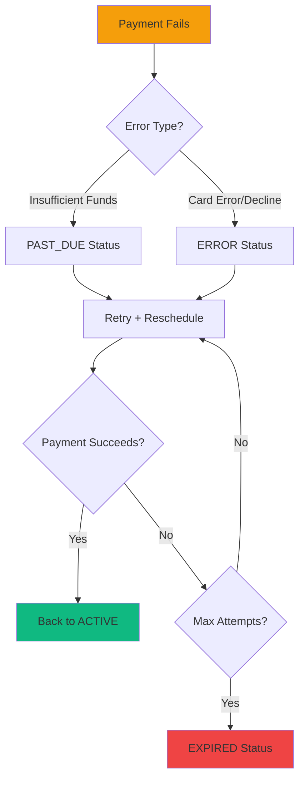

## Overview

Journey's dunning system automatically handles failed subscription payments through intelligent retry logic, delivery rescheduling, and customer communication. The system is designed to maximize payment recovery rates while minimizing customer friction and churn.

<Info>
  **Dunning** (from German "mahnen" - to remind) is the process of communicating with customers to recover failed payments. Journey automates this entire workflow.
</Info>

## Why Dunning Matters

Payment failures are inevitable in subscription businesses:

- **Credit cards expire** - Average card lifespan is 2-3 years
- **Insufficient funds** - Temporary account balance issues
- **Bank declines** - Fraud prevention systems, spending limits
- **Technical errors** - Network timeouts, processor issues

**Without dunning:**

- 20-30% of subscriptions would churn unnecessarily
- Lost revenue from otherwise happy customers
- No recovery mechanism for temporary issues

**With Journey's dunning:**

- 70-80% of failed payments successfully recover (companies with mature dunning processes)\*
- Automated communication keeps customers informed
- Delivery rescheduling prevents waste and maintains satisfaction

<Info>
  \*Source: [PayPro Global - SaaS Dunning Management](https://blog.payproglobal.com/saas-dunning-management)
</Info>



## Subscription Statuses

Journey uses five subscription statuses to manage the dunning lifecycle:

<AccordionGroup>
  <Accordion title="ACTIVE - Successful Payments">
    **Description:** Subscription is in good standing with successful payment.

    **Triggers:**

    - New subscription created with successful payment
    - Failed payment successfully retries and settles
    - Customer updates payment method and payment succeeds

    **System Behavior:**

    - Future deliveries scheduled normally
    - Payment charged according to billing frequency
    - No retry attempts needed

    **Customer Experience:** Seamless - customer receives deliveries as expected.
  </Accordion>
  <Accordion title="PAST_DUE - Insufficient Funds">
    **Description:** Payment failed due to insufficient funds (response code 51).

    **Triggers:**

    - Payment processor returns "insufficient funds" error code
    - Typically temporary - customer may receive paycheck soon

    **System Behavior:**

    - Delivery rescheduled to next available date
    - Daily retry attempts (or as configured)
    - Email notification on first failure
    - Reminder email every 4th retry attempt

    **Key Difference from ERROR:**

    - Past due indicates a **temporary** issue (no money right now)
    - More lenient retry schedule
    - Higher recovery rate (70-80%)

    **Customer Experience:**

    - Receives friendly reminder email: "Payment didn't go through, we'll try again"
    - Delivery automatically moved to avoid waste
    - No service interruption if payment succeeds within retry window
  </Accordion>
  <Accordion title="ERROR - Card/Bank Decline">
    **Description:** Payment failed due to card error, bank decline, or processor issue.

    **Triggers:**

    - Expired credit card
    - Card reported lost/stolen
    - Bank fraud detection
    - Payment processor errors

    **System Behavior:**

    - Delivery rescheduled to next available date
    - Daily retry attempts (or as configured)
    - Email notification on first failure: "Please update payment method"
    - Reminder email every 4th retry attempt
    - More urgent tone than PAST_DUE

    **Key Difference from PAST_DUE:**

    - Indicates **customer action needed** (update payment method)
    - Lower automatic recovery rate (20-30%)
    - Requires customer intervention for resolution

    **Customer Experience:**

    - Receives email with link to update payment method
    - Clear call-to-action to prevent cancellation
    - Delivery held until payment resolves
  </Accordion>
  <Accordion title="EXPIRED - Max Retries Exceeded">
    **Description:** Payment failed for maximum number of attempts. Subscription cancelled.

    **Triggers:**

    - Settling attempts reaches the merchant's max retry threshold (typically 20)
    - No successful payment after retry period (typically 20 days)

    **System Behavior:**

    - Subscription marked as expired
    - Future deliveries cancelled
    - Final notification email sent
    - Payment attempts cease
    - Stock unreserved for all failed orders

    **Reconciliation:**

    - If customer wants to reactivate, they must create a new subscription
    - Old subscription remains in EXPIRED state for record-keeping

    **Customer Experience:**

    - Receives final cancellation email
    - Account suspended until new subscription created
    - Can restart anytime with updated payment method

    <Warning>
      Once a subscription reaches EXPIRED status, it cannot be reactivated. The customer must create a new subscription with a valid payment method.
    </Warning>
  </Accordion>
  <Accordion title="ON_HOLD - Customer Paused">
    **Description:** Customer voluntarily paused their subscription.

    **Triggers:**

    - Customer clicks "Pause Subscription" in customer portal
    - Temporary hold for vacation, travel, etc.

    **System Behavior:**

    - No payment attempts made
    - Future deliveries cancelled automatically
    - No dunning emails sent
    - Subscription remains paused until customer resumes

    **Key Difference:** This is **customer-initiated**, not payment-related. No dunning logic applies.

    **Customer Experience:**

    - Full control to pause and resume
    - No charges while paused
    - Easy reactivation when ready
  </Accordion>
</AccordionGroup>

## Intelligent Retry Logic

Journey's dunning system adapts retry behavior based on the type of payment failure and whether the order has already been delivered.

### Daily Retry Schedule

<Steps>
  <Step title="Respectful Retry Timing">
    Retries are scheduled during configured business hours (default: after 8 AM local time) to avoid charging customers in the middle of the night and to align with your customer service availability. You can customize the retry window to match your business needs.
  </Step>
  <Step title="One Attempt Per Day">
    The system attempts to retry a failed payment only once per day. This limits processor fees and prevents customers from seeing multiple charges in quick succession.
  </Step>
  <Step title="Automatic Rescheduling">
    If an order hasn't been delivered yet when a payment fails, the system automatically reschedules it to the next available delivery window based on the customer's location and your delivery schedule.
  </Step>
  <Step title="Retry Charge">
    The system attempts to charge the customer's payment method again with the retry.
  </Step>
</Steps>

### Understanding Payment Failures

The system intelligently classifies payment failures into two categories, each requiring a different response:

<Tabs>
  <Tab title="Temporary Issues (PAST_DUE)">
    **What triggers this category:**

    - Insufficient funds in the account
    - Card temporarily declined by the bank
    - A temporary processing issue

    **Why it matters:**

    - These are usually temporary problems the customer may not even realize they have
    - High probability of recovery with a simple retry
    - The customer is often aware of the issue (low balance) and may resolve it themselves
    - These represent pure revenue recovery opportunities

    **What happens:** The system marks the subscription as "past due" and will continue retrying over the following days until the payment succeeds or the retry period expires.
  </Tab>
  <Tab title="Customer Action Required (ERROR)">
    **What triggers this category:**

    - Card has expired or is no longer valid
    - Card was lost or stolen
    - Fraud protection system blocked the charge
    - Payment method information is incomplete or incorrect

    **Why it matters:**

    - These require the customer to take action (update their card information)
    - Without customer intervention, these won't resolve automatically
    - These represent customers who want to stay but need help

    **What happens:** The system marks the subscription as "error" and sends alerts to the customer so they can update their payment information. This is where proactive customer communication is critical to retention.
  </Tab>
</Tabs>

### Retry Attempt Limits

The system tracks how many times it has attempted to collect payment for each order. This prevents infinite retry loops while giving customers multiple opportunities to resolve their payment issues.

**How It Works:**

- Each retry attempt is logged and counted
- After reaching the maximum number of attempts (default: 20 attempts, configurable per business), the system stops retrying
- When the retry limit is reached, the subscription is marked as "expired" and cancelled
- A final cancellation notification is automatically sent to the customer

**Business Configuration:** You can customize the maximum number of retry attempts to match your business strategy. Typically, businesses set this between 15-25 attempts, balancing:

- **More attempts** = Higher recovery rate, but longer customer experience limbo
- **Fewer attempts** = Faster resolution, but may lose recoverable payments

This threshold protects your business from perpetual retry loops while still giving customers a fair window to resolve their payment issues.

## Customer Communication Strategy

Journey automatically sends emails at key points in the dunning lifecycle to keep customers informed and drive payment resolution.

### Communication Timeline

```mermaid
gantt
    title Dunning Email Sequence
    dateFormat X
    axisFormat %d

    First Failure Email :milestone, m1, 0, 0
    Retry Attempts :active, a1, 0, 3
    4th Attempt Reminder :milestone, m2, 3, 0
    More Retries :active, a2, 3, 7
    8th Attempt Reminder :milestone, m3, 7, 0
    Continue Retries :active, a3, 7, 11
    12th Attempt Reminder :milestone, m4, 11, 0
    Final Retries :active, a4, 11, 15
    16th Attempt Reminder :milestone, m5, 15, 0
    Last Attempts :active, a5, 15, 19
    20th Attempt - Expiration :crit, milestone, m6, 19, 0
```



<AccordionGroup>
  <Accordion title="First Failure Notification">
    **Event:** `SUBSCRIPTION_STATUS_SET_TO_PAST_DUE_FOR_THE_FIRST_TIME` or `SUBSCRIPTION_STATUS_SET_TO_ERROR_FOR_THE_FIRST_TIME`

    **Timing:** Immediately after first payment failure

    **Tone:** Friendly and helpful

    **Content:**

    - Explanation that payment didn't go through
    - Reason (insufficient funds vs. card issue)
    - For PAST_DUE: "We'll try again soon"
    - For ERROR: "Please update your payment method"
    - Link to customer portal to update payment method
    - Delivery rescheduled date
    - Contact support information

    **Example Message (PAST_DUE):**

    > Hi [Customer Name],
    >
    > We tried to process your payment of [Amount] for your upcoming delivery, but it didn't go through due to insufficient funds.
    >
    > **Don't worry** - we'll automatically try again tomorrow. Your delivery has been rescheduled to [New Date] to give the payment time to process.
    >
    > If you'd like to update your payment method, you can do so here: [Link]
    >
    > Questions? Contact us at [Email]

    **Example Message (ERROR):**

    > Hi [Customer Name],
    >
    > We tried to process your payment of [Amount], but your card was declined.
    >
    > **Action needed:** Please update your payment method to keep your subscription active.
    >
    > Update Payment Method: [Link]
    >
    > Your delivery is on hold until we can process payment successfully. We'll continue trying daily for the next 20 days.
    >
    > Questions? Contact us at [Email]
  </Accordion>
  <Accordion title="Every 4th Attempt Reminder">
    **Event:** `SUBSCRIPTION_STATUS_STILL_ON_ERROR_EVERY_FOURTH_TIME`

    **Timing:** On attempts 4, 8, 12, 16, 20

    **Purpose:** Periodic reminder without overwhelming the customer

    **Tone:** Progressively more urgent

    **Content:**

    - Number of attempts so far
    - Days until cancellation
    - Strong call-to-action
    - Link to update payment method
    - Current delivery status

    **Example Message (Attempt 8):**

    > Hi [Customer Name],
    >
    > We've now tried 8 times to process your payment without success.
    >
    > **You have 12 days remaining** before your subscription is cancelled.
    >
    > Please update your payment method now to avoid interruption: [Link]
    >
    > Need help? Reply to this email or call [Phone]

    **Example Message (Attempt 16):**

    > **URGENT:** Only 4 days left - [Customer Name]
    >
    > We've tried 16 times to process your payment. After 4 more attempts, your subscription will be permanently cancelled.
    >
    > **Update payment method NOW:** [Link]
    >
    > This is your final reminder before cancellation.
  </Accordion>
  <Accordion title="Final Expiration Notice">
    **Event:** `SUBSCRIPTION_STATUS_SET_TO_EXPIRED`

    **Timing:** After reaching `dunning_settling_attempts` limit

    **Tone:** Apologetic but firm

    **Content:**

    - Subscription has been cancelled
    - Reason (max retries exceeded)
    - How to reactivate (create new subscription)
    - Thank you message
    - Feedback request (optional)

    **Example Message:**

    > Hi [Customer Name],
    >
    > We're sorry to see you go. After 20 unsuccessful payment attempts, we've had to cancel your subscription.
    >
    > **What this means:**
    >
    > - No future deliveries will be sent
    > - Your account remains active for viewing history
    > - You can create a new subscription anytime
    >
    > **Want to come back?** Simply visit [Link] and create a new subscription with an updated payment method.
    >
    > We'd love to hear why you left: [Feedback Link]
    >
    > Thank you for being a customer!
  </Accordion>
</AccordionGroup>

### Communication Best Practices

<Tabs>
  <Tab title="Email Design">
    **Subject Lines:**

    - First failure: "Payment issue with your [Product] subscription"
    - 4th attempt: "Reminder: Update payment method"
    - 8th attempt: "Action needed: [Days] days until cancellation"
    - 16th attempt: "URGENT: Update payment by [Date]"
    - Expiration: "Your subscription has been cancelled"

    **Content Guidelines:**

    - Use customer's first name
    - Clear subject line indicating urgency
    - Mobile-responsive HTML design
    - Prominent call-to-action button
    - Include support contact information
    - Merchant branding (logo, colors)
  </Tab>
  <Tab title="Tone & Voice">
    **PAST_DUE (Insufficient Funds):**

    - Empathetic and understanding
    - "These things happen"
    - Less urgent initially
    - Assumes customer is aware of the issue

    **ERROR (Card Declined):**

    - More direct and action-oriented
    - Clear that customer action is required
    - Provide specific steps to resolve
    - Emphasize urgency earlier

    **Progressive Urgency:**

    - Attempts 1-4: Helpful, friendly
    - Attempts 5-12: Concerned, reminder tone
    - Attempts 13-20: Urgent, final warning
  </Tab>
  <Tab title="Conversion Tactics">
    **Make it Easy:**

    - One-click link to payment method update page
    - Pre-fill customer information
    - Mobile-optimized payment form
    - Support multiple payment methods

    **Create Urgency:**

    - Countdown timer (X days remaining)
    - Show current attempt count
    - Highlight what they'll lose (products, benefits)
    - Limited-time recovery offer (optional)

    **Reduce Friction:**

    - No re-entering of personal information
    - Clearly show subscription details
    - Option to pause instead of cancel
    - Easy way to contact support

    **Social Proof (Optional):**

    - "Join [X] happy subscribers"
    - Customer testimonials
    - Product benefits reminder
  </Tab>
</Tabs>

## Technical Implementation

### Automated Cron Job

The dunning system runs via the `payment_for_delivery.py` management command, executed daily by cron.

<Steps>
  <Step title="Cron Schedule">
    Typically runs once per day in the morning (8-9 AM) to align with retry window.

    ```bash
    # /etc/cron.d/journey-dunning
    0 8 * * * root cd /app && python manage.py payment_for_delivery
    ```
  </Step>
  <Step title="Multi-Tenant Execution">
    Processes all tenants sequentially, with tenant-context isolation.

    ```python
    tenants = get_tenant_model().objects.all().exclude(schema_name='public')
    
    for tenant in tenants:
        with tenant_context(tenant):
            # Process past_due subscriptions
            process_deliveries_with_past_due_subscription_status()
    
            # Process error subscriptions
            process_deliveries_with_error_subscription_status()
    ```
  </Step>
  <Step title="Error Handling">
    Failures logged to Sentry and `/var/log/cron.log`. Individual tenant failures don't stop other tenants from processing.

    ```python
    try:
        process_deliveries_with_error_subscription_status()
    except Exception as e:
        sentry_sdk.capture_exception(e)
        log.write(f"[{tenant.schema_name}] Dunning failed: {e}\n")
        # Continue to next tenant
    ```
  </Step>
</Steps>

### Processing Functions

<Tabs>
  <Tab title="PAST_DUE Processing">
    **Function:** `process_deliveries_with_past_due_subscription_status_and_failed_payment_status()`

    **Query Filters:**

    - Subscription status: `ACTIVE` or `PAST_DUE`
    - Payment status: `FAILED`
    - Date range: Last 30 days to +14 days ahead
    - Not cancelled

    **Logic Flow:**

    1. Check if already retried today → Skip if yes
    2. If delivery already completed → Retry payment
    3. If delivery not completed → Reschedule to next date, then retry
    4. If max attempts reached → Set to `EXPIRED`
    5. Every 4th attempt → Send reminder email

    ```python
    def process_delivery_item(delivery_item):
        payment = delivery_item.payment_id
    
        # Skip if already tried today
        if payment.last_attempt.date() == today:
            return
    
        # Reschedule if not delivered
        if not delivery_item.delivered:
            delivery_item.delivery_date = find_next_delivery_date(
                postal_code=customer.postal_code,
                from_date=today
            )
            delivery_item.save()
    
        # Attempt payment
        charge_for_delivery(delivery_item)
    
        # Check for expiration
        if payment.settling_attempts >= merchant.dunning_settling_attempts:
            subscription.status = 'EXPIRED'
            subscription.save()
            send_expiration_email()
    
        # Reminder every 4 attempts
        elif payment.settling_attempts % 4 == 0:
            send_reminder_email()
    ```
  </Tab>
  <Tab title="ERROR Processing">
    **Function:** `process_deliveries_with_error_subscription_status()`

    **Query Filters:**

    - Subscription status: `ERROR`
    - Payment status: `FAILED` or `NEW_CHARGE`
    - Not cancelled

    **Logic Flow:**

    1. Check if already retried today → Skip if yes
    2. If delivery already completed → Retry payment
    3. If delivery not completed → Reschedule to next date, then retry
    4. Exactly at max attempts → Set to `EXPIRED` (not \>=, exactly ==)
    5. Every 4th attempt → Send urgent reminder email

    **Key Differences from PAST_DUE:**

    - More urgent email tone
    - No date range filter (process all ERROR subscriptions)
    - Exact match on max attempts (not \>=)

    ```python
    def process_delivery_item(delivery_item):
        payment = delivery_item.payment_id
    
        # Skip if already tried today
        if payment.last_attempt.date() == today:
            return
    
        # Reschedule if needed and charge
        if not delivery_item.delivered:
            delivery_item.delivery_date = find_next_delivery_date(
                postal_code=customer.postal_code,
                from_date=today
            )
            delivery_item.save()
    
        charge_for_delivery(delivery_item)
    
        # Exact match for expiration
        if payment.settling_attempts == merchant.dunning_settling_attempts:
            subscription.status = 'EXPIRED'
            subscription.save()
    
        # More urgent reminders every 4 attempts
        if payment.settling_attempts % 4 == 0:
            send_urgent_reminder_email()
    ```
  </Tab>
  <Tab title="Failed Invoice Cleanup">
    **Function:** `process_failed_invoices()`

    **Purpose:** Cancel deliveries with long-expired payments to prevent infinite rescheduling.

    **Query Filters:**

    - Payment created \> `merchant.failed_payment_cancelled_days` ago (typically 20)
    - Delivery not completed
    - Payment not `authorized` or `settled`

    **Logic:**

    ```python
    def process_failed_invoices():
        days_threshold = merchant.failed_payment_cancelled_days
    
        old_failed_deliveries = delivery.objects.filter(
            order_id__payment_id__created__lte=now - timedelta(days=days_threshold),
            delivered=False
        ).exclude(
            order_id__payment_id__payment_status__in=['authorized', 'settled']
        )
    
        for delivery_item in old_failed_deliveries:
            delivery_item.cancelled = True
            delivery_item.save()
    
            delivery_item.payment_id.payment_status = 'CANCELLED'
            delivery_item.payment_id.save()
    
            # Unreserve stock
            unreserve_stock_for_order(delivery_item.order_id)
    ```

    **Why This Matters:**

    - Prevents zombie deliveries from being rescheduled indefinitely
    - Frees up reserved stock for other orders
    - Keeps delivery queue clean
  </Tab>
</Tabs>

### Date Range Strategy

<Info>
  **PAST_DUE Window:** Last 30 days to +14 days ensures:

  - Deliveries from the past month get retry attempts
  - Future deliveries within 14 days are prepared for payment
  - Old deliveries eventually get cancelled by `process_failed_invoices()`
</Info>

**ERROR Subscriptions:** No date filter - process all ERROR subscriptions regardless of delivery date. This is more aggressive to recover revenue.

## Stock Management Integration

Dunning integrates with Journey's stock management system to handle inventory correctly during payment retries.

<Steps>
  <Step title="Stock Reserved on Order Creation">
    When a subscription order is created, stock is automatically reserved:

    ```python
    # Reserve stock for upcoming delivery
    stock_movements = StockManager.reserve_stock_for_order(
        order=order_object,
        created_by=None
    )
    ```
  </Step>
  <Step title="Stock Fulfilled on Payment Success">
    When payment settles, reserved stock is converted to fulfilled stock:

    ```python
    if payment.payment_status == 'SETTLED':
        stock_movements = StockManager.fulfill_order(
            order=order_object,
            created_by=None
        )
        # Reduces available stock, removes reservation
    ```
  </Step>
  <Step title="Stock Unreserved on Payment Failure">
    When payment fails or is cancelled, stock reservation is released:

    ```python
    if payment.payment_status in ['FAILED', 'CANCELLED']:
        stock_movements = unreserve_stock_for_order(
            order=order_object,
            created_by=None
        )
        # Frees stock for other customers
    ```
  </Step>
  <Step title="Stock Unreserved on Delivery Cancellation">
    When a delivery is cancelled after max attempts:

    ```python
    delivery_item.cancelled = True
    delivery_item.save()
    
    unreserve_stock_for_order(delivery_item.order_id)
    # Stock returned to available inventory
    ```
  </Step>
</Steps>

<Warning>
  **Inventory Accuracy:** Proper stock management during dunning prevents overselling and ensures accurate inventory counts.
</Warning>

## Monitoring & Reporting

### Dunning Report

Access the live dunning report at `/dashboard/reports` → "Dunning subscriptions"

**Shows:**

- Subscription status (PAST_DUE or ERROR)
- Customer name and email
- Subscription ID (clickable link to admin)
- Number of settling attempts
- **Sorted by:** Settling attempts DESC (most urgent first)

**Use Cases:**

- Proactive customer outreach
- Identify subscriptions close to expiration
- Manual payment method updates via admin
- Customer success intervention

```sql
-- Query behind the dunning report
SELECT
    os.subscription_status,
    oc.full_name AS "Customer Name",
    oc.email AS "Customer Email",
    os.id AS "Subscription id",
    op.settling_attempts AS "Settling attempts"
FROM order_subscription os
JOIN order_customer oc ON oc.id = os.customer_id_id
JOIN order_order oo ON oo.subscription_id_id = os.id
JOIN order_payment op ON op.order_id_id = oo.id
WHERE os.subscription_status IN ('past_due', 'error')
  AND op.payment_status != 'cancelled'
ORDER BY op.settling_attempts DESC
```

### Cron Logging

All dunning execution is logged to `/var/log/cron.log`:

```log
[2025-10-16 08:00:00] payment-and-delivery.py started
[2025-10-16 08:00:15] ⚡ Processing tenant: venja
[2025-10-16 08:01:42] ⚡ Processing tenant: blomstra
[2025-10-16 08:02:03] [venja] Dunning failed: ConnectionError
[2025-10-16 08:05:22] payment-and-delivery.py completed
```

### Sentry Integration

All dunning errors are automatically captured to Sentry with context:

- Tenant schema name
- Function that failed
- Delivery/payment/subscription IDs
- Full stack trace
- Payment processor response

**Sentry Tags:**

```python
sentry_sdk.set_tag("tenant", connection.schema_name)
sentry_sdk.set_tag("function", "process_deliveries_with_error_subscription_status")
sentry_sdk.set_context("delivery", {
    "id": delivery_item.id,
    "subscription_id": delivery_item.subscription_id.id,
    "settling_attempts": payment.settling_attempts
})
```

## Merchant Configuration

Each merchant can customize dunning behavior via the admin interface.

<AccordionGroup>
  <Accordion title="dunning_settling_attempts">
    **Field:** `merchant.dunning_settling_attempts`

    **Default:** 20

    **Description:** Maximum number of retry attempts before subscription expires.

    **Configuration:**

    ```python
    # Typical values:
    15 attempts = ~2 weeks
    20 attempts = ~3 weeks (default)
    25 attempts = ~3.5 weeks
    30 attempts = ~1 month
    ```

    **Impact:**

    - Higher value = More recovery opportunities, longer retry period
    - Lower value = Faster expiration, cleaner subscriber list

    **Recommendation:** 20 attempts balances recovery rate with customer experience.
  </Accordion>
  <Accordion title="failed_payment_cancelled_days">
    **Field:** `merchant.failed_payment_cancelled_days`

    **Default:** 20

    **Description:** Days before failed deliveries are automatically cancelled.

    **Configuration:**

    ```python
    # Should match dunning_settling_attempts roughly
    failed_payment_cancelled_days = 20
    dunning_settling_attempts = 20
    ```

    **Impact:**

    - Prevents infinite delivery rescheduling
    - Cleans up zombie deliveries
    - Frees reserved stock

    **Recommendation:** Set to same value as `dunning_settling_attempts`.
  </Accordion>
  <Accordion title="Email Templates">
    Customize dunning email templates in the admin interface at `/admin/communication/message/`.

    **Key Templates:**

    1. **PAST_DUE First Time** - Friendly insufficient funds notice
    2. **ERROR First Time** - Urgent payment method update request
    3. **Every 4th Attempt** - Progressive urgency reminders
    4. **EXPIRED** - Final cancellation notice

    **Template Variables:**

    - `{{ customer_object.full_name }}`
    - `{{ merchant_object.name }}`
    - `{{ delivery_object.delivery_date }}`
    - `{{ subscription_object.id }}`
    - Custom context variables
  </Accordion>
</AccordionGroup>

## Best Practices

<AccordionGroup>
  <Accordion title="For Merchants">
    **Monitor the Dunning Report Weekly:**

    - Review subscriptions with 10+ attempts
    - Proactively call high-value customers at risk
    - Offer payment plan or pause option

    **Test Your Email Templates:**

    - Send test emails to yourself
    - Check mobile rendering
    - Verify links work correctly
    - A/B test subject lines

    **Set Appropriate Thresholds:**

    - Higher-value subscriptions → More attempts (25-30)
    - Lower-value subscriptions → Fewer attempts (15-20)
    - Consider customer acquisition cost (CAC)

    **Offer Multiple Payment Methods:**

    - Credit cards
    - Debit cards
    - Bank transfers
    - Digital wallets (Apple Pay, Google Pay)

    **Customer Communication:**

    - Train support team on dunning process
    - Provide self-service payment method update
    - Offer pause instead of cancel
    - Consider win-back campaigns for EXPIRED
  </Accordion>
  <Accordion title="For Developers">
    **Error Handling:**

    - Always wrap payment calls in try/except
    - Log all failures to Sentry
    - Don't let one failure stop batch processing
    - Use `@exception_via_slack` decorator for critical functions

    **Testing:**

    - Test with all three payment processors (Rapyd, Reepay, Straumur)
    - Simulate insufficient funds (response code 51)
    - Simulate card declines
    - Test expiration at exact threshold
    - Verify stock unreservation

    **Performance:**

    - Index `payment.settling_attempts` column
    - Index `subscription.subscription_status` column
    - Optimize queries with proper joins
    - Use tenant context correctly

    **Monitoring:**

    - Set up Sentry alerts for dunning failures
    - Monitor recovery rate (settled after failure)
    - Track average attempts to recovery
    - Alert on processing time \> 10 minutes
  </Accordion>
  <Accordion title="Recovery Optimization">
    **Timing Strategy:**

    - Retry after 8 AM (customer may have deposited paycheck)
    - Avoid weekends for initial failures (check deposit timing)
    - Consider payday schedules (1st and 15th)

    **Communication Strategy:**

    - First email: Informative, not urgent
    - 4th attempt: Gentle reminder
    - 8th attempt: Moderate urgency
    - 12th+ attempts: High urgency
    - 16th+ attempts: Final warning

    **Payment Method Flexibility:**

    - Allow customers to update payment method themselves
    - Accept multiple backup payment methods
    - Automatically try backup method after primary fails
    - Notify when card is expiring (before it fails)

    **Incentive Strategy (Optional):**

    - Small discount for updating payment method
    - Free delivery if resolved within 3 days
    - Loyalty points for maintaining active status
    - Win-back offers for EXPIRED subscriptions
  </Accordion>
</AccordionGroup>

## Troubleshooting

<AccordionGroup>
  <Accordion title="Subscriptions Not Recovering">
    **Symptoms:**

    - PAST_DUE subscriptions staying in that status
    - Settling attempts incrementing but not expiring
    - Customers complaining about repeated charges

    **Diagnosis:**

    1. Check cron job is running: `grep "payment-and-delivery" /var/log/cron.log`
    2. Check Sentry for errors during payment processing
    3. Verify payment processor credentials are valid
    4. Check customer has valid payment method

    **Solutions:**

    - Restart cron service if jobs aren't running
    - Update payment processor API credentials
    - Contact customer to update payment method
    - Check for rate limiting from payment processor
  </Accordion>
  <Accordion title="Too Many Reminder Emails">
    **Symptoms:**

    - Customers receiving multiple emails per day
    - Spam complaints from customers

    **Diagnosis:**

    1. Check `payment.last_attempt` dates - should be once per day
    2. Verify `settling_attempts % 4 == 0` logic for reminders
    3. Check for duplicate cron jobs

    **Solutions:**

    - Fix daily attempt check logic
    - Consolidate duplicate cron entries
    - Add rate limiting to email sending
    - Review communication event triggers
  </Accordion>
  <Accordion title="Stock Not Unreserving">
    **Symptoms:**

    - Inventory showing as reserved for cancelled deliveries
    - Out of stock errors despite physical inventory

    **Diagnosis:**

    1. Check `process_failed_invoices()` is running
    2. Verify stock unreservation calls in cancellation flow
    3. Check for errors in stock management system

    **Solutions:**

    - Manually unreserve stock via admin interface
    - Run stock reconciliation script
    - Fix stock unreservation error handling
    - Add logging to stock management operations
  </Accordion>
  <Accordion title="Subscriptions Expiring Too Soon">
    **Symptoms:**

    - Subscriptions reaching EXPIRED before customer can act
    - High churn rate from dunning

    **Diagnosis:**

    1. Check `merchant.dunning_settling_attempts` value
    2. Verify email templates are being sent
    3. Check email delivery rates (Postmark dashboard)
    4. Review customer feedback

    **Solutions:**

    - Increase `dunning_settling_attempts` (20 → 25)
    - Improve email subject lines for better open rates
    - Add SMS notifications for high-value customers
    - Offer pause option before cancellation
    - Call high-value customers at risk
  </Accordion>
</AccordionGroup>

## Performance Metrics

Track these metrics to optimize dunning effectiveness:

**Recovery Rate:**

```
(Subscriptions recovered) / (Total subscriptions in dunning) × 100
```

Target: 60-70%

**Average Days to Recovery:**

```
AVG(days between first failure and successful payment)
```

Target: 3-5 days

**Expiration Rate:**

```
(Subscriptions expired) / (Total subscriptions in dunning) × 100
```

Target: \<30%

**Email Engagement:**

- Open rate: \>40%
- Click-through rate: \>10%
- Payment method update rate: \>15%

## Related Concepts

<CardGroup cols={2}>
  <Card title="Recurring Payments" icon="credit-card" href="/concepts/recurring-payments">
    Understanding payment processing and failure types
  </Card>
  <Card title="Communication System" icon="envelope" href="/concepts/communication">
    How dunning emails are triggered and delivered
  </Card>
  <Card title="Reports" icon="chart-bar" href="/concepts/reports">
    Monitoring dunning performance with the dunning report
  </Card>
  <Card title="Subscriptions" icon="repeat" href="/concepts/subscriptions">
    Complete subscription lifecycle and status management
  </Card>
</CardGroup>
