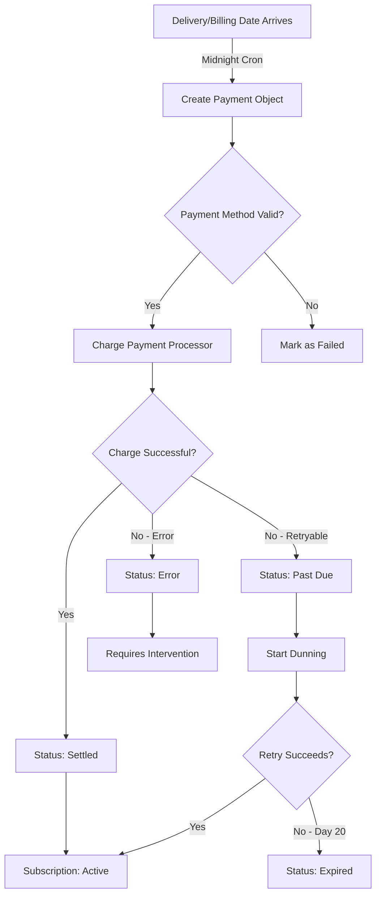
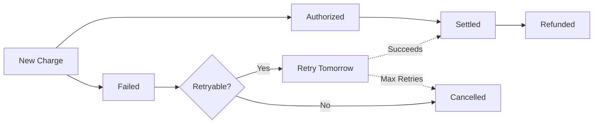

## What are Recurring Payments?

**Recurring Payments** in Journey are automated billing transactions that execute on defined schedules without manual intervention. Journey's system handles everything from payment method storage to retry logic, enabling businesses to run subscription models with minimal operational overhead.

<Info>
**Key Innovation:** Journey's recurring payment engine supports multi-frequency billing within a single subscription, automatic dunning management, and seamless switching between payment processors (Straumur, Reepay, Rapyd) without code changes.
</Info>

## How Recurring Payments Work

Journey's billing system operates on a delivery-centric model where payments are tied to delivery or charge dates:

<Steps>
<Step title="Subscription Created">
Customer signs up with payment method verification
</Step>

<Step title="Orders Generated">
System creates orders from subscription recipe based on item frequencies
</Step>

<Step title="Deliveries or Billing Day Scheduled">
Each order gets a delivery or billing date (depending on whether the merchant is uses physical products or not)
</Step>

<Step title="Automated Charging">
On the delivery/billing date, system automatically charges the customer's payment method
</Step>

<Step title="Status Updates">
Payment status updates subscription state (active, past_due, error, expired)
</Step>

<Step title="Dunning Management">
Failed payments trigger automatic retry sequences with customer notifications
</Step>
</Steps>

### Payment Flow Diagram



## Payment States

Payments progress through clearly defined states:



### Status Definitions

<AccordionGroup>
  <Accordion title="New Charge" icon="plus">
    Payment object created but not yet attempted. Occurs when delivery/billing date arrives and system creates initial payment record.

    **Next Step:** Immediate charge attempt via payment processor
  </Accordion>

  <Accordion title="Authorized" icon="lock">
    The payment method has been verified and funds are **reserved**, but no money has actually been transferred yet.

    **What's happening:** The payment processor confirms the customer has enough funds available, and those funds are temporarily set aside and unavailable to the customer for other purchases.

    **Next Step:** Funds will be captured (actually transferred) when the delivery ships or billing date arrives. Most payments move from Authorized to Settled within a few days.
  </Accordion>

  <Accordion title="Settled" icon="circle-check">
    Money has been **actually transferred** from the customer's account to yours. This is the final successful state.

    **What happened:** The authorized funds were captured, processed through the banking system, and are now in your merchant account. You have the revenue.

    **Effect:** Subscription remains/returns to active status, and you can rely on having received the payment
  </Accordion>

  <Accordion title="Failed" icon="circle-xmark">
    Payment attempt was declined by payment processor or bank.

    **Triggers:**
    - Insufficient funds (past_due)
    - Expired card (error)
    - Invalid card (error)
    - Technical issues (error)

    **Next Step:** Automatic retry based on error classification
  </Accordion>

  <Accordion title="Cancelled" icon="ban">
    Payment was cancelled due to:
    - Max retry attempts exceeded (20 days default)
    - Delivery cancelled before charge
    - Merchant manually cancelled

    **Final State:** No further processing
  </Accordion>

  <Accordion title="Refunded" icon="rotate-left">
    Previously settled payment has been refunded to customer.

    **Triggers:**
    - Customer return
    - Merchant error
    - Service cancellation

    **Process:** Full or partial refund via payment processor API
  </Accordion>

  <Accordion title="Uncapturable" icon="hourglass-end">
    Authorization has expired before capture (typically 7 days for card authorizations).

    **Resolution:** New authorization required
  </Accordion>
</AccordionGroup>

## Multi-Frequency Billing

Journey uniquely supports different billing frequencies for items within a single subscription.

### How It Works

**Traditional Systems:**
```
All items share one frequency
❌ Customer must create separate subscriptions for different schedules
❌ Higher operational complexity
❌ More payment transactions = more fees
```

**Journey's Approach:**
```
Each item has its own frequency
✅ Single subscription for all items
✅ Intelligent delivery synchronization
✅ Fewer transactions through batching
```

### Example: Grocery Subscription

```json
{
  "subscription_id": 789,
  "order_items": [
    {
      "product": "Fresh Milk",
      "frequency": "every_7_days",
      "next_charge": "2025-11-01"
    },
    {
      "product": "Eggs",
      "frequency": "every_14_days",
      "next_charge": "2025-11-08"
    },
    {
      "product": "Coffee Beans",
      "frequency": "every_30_days",
      "next_charge": "2025-11-15"
    }
  ]
}
```

**Billing Schedule:**
- **Nov 1:** Charge for Milk only
- **Nov 8:** Charge for Milk + Eggs (synchronized)
- **Nov 15:** Charge for Milk + Coffee (synchronized)
- **Nov 22:** Charge for Milk + Eggs (synchronized)

<Info>
Journey's 5-day synchronization window automatically batches items, reducing payment processing fees by up to 60% compared to separate charges.
</Info>

## Payment Processors

Journey supports multiple payment processors with unified API:

| Processor | Region | Features | Use Case |
|-----------|--------|----------|----------|
| **Straumur** | Iceland | Local cards, low fees | Icelandic merchants |
| **Reepay** | Europe | SEPA, cards, subscriptions | European expansion |
| **Rapyd** | Global | 900+ payment methods | International markets |

### Processor Selection

Journey **doesn't automatically select the payment processor**. Instead, it provides flexibility for merchants to configure which processor to use based on their business needs.

**Configuration Options:**
1. **Per-Subscription Level** - Assign specific processor when creating subscription
2. **Per-Customer Level** - Set preferred processor for customer's payment methods
3. **Multiple Processors** - Journey supports running multiple payment processors simultaneously, allowing you to:
   - Test new processors without migrating existing customers
   - Offer region-specific payment options
   - Segment customers by processor (e.g., B2B vs B2C)
   - Gradually migrate between processors

**Selection Priority:**
The system checks for a processor in this order:
1. Processor explicitly assigned to the subscription
2. Customer's preferred processor (from their payment method)
3. Merchant's default payment processor

<Info>
You can have multiple payment processors active at the same time. For example, use Straumur for Icelandic customers and Reepay for international customers within the same merchant account.
</Info>

## Automated Billing Process

Journey runs daily billing automation to handle recurring payment processing automatically.

### Daily Billing Workflow

The system performs several key operations each day:

<Steps>
<Step title="Process New Deliveries">
The system identifies deliveries scheduled for today that haven't been charged yet. For each eligible delivery:
- Creates a payment record
- Charges the customer's payment method
- Updates subscription status based on payment result

**Result:** New charges processed for today's deliveries
</Step>

<Step title="Capture Authorized Payments">
For payment processors that use two-step authorization (authorize → capture), the system finds payments that were pre-authorized and are now ready to be captured when their delivery date arrives.

**Result:** Pre-authorized payments captured and funds transferred
</Step>

<Step title="Retry Failed Payments">
The system identifies subscriptions with failed payments that are eligible for retry (within the configured retry window and daily retry limit). Each payment is attempted once per day.

**Result:** Daily retry attempts for recoverable payment failures
</Step>

<Step title="Cancel Old Failed Payments">
Payments that have exceeded the maximum retry period (typically 20 days) are automatically cancelled. The associated subscriptions are expired and future deliveries are cancelled.

**Result:** Expired subscriptions and cancelled deliveries for unrecoverable payments
</Step>

<Step title="Send Dunning Communications">
Customer notifications are triggered based on payment attempt counts:
- First failure: Friendly reminder
- Every 4th attempt: Urgent reminder with days remaining
- Final attempt: Last chance notice
- After expiration: Subscription cancelled notice

**Result:** Automated customer communication throughout the dunning process
</Step>
</Steps>

### Monitoring

Journey provides comprehensive monitoring of the automated billing process:

**Logging:**
- All cron job executions are logged with timestamps and results
- Errors are captured with full context for debugging
- Processing summaries show counts of payments processed, retries attempted, and subscriptions updated

**Alerts:**
- Payment processor failures trigger immediate alerts
- Unusually high retry rates indicate potential issues
- Authorization decline spikes warrant investigation
- Processing time exceeding thresholds

## Payment Retry Logic & Dunning

**Dunning** is the process of automatically recovering failed payments through intelligent retries and customer communication. When a payment fails, Journey doesn't give up—it classifies the failure and retries using the most effective strategy for that error type.

**Why it matters:**
- Without dunning, 20-30% of subscriptions would churn unnecessarily from temporary payment issues
- With intelligent dunning, 70-80% of failed payments successfully recover
- Automated retries and customer notifications make it seamless for customers to fix issues

Journey implements intelligent retry logic based on error classification:

### Error Classification

| Error Type | Example Codes | Classification | Retry Strategy |
|------------|--------------|----------------|----------------|
| Insufficient Funds | `51`, `insufficient_funds` | PAST_DUE | Daily retry × 20 |
| Card Declined | `05`, `card_declined` | PAST_DUE | Daily retry × 20 |
| Do Not Honor | `04`, `do_not_honor` | PAST_DUE | Daily retry × 20 |
| Expired Card | `54`, `expired_card` | ERROR | No retry (update required) |
| Invalid Card | `14`, `invalid_card_number` | ERROR | No retry (update required) |
| Fraud Suspected | `fraud_detected` | ERROR | No retry (verification required) |
| Gateway Error | `500`, `timeout` | ERROR | No retry (technical issue) |

### Retry Schedule

<Tabs>
  <Tab title="PAST_DUE (Retryable)">
    ```
    Day 1:  Attempt 1 → Failed
            Status: past_due
            Action: Send friendly reminder

    Day 2:  Attempt 2 → Failed
            Action: Silent retry

    Day 3:  Attempt 3 → Failed
            Action: Silent retry

    Day 4:  Attempt 4 → Failed
            Action: Send urgent reminder (4th attempt)

    Days 5-7: Silent retries

    Day 8:  Attempt 8 → Failed
            Action: Send urgent reminder (8th attempt)

    Days 9-11: Silent retries

    Day 12: Attempt 12 → Failed
            Action: Send urgent reminder (12th attempt)

    Days 13-15: Silent retries

    Day 16: Attempt 16 → Failed
            Action: Send urgent reminder (16th attempt)

    Days 17-19: Silent retries

    Day 20: Attempt 20 → Failed (FINAL)
            Status: error
            Action: Send final notice

    Day 21: No retry
            Status: expired
            Action: Cancel subscription
    ```
  </Tab>

  <Tab title="ERROR (Requires Action)">
    ```
    Day 1:  Attempt 1 → Failed (expired card)
            Status: error
            Action: Send immediate notification
                   "Please update payment method"

    Day 2+: No automatic retries
            Status: remains error
            Action: Customer must update card

    When customer updates:
            System: Automatically use new card
            Next scheduled: Normal billing resumes
    ```
  </Tab>
</Tabs>

<Info>
Customers can update payment methods at any time during the retry period. The next retry automatically uses the new card without manual intervention.
</Info>

### Retry Prevention

Journey implements safeguards to prevent excessive retry attempts:

**Daily Limit:** Only one retry attempt per payment per day
- Prevents rapid-fire retry attempts that could trigger fraud detection
- Reduces payment processor fees from multiple failed attempts
- Gives customers time to resolve underlying issues (add funds, update card, etc.)

**Already Attempted Check:** System tracks the last attempt timestamp
- Skips retry if already attempted today
- Prevents duplicate charges if cron job runs multiple times
- Ensures predictable billing behavior for customers

## Payment Method Management

### Adding Payment Methods

Customers can easily add and manage their payment methods on their My Pages account.

**How It Works:**

1. **Go to My Pages** - Customer logs into My Pages and goes to the Payment Methods section
2. **Add New Card** - Click "Add Payment Method" and securely enter their card details
3. **Verification** - The system verifies the card
4. **Set as Primary** - Customer can choose which card to use for their subscription
5. **Auto-Billing** - On the next billing date, the selected card is automatically charged

**Multiple Cards:**
Customers can add multiple payment methods and switch between them at any time. This is especially useful if they want to use different cards for different subscriptions, or if their primary card expires.

<Info>
Customers can update their payment method anytime on My Pages—even during a failed payment recovery period. The next automatic retry will use their updated card.
</Info>

### Updating During Dunning

**Scenario:** Payment fails, customer updates card while in retry period.

**Journey's Seamless Recovery:**
1. Customer adds new payment method through the customer portal
2. New card is automatically set as their primary payment method
3. The very next retry attempt (could be within hours) uses the new card
4. If the new card charges successfully, subscription immediately returns to active status
5. Customer experiences no service interruption or missed deliveries

**Behind the Scenes:**
- System always uses the customer's current primary payment method for retry attempts
- No manual intervention needed from support or merchant
- Subscription status updates automatically based on payment success
- Delivery schedules remain intact if payment recovered within retry window

<Tip>
This seamless recovery is a key feature - customers can fix payment issues without contacting support or missing deliveries. The system is designed to "just work" when customers update their payment information.
</Tip>

## Refunds and Adjustments

**Process:**
- Merchant initiates refund for the entire payment amount
- System calls the payment processor's refund API
- If successful, payment status updates to `REFUNDED`
- Customer receives credit to their original payment method

<Warning>
Refunds cannot be reversed once processed. Always confirm amount and reason before executing.
</Warning>

## Invoice Generation

Journey automatically generates invoices for every successful payment.

### What's Included on Invoices

Each invoice includes:
- **Order Details** - Items ordered, quantities, and prices
- **Delivery Fee** - If applicable
- **Subtotal & Tax** - Clear cost breakdown
- **Payment Method** - Last 4 digits of the card used
- **Payment Date** - When the charge was processed
- **Next Billing Date** - When the next charge will occur

### Auto-Send Invoices

Customers can enable automatic invoice delivery through their My Pages settings. When enabled:

**Trigger:** After every successful payment settles

**How It Works:**
- Customers check "Send me invoices automatically" on My Pages
- After each payment, they receive an email with the invoice PDF attached
- They can also print or forward invoices as needed

**Configuration:**
- Each customer controls this setting individually
- Can be toggled on/off at any time
- Takes effect on the next payment

### Invoice History

All invoices are always available in the **Order History** section of My Pages:

- **View Anytime** - Customers can access any past invoice without relying on email
- **Download** - Invoices can be downloaded as PDF for record-keeping or accounting
- **Print** - Print directly from My Pages for records or receipts

<Info>
Customers have two ways to access invoices: via email (if auto-send is enabled) or anytime through their Order History on My Pages.
</Info>

## Stock Management Integration

Journey integrates payment status with stock management:

### Stock Lifecycle

<Steps>
<Step title="Order Created">
**Stock Availability Check:**
- System verifies all items are in stock before creating order
- If any item is unavailable, order creation fails
- Prevents overselling and customer disappointment
</Step>

<Step title="Payment Authorized">
**Stock Reservation:**
- When payment is pre-authorized, stock is reserved for this order
- Reserved stock is temporarily unavailable to other customers
- Ensures items will be available when payment captures
</Step>

<Step title="Payment Settled">
**Stock Fulfillment:**
- Once payment fully settles, stock is permanently reduced
- Reservation is removed (no longer needed)
- Order moves to fulfillment queue
</Step>

<Step title="Payment Failed">
**Stock Unreservation:**
- If payment fails or is cancelled, reserved stock is released
- Items become available again for other customers
- Prevents stock being locked indefinitely for failed orders
</Step>
</Steps>

<Info>
This integration ensures inventory accuracy and prevents overselling during payment processing delays.
</Info>

## Security & Compliance

### PCI DSS Compliance

Journey never stores raw card data:

**Secure Flow:**
```
Customer enters card
    ↓
Directly to processor
    ↓
Processor returns token
    ↓
Journey stores token only
    ↓
Token used for charges
```

**Journey stores:**
- ✅ Payment method tokens
- ✅ Last 4 digits
- ✅ Card type (Visa, Mastercard)
- ✅ Expiry date

**Journey never stores:**
- ❌ Full card numbers
- ❌ CVV codes
- ❌ PIN numbers

### 3D Secure Support

All processors support 3D Secure authentication:

```json
{
  "requires_3ds": true,
  "redirect_url": "https://secure.bank.com/verify",
  "challenge_required": true
}
```

**Flow:**
1. Customer initiates payment
2. Bank requires 3DS challenge
3. Customer redirected to bank verification
4. After verification, return to Journey
5. Payment completes

### Data Protection

**Encryption:**
- All API calls use TLS 1.3
- Database fields encrypted at rest
- Payment tokens encrypted with AES-256

**Access Control:**
- Multi-tenant data isolation
- Role-based permissions
- Audit logging for all payment actions

## Related Concepts

<CardGroup cols={2}>
  <Card
    title="Subscriptions"
    icon="repeat"
    href="/subscriptions/subscriptions"
  >
    Understand subscription lifecycle and how payments integrate with recurring orders
  </Card>
  <Card
    title="Invoice Claims"
    icon="receipt"
    href="/payments/claims"
  >
    Understand Icelandic invoice claims as an alternative payment method
  </Card>
  <Card
    title="Communications"
    icon="envelope"
    href="/customer-communication/communication"
  >
    Learn how payment events trigger automated customer notifications
  </Card>
  <Card
    title="Reports & Analytics"
    icon="chart-bar"
    href="/analytics/reports"
  >
    Track payment performance, revenue metrics, and failure analysis
  </Card>
</CardGroup>
