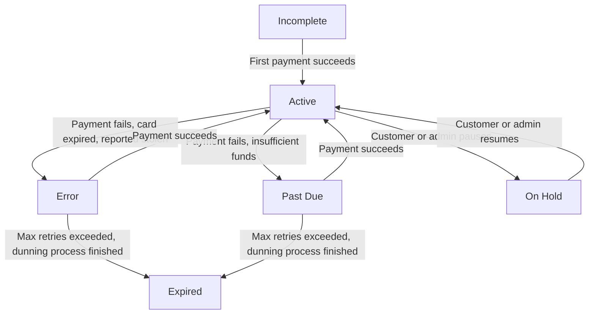

## What is a Subscription?

A **subscription** in Journey is a recipe-based recurring billing container that automatically generates orders and processes payments based on defined frequencies. Unlike traditional subscription systems, Journey supports different billing frequencies for each item within a single subscription.

<Info>
  **Key Innovation:** Journey's multi-frequency system allows items like "milk weekly, eggs bi-weekly, and coffee monthly" to coexist in one subscription, with intelligent delivery synchronization to minimize shipping costs.
</Info>

## The Recipe Model

Journey's subscription system works like a recipe:

<Steps>
  <Step title="Subscription = Container">
    Holds customer information, delivery preferences, and payment processor configuration
  </Step>
  <Step title="Subscription Order Items = Recipe">
    Defines what products to deliver and how often (the "ingredients")
  </Step>
  <Step title="Orders = Execution">
    Created automatically from the recipe on each billing cycle
  </Step>
  <Step title="Deliveries = Charging Events">
    Represent when the order will be delivered AND charged (dual purpose)
  </Step>
  <Step title="Payments = Financial Tracking">
    Track the transaction status for each order
  </Step>
</Steps>

### Example: Multi-Frequency Subscription

```json
{
  "subscription_id": 789,
  "customer_id": 42,
  "subscription_status": "active",
  "order_items": [
    {
      "product_variation_id": 5,  // Milk
      "quantity": 2,
      "subscription_frequency_id": 1  // Every 7 days (weekly)
    },
    {
      "product_variation_id": 8,  // Eggs
      "quantity": 1,
      "subscription_frequency_id": 2  // Every 14 days (bi-weekly)
    },
    {
      "product_variation_id": 12, // Coffee
      "quantity": 1,
      "subscription_frequency_id": 3  // Every 30 days (monthly)
    }
  ]
}
```

## Subscription States

### Status Definitions

<AccordionGroup>
  <Accordion title="Incomplete" icon="circle-pause">
    Customer information and subscription created but missing payment information. This typically occurs when customers start the signup process but don't complete it—they enter their details but never add a payment method (known as an "abandoned cart"). No charges are attempted until a payment method is added. This represents a recovery opportunity to re-engage these customers.
  </Accordion>
  <Accordion title="Active" icon="circle-check">
    The subscription is processing normally. Orders are created and payments are charged according to each item's billing frequency. This is the healthy state.
  </Accordion>
  <Accordion title="Past Due" icon="circle-exclamation">
    A recent payment failed with a retryable error (insufficient funds, card declined). The dunning process has started and will retry daily.

    **Trigger:** Payment declined with error codes like `insufficient_funds`, `card_declined`
  </Accordion>
  <Accordion title="Error" icon="circle-xmark">
    Payment failed with a card-related error (expired card, invalid card, fraud detection). Journey retries daily to settle payment but the error requires manual intervention or customer action, such as update payment method.

    **Trigger:** Technical payment errors or card issues
  </Accordion>
  <Accordion title="On Hold" icon="pause">
    The subscription is  paused by customer or merchant. No new orders or charges occur. Can be resumed (on my pages and/or Journey admin) at any time without losing configuration. We encourage merchants to use on hold if the customer requests to stop subcription.

    **Use Cases:** Vacation, temporary or permanent financial hardship, seasonal or permanent pause.
  </Accordion>
  <Accordion title="Expired" icon="ban">
    The subscription has been automatically put to status expired after extended payment failure (exceeding `failed_payment_cancelled_days`, default 20 days). All pending deliveries are cancelled and the past due process has finished.

    **Final State:** Cannot be reactivated except with manual intervention by admin
  </Accordion>
</AccordionGroup>

Subscriptions progress through clearly defined states with automatic or manually triggered (on my pages) transitions:



## Creating a Subscription

Setting up a new subscription follows a straightforward four-step process. Each step ensures the customer is verified, their payment method is secured, and their recurring order preferences are captured.

<Steps>
  <Step title="Capture Customer Information">
    Collect the customer's basic information including name, email, phone number, and delivery address. This information is used for billing, customer communication, and order fulfillment.
  </Step>
  <Step title="Secure Payment Method">
    The customer adds and verifies a payment method (typically a credit or debit card). This is handled through a secure payment interface that keeps sensitive payment data protected while confirming the card is valid and active.
  </Step>
  <Step title="Create the Subscription">
    Once customer details and payment are confirmed, the subscription is activated. You can specify the start date and choose which delivery schedule option the customer prefers (e.g., weekly, bi-weekly, monthly).
  </Step>
  <Step title="Configure Recurring Items">
    The customer selects which products they want to receive and how frequently. For example, they might want item A delivered weekly and item B delivered bi-weekly. The system tracks these preferences and uses them during each automated billing cycle.
  </Step>
</Steps>

### System Auto-Generates Orders

Once the subscription is live, the system automatically handles the rest:

1. Calculates when each item needs to be delivered based on the customer's chosen frequency
2. Optimizes delivery dates to consolidate multiple items when possible
3. Coordinates with regional delivery schedules for efficiency
4. Creates orders and schedules deliveries
5. Charges the customer on their delivery date

## Managing Subscriptions

Your team has full flexibility to manage active subscriptions, making it easy to retain customers through life changes and evolving needs.

### Pause a Subscription

Allow customers to temporarily stop their subscriptions without canceling. This is useful for vacations, budget constraints, or seasonal needs.

**Control the Customer Experience:**

You decide whether customers can pause on their own or must contact your support team. This gives you options:

- **Self-service pause** - Customers pause immediately through their [My Pages](my-pages.md) (reduces support burden)
- **Manual pause** - Customers email support to pause (gives you a chance to intervene and offer alternatives)

**Capture Why They're Pausing:**

You can define custom pause reasons for customers to choose from. Examples:

- "Going on vacation"
- "Budget constraints"
- "Seasonal - will resume in spring"
- "Product quality concerns"
- "Too frequent deliveries"
- "Switching to competitor"

**Suggest Alternatives Before Pause:**

When a customer selects certain reasons, you can automatically suggest alternatives:

- **For "Too frequent"** → "Would you prefer bi-weekly instead of weekly?"
- **For "Budget constraints"** → "Would you like to delay your next delivery by 2 weeks?"
- **For "Seasonal"** → "Would you like to resume automatically on [date]?"

This data helps you understand churn reasons and gives you opportunities to retain customers with adjusted terms rather than lost revenue.

**What Happens:**

- The subscription is placed on hold
- No new charges occur
- Customers can resume at any time without signing up again
- Optionally, any pending deliveries can be cancelled if the customer prefers

**Business Impact:** Pause functionality significantly reduces churn because customers can easily come back without friction.

### Resume a Subscription

When customers are ready to restart, they can resume their subscription instantly.

**What Happens:**

- The subscription becomes active again
- The system recalculates delivery dates based on the resumed date
- New orders begin generating immediately
- You can optionally apply a "welcome back" discount to encourage re-engagement

**Business Impact:** Reactivating paused subscriptions is pure revenue recovery with minimal effort.

### Update Product Selections

Customers can change which products they want to receive or adjust quantities at any time.

**What Happens:**

- New product preferences take effect immediately for future deliveries
- Any orders already paid continue as-is (no disruption)
- Changes only apply to upcoming deliveries, protecting your revenue pipeline

**Business Impact:** Flexibility here reduces churn from customers with changing preferences.

### Adjust Delivery Frequency

Customers can change how often they receive deliveries (e.g., switching from weekly to bi-weekly).

**What Happens:**

The system uses a simple rule: **next delivery date = last delivery date + new frequency interval**

This means the next delivery is always calculated from when they last received (and paid for) the item, not from today.

**Example:**

```
Scenario: Customer has been receiving milk weekly. 
         Today is Oct 20. They want to switch to bi-weekly.

Last delivery:        Oct 15 (successfully charged)
Old frequency:        Weekly (7 days)
New frequency:        Bi-weekly (14 days)
Today:                Oct 20

Calculation:
├─ Start point: Last successful charge = Oct 15
├─ Add new frequency: Oct 15 + 14 days
└─ Next delivery: Oct 29

Timeline:
  Oct 15 (charged)  Oct 20 (change frequency)  Oct 29 (next charge)
      ✓                      ↓
   Last charge          Customer switches       New delivery
                        (4 days in)            (14 days after Oct 15)
```

**Why This Approach:**

- **Fair to customers** - They don't get charged earlier just because they made the change late in the week
- **Predictable** - Changes don't create confusing gaps or sudden charges
- **Simple logic** - Easy for customers to understand when their next charge will be

**Business Impact:** Frequency changes are a powerful retention tool—customers who find a subscription too frequent often stick around when they can adjust the cadence.


## Subscription Frequencies

Each subscription item can have its own billing frequency:

| Frequency   | Description    | Interval  | Common Use Cases           |
| ----------- | -------------- | --------- | -------------------------- |
| Weekly      | Every 7 days   | 7 days    | Fresh groceries, meal kits |
| Bi-weekly   | Every 14 days  | 14 days   | Household supplies         |
| Monthly     | Every 30 days  | 1 month   | Insurance premiums, SaaS   |
| Bi-monthly  | Every 60 days  | 60 days   | Quarterly-lite products    |
| Quarterly   | Every 90 days  | 3 months  | Seasonal items, insurance  |
| Semi-Annual | Every 180 days | 6 months  | Long-term services         |
| Annual      | Every 365 days | 12 months | Annual memberships         |

<Info>
  Each business can customize which frequency options are available for their subscriptions. This allows you to offer only the delivery schedules that make sense for your business model.
</Info>

### How Delivery Dates Are Calculated

The system automatically calculates when each item should be delivered next, based on its frequency. This calculation is more sophisticated than it might seem, especially for monthly deliveries.

**Examples:**

| Frequency     | How It Works                                                                                                           |
| ------------- | ---------------------------------------------------------------------------------------------------------------------- |
| **Weekly**    | Each delivery is exactly 7 days after the previous one                                                                 |
| **Monthly**   | Delivered on the same date each month (e.g., always on the 15th), accounting for months with different numbers of days |
| **Quarterly** | Delivered every 3 months on the same day of the month                                                                  |

For instance, if a customer's monthly delivery is on the 31st and one month only has 30 days, the system intelligently handles this edge case. This accuracy is critical for building customer trust and ensuring consistent, predictable billing.

This ensures that subscriptions created on Jan. 31 will be billed on Feb. 28 (not March 3).

## Common Use Cases

### Insurance Premium Subscriptions

Perfect for recurring fees or premium charges with no physical product involved.

| Aspect        | Details                                       |
| ------------- | --------------------------------------------- |
| **Items**     | 1 monthly premium charge                      |
| **Frequency** | Monthly                                       |
| **Example**   | Car insurance premium auto-renewed each month |

### SaaS Subscriptions

Ideal for SaaS platforms offering tiered access or service levels.

| Aspect        | Details                                       |
| ------------- | --------------------------------------------- |
| **Items**     | 1 software plan/tier                          |
| **Frequency** | Monthly or annually                           |
| **Example**   | Pro Plan subscription renewed every 12 months |

### E-commerce Box Subscriptions

Curated collections delivered as a complete package each month.

| Aspect        | Details                                                       |
| ------------- | ------------------------------------------------------------- |
| **Items**     | Multiple curated products (e.g., 2 full-size + 1 sample item) |
| **Delivery**  | Monthly shipment                                              |
| **Frequency** | All items ship together monthly                               |
| **Example**   | Beauty box with 3 items arriving together each month          |

### Mixed-Frequency Grocery Subscription

The most powerful example: a single subscription with items delivered at different frequencies, all intelligently synchronized.

**Subscription Contents:**

| Item       | Quantity  | Delivery Frequency |
| ---------- | --------- | ------------------ |
| Fresh Milk | 2 bottles | Every week         |
| Eggs       | 1 dozen   | Every 2 weeks      |
| Coffee     | 1 bag     | Every month        |

**How it Works:**

The system automatically orchestrates these different schedules. Some weeks the customer receives just milk. Other weeks, milk arrives with eggs. Once a month, all three items come together. The customer never has to think about it and the system coordinates everything automatically.

**Timeline Example:**

- **Week 1:** Milk arrives (charged) + Coffee arrives (charged)
- **Week 2:** Milk arrives (charged) + Eggs arrive (charged)
- **Week 3:** Milk arrives (charged)
- **Week 4:** Milk arrives (charged) + Eggs arrive (charged)
- **Week 5:** Milk arrives (charged) + Coffee arrives (charged)
- _(pattern repeats)_

This is where Journey's intelligence shines, managing complex recurring orders that would otherwise frustrate customers or require manual coordination.

## Related Concepts

<CardGroup cols={2}>
  <Card title="Delivery & Fulfillment" icon="box" href="/subscriptions/delivery-fulfillment">
    Learn about deliveries of physical products are handled
  </Card>
  <Card title="Recurring Payments" icon="repeat" href="/concepts/recurring-payments">
    Understand payment processing and billing cycles
  </Card>
</CardGroup>